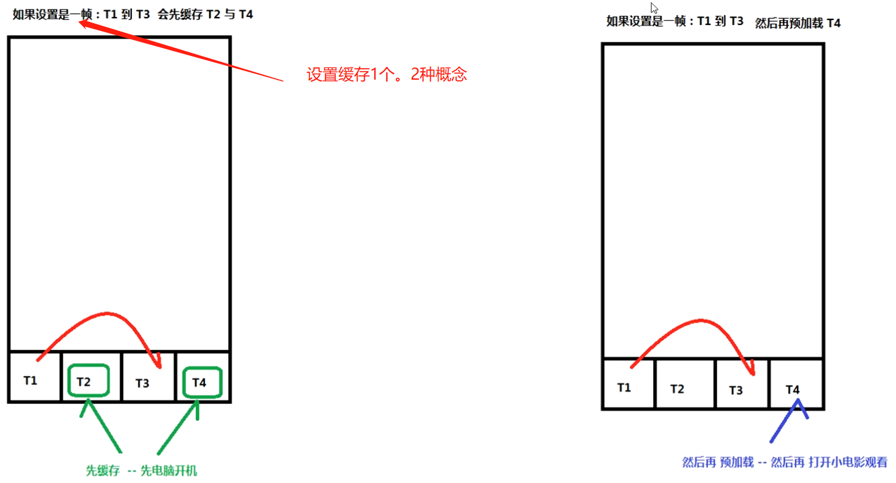
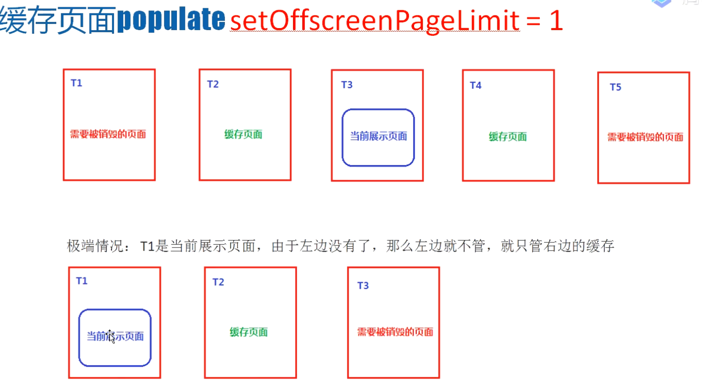
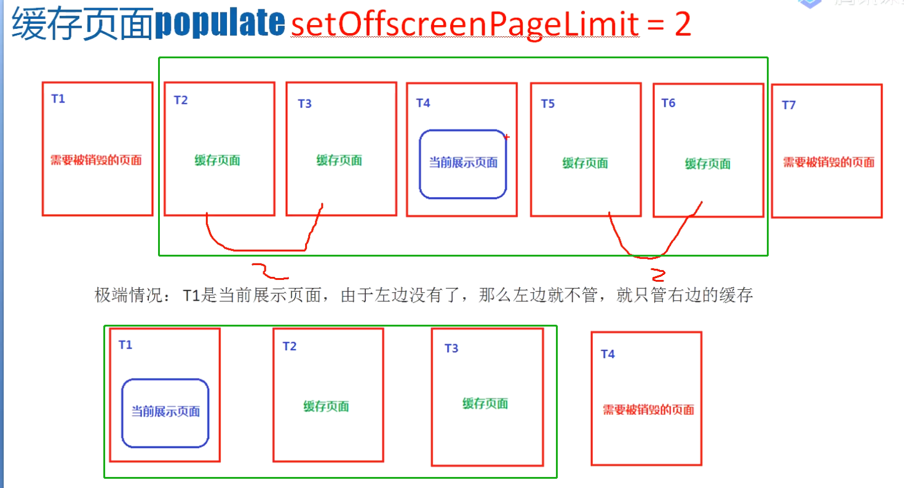
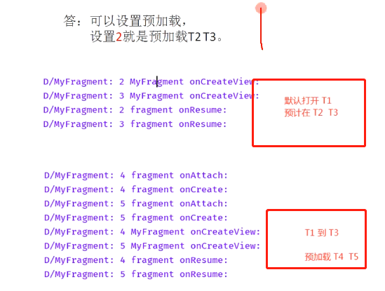
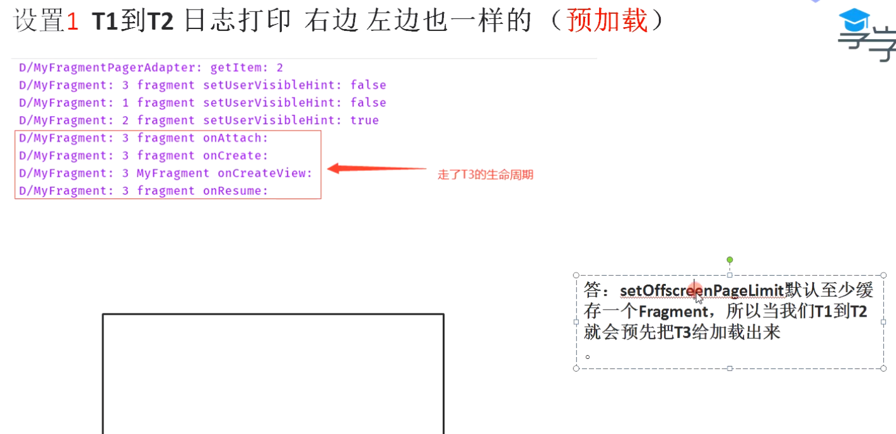
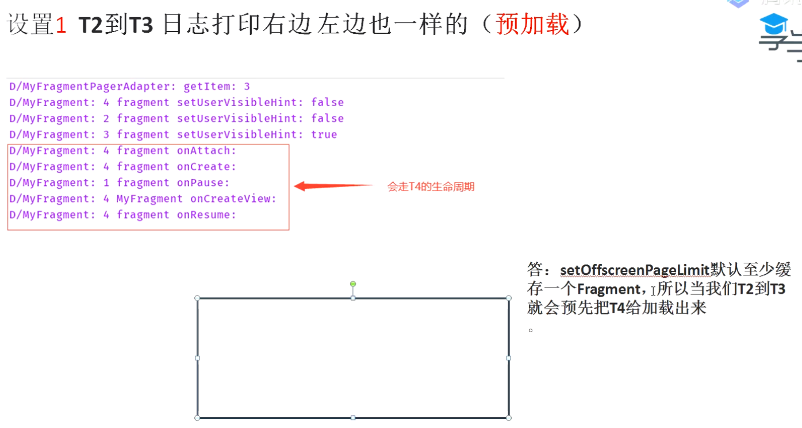
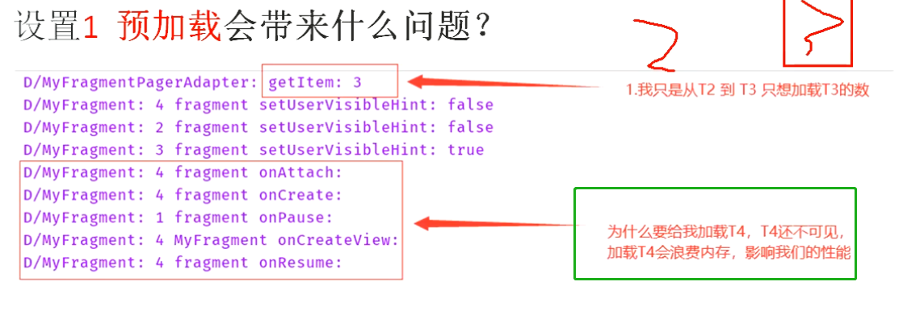

# 1、先有缓存还是先有预加载？
collapsed:: true
	- 答案：先有缓存
	- 缓存的目的就是为了预加载
	- 图解：我设置setOffscreenPageLimit = 1，缓存1个。从1跳到3.会先缓存24.再预加载4
	  collapsed:: true
		- 
- # 2、setOffscreenPageLimit：
  collapsed:: true
	- ## 缓存上来说
	  collapsed:: true
		- 在缓存上的作用：
			- 设置当前page。前后缓存的个数。比如5个页面点击第3个那么缓存12和 45
		- ### vp缓存图示
			- 缓存1个图解
			  collapsed:: true
				- 
			- 缓存2个图解
			  collapsed:: true
				- 
		- ## 问题：为什么设置缓存0个无效，还会给我缓存？
			- 源码
			  collapsed:: true
				- ```java
				      public void setOffscreenPageLimit(int limit) {
				          if (limit < 1) {
				              Log.w("ViewPager", "Requested offscreen page limit " + limit + " too small; defaulting to " + 1);
				              limit = 1;
				          }
				  
				          if (limit != this.mOffscreenPageLimit) {
				              this.mOffscreenPageLimit = limit;
				              this.populate();
				          }
				  
				      }
				  ```
			- 判断最小为1个。此时缓存个数为3，当前1个左右各1个
	- ## 预加载来说
		- 可以用来设置预加载，首先进入T1。设置2就是预加载T2 T3。
		  collapsed:: true
			- 
		- 预加载规则：设置两个：往跳转方向再多数2个算预加载。
			- 比如：1跳3，预加载45
			- 5跳3，预加载12
		- 图解
		  collapsed:: true
			- 
			- 
- # 3、什么是预加载？
  collapsed:: true
	- 
- # 4、预加载会带来什么问题？
	- 
	- 1.预加载的越多就会越卡
	  2.一个Fragment占用 1M，5个就(5*1M)，累计到后面就会OOM
	  3.如果预加载的Fragment在请求网络，不仅浪费流量，还会很卡顿
	- ## 怎么解决：[[懒加载]]