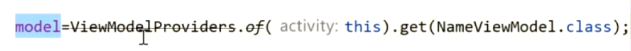

# 产生的目的
	- 注重生命周期的方式存储和管理界面相关的数据,可在发生屏幕旋转等配置更改后继续留存
- # 作用
  collapsed:: true
	- 1.管理数据，把VIEW中的数据独出来，单独进行管理
	- 2.管理数据的保存与恢复，比如屏幕转动，用户点回退按钮，或切换语言等操作
	- 3.可以很方便的监听到UI上的数据变化
	- 4.主要和LiveData与Room组合使用
	- 注意：ViewModel只是用来管理UI的数据的,千万不要让它持有View、Activity或者Fragment的引用(小心内存泄露)。
- # 使用
	- //获取viewModel
	  model = ViewModelProviders.of(getActivity()).get(NameViewModel.class);
	- viewModel 需要通过工厂创建，而不是new
	- 
	- ## 需要上下文，则可用
- # 优点
  collapsed:: true
	- Acitivty、Fragment 因为屏幕选装导致重建,但是ViewModel会保存数据
	- viewModel 会在页面销毁时回调clear方法
- # 原理
	- ## [[ViewModel数据恢复原理]]
- # 扩展
  collapsed:: true
	- [[viewmodel的Rx扩展]]
	-
- # [[ViewModel-面试]]
-