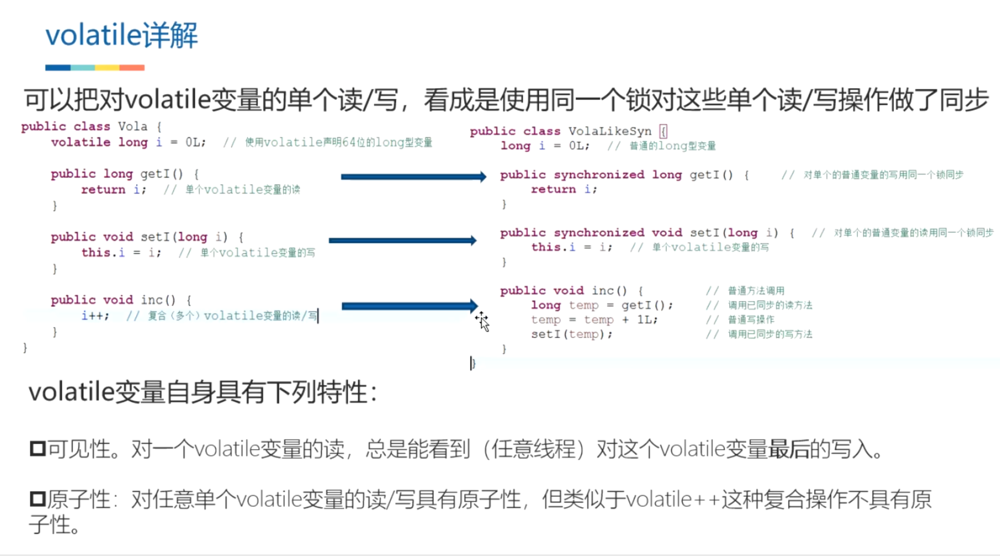

## 1、volatile特性
	- 每个线程运算前，强制从主内存读一次，修改完后立刻同步到主内存，
	- ## 具有可见性，不具有原子性，可以抑制指令重排序（双重检查单例用了）
	- ## 举例
	  collapsed:: true
		- 
		- volatile虽然能保证执行完及时把变量刷到主内存中，但对于count++这种非原子性、多指令的情况，由于线程切换，线程A刚把count=0加载到工作内存，线程B就可以开始工作了，这样就会导致线程A和B执行完的结果都是1，都写到主内存中，主内存的值还是1不是2
- ## 问题缺点：假如计算非原子操作，那么会有问题，因为不具有原子性
- ## 2、适用场景
  collapsed:: true
	- 1、变量时原子性操作的
	- 2、一个线程写，多个线程读，都是直接从主内存读，没问题
- ## 特点
	- volatile 只对[[#red]]==**基本数据类型**== (byte、char、short、int、long、flfloat、double 、 boolean) 的赋值操作和
	- ==**对象的引⽤**==赋值操作有效，你要修改 User.name 是 不能保证同步的
- ## 3、volatile的实现原理
	- 1、volatile关键字修饰的变量会存在一个“lock:”的前缀。
		- Lock前缀，Lock不是一种内存屏障，但是它能完成类似内存屏障的功能。Lock会对CPU总线和高速缓存加锁，可以理解为CPU指令级的一种锁。
	- 2、该指令会将[[#red]]==**当前处理器缓存行的数据**==直接写回到系统内存中
	- 3、这个==**写回内存的操作**==会使在[[#red]]==**其他CPU里缓存了该地址的数据无效**==。
- 
- ## 4、[[volatile能否保证线程安全？在DCL（双重检查锁）上的作用是什么？]]
	-
- ## 5、[[volatile和Synchronized区别]]