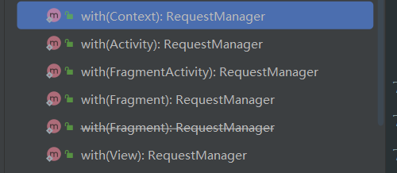
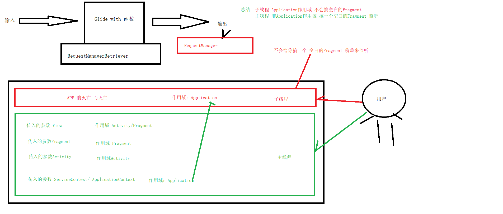

- 
- 
- ## 作用域总结：
	- ### Application作用域
		- 情况
			- [[#red]]==**子线程执行Glide.with(this)**==
			- 或者主线程执行with（Application Context），传入参数为Service Context 或者 Application Context
		- 特点：==**不会搞空白Fragment监听生命周期。**==
	- ### 非Application作用域：
		- 主线程
			- 传入VIew-> 作用域Activity / Fragment
			- 传入Fragment -> 作用域Fragment
			- 传入Activity -> 作用域Activity
		- 特点：会添加空白Fragment 监听生命周期