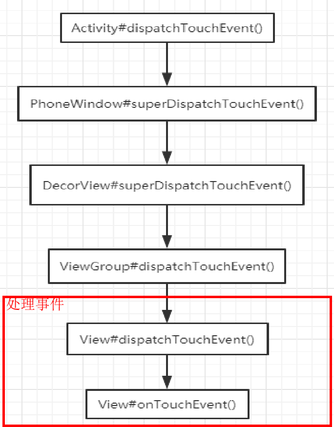

# 事件分发总流程#card
	- ## 1、一个Down事件触发时，先进入[[Activity的dispatchTouchEvent]]，然后
		- PhoneWindow的superDispatchTouchEvent实际是 调用
		- DecorView.superDispatchTouchEvent(event), DecorView又交给了根ViewGroup，所以才有以后的事件分发
	- ## 2、ViewGroup的 dispatchTouchEvent()
		- 1、首先disallowIntercept变量，判断子view有没有要求父view不允许拦截它的事件（默认为false的，因为down事件会重置标记。Down里 这标记一定为false）
			- false:就是没有说不拦截。可以继续看下边ViewGroup的拦截事件onInterceptTouchEvent
			- true: 要求父view不拦截 和 onInterceptTouchEvent返回false一致
	- ## 3、下面看viewGroup重写的onInterceptTouchEvent
		- ### [[#red]]==**返回ture:.拦截**==
			- 最终会调用到super.dispatchTouchEvent()。viewGroup的父类为view.java即[[View.java的dispatchTouchEvent]],具体流程见内
				- 1、最先调用的地方，view设置了[[#red]]==**mOnTouchListener**==，先走它的onTouch。看其返回值
					- 返回true ：被onTouch消费  不会继续分发Down事件
					- 返回false：这时才会执行到TextVIew的onTouchEvent()方法
				- 2、（ 1、view没有写setOnTouchListener2、要么写了返回false 没有消费）下边才会走[[#red]]==**onTouchEvent**==(event)
				- 3、Action_Down事件里,会判断==**onLongClickListener**==
				- 4、Action_UP判断如果设置了[[#red]]==**mOnClickListener**==，则会走onClick方法。同时设置result = true 告诉父容器消费了
			- 最终会调用到viewGroup 重写了 onTouchListener,onTouchEvent，等方法，判断该事件是否在VIewGroup这里消费。将返回值返回。
		- ### [[#red]]==**返回false:不拦截**==
			- 1、遍历所有子view进行分发：找到一个能接受事件的child：子view。
			  collapsed:: true
				- 可见|| 执行animation动画
				- view 在点击范围内
			- 2、最终调用[[#red]]==**child 的dispatchTouchEvent**==，看子view是否消费
				- 如果child是viewGroup。那么viewGroup的 dispatchTouchEvent整个流程再走一遍
				- 如果是view,那么进入view的dispatchTouchEvent，看onTouchListener,onTouchevent  等
			- 3、[[#red]]==**子view消费了**==，那这个viewGroup 也不处理这个事件了
			- 4、如果所有子view全部不处理返回false的话，那么ViewGroup会按照拦截走 调用super.dispatchTouchEvent。最终执行自己重写的onTouchListener,onTouchEvent等。
			- 5、最终将事件是否消费向上传递
-
- ## 总图
  collapsed:: true
	- 