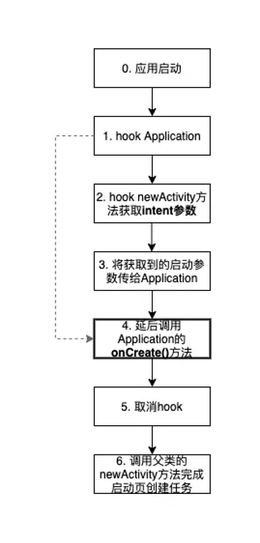
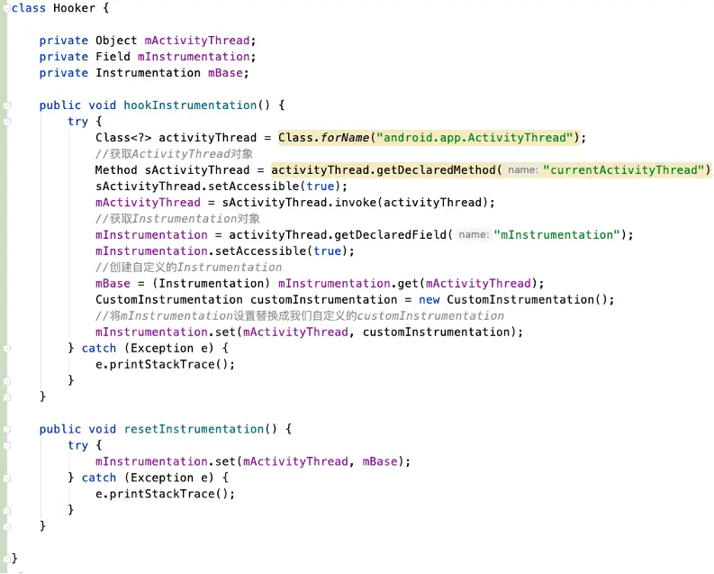

- # 背景
  collapsed:: true
	- APP在启动时通常可以带一些参数，Android系统会在Application初始化后，紧接着根据这些参数创建相应的页面Activity，同时会把这些参数传递给页面，然后完成程序到页面的启动。从系统提供的能力看，启动参数只有在启动页创建后通过页面Intent才可以获取，Application的初始化是在启动页创建之前完成的，它的初始化方法中系统并没有给其提供启动参数。
- # 问题
  collapsed:: true
	- 一些在Application初始化依赖启动参数的逻辑无法在初始化执行，很多都移到了启动页Activity的初始化方法中。比如：一般App会在LaunchActivity或HomeActivity中解析外部调起的协议数据再做分发。
- # 目标
  collapsed:: true
	- 本文主要讲一种Hook方案，重在解决Android在Application初始化时无法直接获得启动参数的问题。同时，也是要引出另一个主题，就是在启动页启动之前，乃至Application初始化（SDK初始化）之前，能不能根据启动参数做一些逻辑和页面处理（隐私弹窗）。
- # 实现思路
  collapsed:: true
	- 通过Hook Instrumentation技术实现对Application的初始化和Activity页面创建这两个方法的重写。
	  Hook Application的初始化方法，将初始化逻辑暂时屏蔽。
	  Hook Activity页面的创建方法，首先获取到启动参数。
	  接着将获取到的启动参数传给Application，重新完成初始化逻辑。
	  完成初始化后，记得将Hook取消，防止其它非启动页被Hook后再次初始化Application。
	  继续往下执行Activity页面的创建方法，走完后续的启动流程。
	- 
- # 具体实现
	- 1、通过反射拿到 ActivityThread 的 sCurrentActivityThread 变量的值，然后再通过该实例变量拿到mInstrumentation 变量。再通过反射 将 mInstrumentation 变量设置为我们自定义的 CustomInstrumentation 对象。这样就实现了Hook Instrumentation。
	  collapsed:: true
		- 
	- 2、自定义Instrumentation。通过重写callApplicationOnCreate方法，将父类的callApplicationOnCreate方法暂时不要调用，以此屏蔽Application的初始化方法。
	  collapsed:: true
		- 
	-