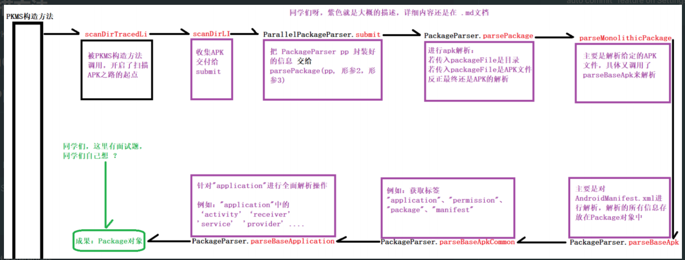

- # 扫描方法
	- [[#red]]==**PKMS的构造函数中调用了**== **scanDirTracedLI**方法 来扫描某个目录的apk文件。
- # Android10路径
  collapsed:: true
	- PKMS主要扫描以下路径的APK信息：
	- ```java
	  /vendor/overlay 系统的APP类别
	  /product/overlay 系统的APP类别
	  /product_services/overlay 系统的APP类别
	  /odm/overlay 系统的APP类别
	  /oem/overlay 系统的APP类别
	  /system/framework 系统的APP类别
	  /system/priv-app 系统的APP类别
	  /system/app 系统的APP类别
	  /vendor/priv-app 系统的APP类别
	  /vendor/app 系统的APP类别
	  /odm/priv-app 系统的APP类别
	  /odm/app 系统的APP类别
	  /oem/app 系统的APP类别
	  /oem/priv-app 系统的APP类别
	  /product/priv-app 系统的APP类别
	  /product/app 系统的APP类别
	  /product_services/priv-app 系统的APP类别
	  /product_services/app 系统的APP类别
	  /product_services/priv-app 系统的APP类别
	  ```
- # APK的扫描，整体描述图：
	- 
	- ## 1、PKMS构造函数中调用：PKMS.**scanDirTracedLi**：
	  collapsed:: true
		- 首先加入了一些systtrace的日志追踪，然后调用scanDirLI()进行分析
		- ```java
		  private void scanDirTracedLI(File scanDir, final int parseFlags, int scanFlags,
		  															long currentTime) {
		      Trace.traceBegin(TRACE_TAG_PACKAGE_MANAGER, "scanDir [" +
		                                                      scanDir.getAbsolutePath() + "]");
		      try {
		          // 【同学们注意】会调用此 scanDirLI函数
		          scanDirLI(scanDir, parseFlags, scanFlags, currentTime);
		      } finally {
		          Trace.traceEnd(TRACE_TAG_PACKAGE_MANAGER);
		      }
		  }
		  ```
	- ## 2、PKMS.**scanDirLI**：
	  collapsed:: true
		- 使用了ParallelPackageParser的对象，ParallelPackageParser是一个队列，我们这里手机所有系统的apk，然后从这些队列里面取出apk，再调用**PackageParser **解析进行解析：
		- scanDirLI
			- ```java
			  private void scanDirLI(File scanDir, int parseFlags, int scanFlags, long
			  																currentTime) {
			      final File[] files = scanDir.listFiles();
			      if (ArrayUtils.isEmpty(files)) {
			          Log.d(TAG, "No files in app dir " + scanDir);
			          return;
			      }
			      if (DEBUG_PACKAGE_SCANNING) {
			          Log.d(TAG, "Scanning app dir " + scanDir + " scanFlags=" + scanFlags
			                                      + " flags=0x" + Integer.toHexString(parseFlags));
			      }
			      // parallelPackageParser是一个队列，收集系统 apk 文件，
			      // 然后从这个队列里面一个个取出 apk ，调用 PackageParser 解析
			      try (
			          ParallelPackageParser parallelPackageParser = new ParallelPackageParser(
			          mSeparateProcesses, mOnlyCore, mMetrics, mCacheDir,
			          mParallelPackageParserCallback)) {
			          // Submit files for parsing in parallel
			          int fileCount = 0;
			          for (File file : files) {
			              // 是Apk文件，或者是目录
			              final boolean isPackage = (isApkFile(file) || file.isDirectory())
			              && !PackageInstallerService.isStageName(file.getName());
			              // 过滤掉非 apk 文件，如果不是则跳过继续扫描
			              if (!isPackage) {
			                // Ignore entries which are not packages
			                continue;
			              }
			              // 把APK信息存入parallelPackageParser中的对象mQueue，PackageParser()函数
			              // 赋给了队列中的pkg成员
			              // 【同学们注意】 这里的 submit 函数 很重要，下面就会分析此函数
			              parallelPackageParser.submit(file, parseFlags);
			              fileCount++;
			          }
			          // Process results one by one
			          for (; fileCount > 0; fileCount--) {
			              // 从parallelPackageParser中取出队列apk的信息
			              ParallelPackageParser.ParseResult parseResult = parallelPackageParser.take();
			              Throwable throwable = parseResult.throwable;
			              int errorCode = PackageManager.INSTALL_SUCCEEDED;
			              if (throwable == null) {
			                  // TODO(toddke): move lower in the scan chain
			                  // Static shared libraries have synthetic package names
			                  if (parseResult.pkg.applicationInfo.isStaticSharedLibrary()) {
			                      renameStaticSharedLibraryPackage(parseResult.pkg);
			                  }
			                  try {
			                      //调用 scanPackageChildLI 方法扫描一个特定的 apk 文件
			                      // 该类的实例代表一个 APK 文件，所以它就是和 apk 文件对应的数据结构。
			                      scanPackageChildLI(parseResult.pkg, parseFlags, scanFlags, currentTime, null);
			                  } catch (PackageManagerException e) {
			                      errorCode = e.error;
			                      Slog.w(TAG, "Failed to scan " + parseResult.scanFile + ": " + e.getMessage());
			                  }
			              } else if (throwable instanceof PackageParser.PackageParserException) {
			                  PackageParser.PackageParserException e = (PackageParser.PackageParserException)throwable;
			                  errorCode = e.error;
			                  Slog.w(TAG, "Failed to parse " + parseResult.scanFile + ": " +e.getMessage());
			              } else {
			                  throw new IllegalStateException("Unexpected exception occurred while parsing "+
			                                                                  parseResult.scanFile, throwable);
			              }
			              // Delete invalid userdata apps
			              //如果是非系统 apk 并且解析失败
			              if ((scanFlags & SCAN_AS_SYSTEM) == 0 &&
			                  errorCode != PackageManager.INSTALL_SUCCEEDED) {
			                  logCriticalInfo(Log.WARN,
			                  "Deleting invalid package at " + parseResult.scanFile);
			                  // 非系统 Package 扫描失败，删除文件
			                  removeCodePathLI(parseResult.scanFile);
			              }
			          }
			      }
			  }
			  ```
	- ## 3、ParallelPackageParser.**submit** :
	  collapsed:: true
		- 把扫描路径中的APK等内容，放入队列mQueue，并把parsePackage() pp 赋给ParseResult，用于后面的调用
		- submit
			- ```java
			  public void submit(File scanFile, int parseFlags) {
			      mService.submit(() -> {
			          ParseResult pr = new ParseResult();
			          Trace.traceBegin(TRACE_TAG_PACKAGE_MANAGER, "parallel parsePackage [" + scanFile + "]"); // 日志打印
			          try {
			              PackageParser pp = new PackageParser();
			              pp.setSeparateProcesses(mSeparateProcesses);
			              pp.setOnlyCoreApps(mOnlyCore);
			              pp.setDisplayMetrics(mMetrics);
			              pp.setCacheDir(mCacheDir);
			              pp.setCallback(mPackageParserCallback);
			              pr.scanFile = scanFile;
			              // 并把parsePackage()与pp 赋值ParseResult，用于后面的调用
			              pr.pkg = parsePackage(pp, scanFile, parseFlags); 
			              // 【同学们注意】 parsePackage下面会分析
			          } catch (Throwable e) {
			              pr.throwable = e;
			          } finally {
			              Trace.traceEnd(TRACE_TAG_PACKAGE_MANAGER);
			          }
			          try {
			              // 把扫描路径中的APK等内容，放入队列mQueue
			              mQueue.put(pr);
			          } catch (InterruptedException e) {
			              Thread.currentThread().interrupt();
			              // Propagate result to callers of take().
			              // This is helpful to prevent main thread from getting stuck waiting on
			              // ParallelPackageParser to finish in case of interruption
			              mInterruptedInThread = Thread.currentThread().getName();
			          }
			      });
			  }
			  ```
	- ## 4、PackageParser.**parsePackage**
	  collapsed:: true
		- 通过 PackageParser.**parsePackage **进行apk解析：
		- 如果传入的packageFile是目录， 调用parseClusterPackage()解析
		- 如果传入的packageFile是APK文件， 调用parseMonolithicPackage()解析
		- parsePackage
		  collapsed:: true
			- ```java
			  public Package parsePackage(File packageFile, int flags, boolean useCaches)
			      throws PackageParserException {
			      ...
			      if (packageFile.isDirectory()) {
			          //如果传入的packageFile是目录，调用parseClusterPackage()解析
			          parsed = parseClusterPackage(packageFile, flags);
			      } else {
			          //如果是APK文件，就调用parseMonolithicPackage()解析
			          parsed = parseMonolithicPackage(packageFile, flags); 
			          // 【同学们注意】下面 我们分析此函数
			      }
			      ...
			      return parsed;
			  }
			  ```
	- ## 5、PackageParser.**parseMonolithicPackage**()
	  collapsed:: true
		- 它的作用是解析给定的APK文件，将其作为单个单块包处理，最终调用parseBaseApk()进行解析
		- parseMonolithicPackage
			- ```java
			  public Package parseMonolithicPackage(File apkFile, int flags) throws
			  														PackageParserException {
			      final PackageLite lite = parseMonolithicPackageLite(apkFile, flags);
			      if (mOnlyCoreApps) {
			        if (!lite.coreApp) {
			            throw new  PackageParserException(INSTALL_PARSE_FAILED_MANIFEST_MALFORMED,
			                                                    "Not a coreApp: " + apkFile);
			        }
			      }
			      final SplitAssetLoader assetLoader = new DefaultSplitAssetLoader(lite, flags);
			      try {
			          // 对核心应用解析 【同学们注意】 最终调用parseBaseApk()进行解析，我们下面来分析
			          final Package pkg = parseBaseApk(apkFile,
			          assetLoader.getBaseAssetManager(), flags);
			          pkg.setCodePath(apkFile.getCanonicalPath());
			          pkg.setUse32bitAbi(lite.use32bitAbi);
			          return pkg;
			      } catch (IOException e) {
			          throw new
			                  PackageParserException(INSTALL_PARSE_FAILED_UNEXPECTED_EXCEPTION,
			                                                  "Failed to get path: " + apkFile, e);
			      } finally {
			      	IoUtils.closeQuietly(assetLoader);
			      }
			  }
			  ```
	- ## 6、PackageParser.**parseBaseApk**()
	  collapsed:: true
		- 主要是对AndroidManifest.xml进行解析，解析后所有的信息放在 Package对象中
		- parseBaseApk
			- ```java
			  private Package parseBaseApk(File apkFile, AssetManager assets, int flags)
			  													throws PackageParserException {
			      final String apkPath = apkFile.getAbsolutePath();
			      ...
			      XmlResourceParser parser = null;
			      ...
			      final int cookie = assets.findCookieForPath(apkPath);
			      if (cookie == 0) {
			          throw new PackageParserException(INSTALL_PARSE_FAILED_BAD_MANIFEST,
			          "Failed adding asset path: " + apkPath);
			      }
			      // 获得一个 XML 资源解析对象，该对象解析的是 APK 中的 AndroidManifest.xml 文件。
			      parser = assets.openXmlResourceParser(cookie, ANDROID_MANIFEST_FILENAME);
			      final Resources res = new Resources(assets, mMetrics, null);
			      final String[] outError = new String[1];
			      // 再调用重载函数parseBaseApk()最终到parseBaseApkCommon()，解析
			      // AndroidManifest.xml 后得到一个Package对象
			        // 【同学们注意】解析后所有的信息放在Package对象中
			      final Package pkg = parseBaseApk(apkPath, res, parser, flags, outError);
			      ...
			      pkg.setVolumeUuid(volumeUuid);
			      pkg.setApplicationVolumeUuid(volumeUuid);
			      pkg.setBaseCodePath(apkPath);
			      pkg.setSigningDetails(SigningDetails.UNKNOWN);
			      return pkg;
			      ...
			  }
			  ```
	- ## 7、PackageParser.**parseBaseApkCommon**
	  collapsed:: true
		- 从AndroidManifest.xml中获取标签名，解析标签中的各个 item的内容，存入Package对象中
		- 例如：获取标签 "application"、"permission"、"package"、"manifest" 同学们，太多了，省略了哈
		- parseBaseApkCommon
			- ```java
			  private Package parseBaseApkCommon(Package pkg, Set<String> acceptedTags,
			  Resources res, XmlResourceParser parser, int flags, String[] outError) throws
			                                                          XmlPullParserException,
			                                                          IOException {
			      TypedArray sa = res.obtainAttributes(parser,
			      						com.android.internal.R.styleable.AndroidManifest);
			      //拿到AndroidManifest.xml 中的sharedUserId, 一般情况下有“android.uid.system”等信息
			      String str = sa.getNonConfigurationString(
			      		com.android.internal.R.styleable.AndroidManifest_sharedUserId, 0);
			      while ((type = parser.next()) != XmlPullParser.END_DOCUMENT
			      && (type != XmlPullParser.END_TAG || parser.getDepth() > outerDepth)) {
			      //从AndroidManifest.xml中获取标签名
			      String tagName = parser.getName();
			      //如果读到AndroidManifest.xml中的tag是"application",执行parseBaseApplication()进
			      // 行解析
			      if (tagName.equals(TAG_APPLICATION)) {
			          if (foundApp) {
			          ...
			          }
			          foundApp = true;
			          // 解析"application"的信息，赋值给pkg
			          // 【同学们注意】这里解析到的是"application" <application 包含了 四大组件，
			          // 下面分析此操作
			          if (!parseBaseApplication(pkg, res, parser, flags, outError)) {
			               return null;
			          }
			          ...
			          //如果标签是"permission"
			          else if (tagName.equals(TAG_PERMISSION)) {
			              //进行"permission"的解析
			              if (!parsePermission(pkg, res, parser, outError)) {
			              return null;
			              }
			          }
			   	 }
			  }
			  ```
	- ## 8、PackageParser.**parseBaseApplication**()
		- 上面解析AndroidManifest.xml，会得到 "**application**"、"overlay"、"permission"、"uses permission" 等信息
		- 我们下面就针对"**application**"进行展开分析一下，
		- parseBaseApplication
			- ```java
			  private boolean parseBaseApplication(Package owner, Resources res,
			                          XmlResourceParser parser, int flags, String[] outError)
			                          while ((type = parser.next()) != XmlPullParser.END_DOCUMENT
			                          && (type != XmlPullParser.END_TAG || parser.getDepth() >
			                          innerDepth)) {
			      // 获取"application"子标签的标签内容
			      String tagName = parser.getName();
			      // 如果标签是"activity"
			      // 解析Activity的信息，把activity加入Package对象
			      if (tagName.equals("activity")) {
			          Activity a = parseActivity(owner, res, parser, flags, outError,
			                                     cachedArgs, false,
			                                     owner.baseHardwareAccelerated);
			          if (a == null) {
			              mParseError = PackageManager.INSTALL_PARSE_FAILED_MANIFEST_MALFORMED;
			              return false;
			          }
			          hasActivityOrder |= (a.order != 0);
			          owner.activities.add(a);
			      } else if (tagName.equals("receiver")) { // 如果标签是"receiver"，获取
			   											// receiver信息，加入Package对象
			            Activity a = parseActivity(owner, res, parser, flags, outError,
			            cachedArgs, true, false);
			            if (a == null) {
			                mParseError = PackageManager.INSTALL_PARSE_FAILED_MANIFEST_MALFORMED;
			                return false;
			            }
			            hasReceiverOrder |= (a.order != 0);
			            owner.receivers.add(a);
			      }else if (tagName.equals("service")) { // 如果标签是"service"，获取service信
			      										// 息，加入Package对象
			      	Service s = parseService(owner, res, parser, flags, outError, cachedArgs);
			          if (s == null) {
			              mParseError =  PackageManager.INSTALL_PARSE_FAILED_MANIFEST_MALFORMED;
			              return false;
			          }
			          hasServiceOrder |= (s.order != 0);
			          owner.services.add(s);
			      } else if (tagName.equals("provider")) { // 如果标签是"provider"，获取
			      										// provider信息，加入Package对象
			          Provider p = parseProvider(owner, res, parser, flags, outError, cachedArgs);
			          if (p == null) {
			              mParseError = PackageManager.INSTALL_PARSE_FAILED_MANIFEST_MALFORMED;
			              return false;
			          }
			          owner.providers.add(p);
			      }
			      ...
			      }
			  }
			  ```
			- 在 PackageParser 扫描完一个 APK 后，此时系统已经根据该 APK 中 AndroidManifest.xml，创建了一个完整的 Package 对象
	- ## 总结
		- 第一步：扫描APK，解析AndroidManifest.xml文件，得到清单文件各个标签内容
		- 第二步：解析清单文件到的信息由 Package 保存。从该类的成员变量可看出，和 Android 四大组件相关的信息分别由 activites、receivers、providers、services 保存，由于一个 APK 可声明多个组件，因此activites 和 receivers等均声明为 ArrayList
	- ## [[PKMS-扫描APK及清单文件解析]]