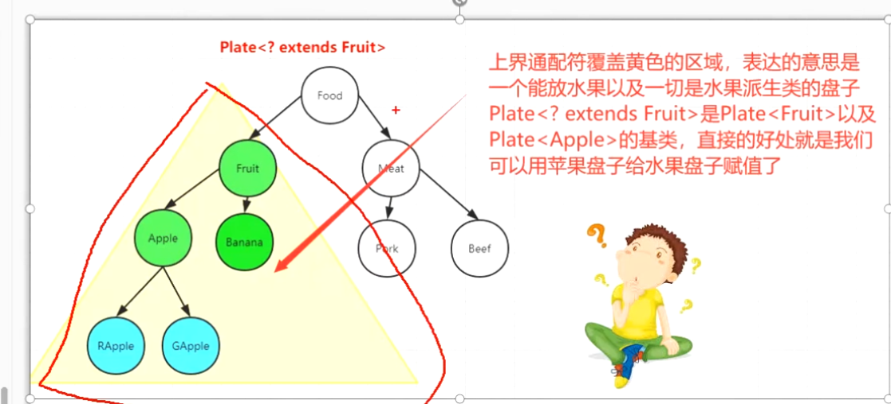

- 不知是否正确： 一般在存储元素的时候都是用上限，因为这样取出都是按照上限类型来运算的。不会出现类型安全隐患，体现Collection.addAll()
  collapsed:: true
	- 
	- 可以存入指定类型及其子类
- ### 覆盖范围：
	- 
- ### **[[#red]]==泛型实例化==**：(和操作存取不是一个概念)
	- ？ extends Fruit 是 [[#red]]==**接受 Fruit子类的 列表**==
		- ```java
		  Plate<? extends Fruit> s = new Plate<Apple>();
		  ```
- ### 缺点：生产者只能取（取数据时，[[#green]]==**只能取出 Fruit 上界类型 不能取出具体类型**==），不能存
	- ```java
	  // 将苹果盘子 转为 水果盘子  
	  // 使用上界通配符 存数据时
	  public Plate<? extends Fruit> getSnack(Plate<Apple> applePlate){  
	        Plate<? extends Fruit> fruitPlate = applePlate;
	        // 使用上界通配符是能将  苹果盘子 转成 水果盘子
	        // 但是不能存放任何元素 
	        fruitPlate.set(new Apple()); // 报错
	        fruitPlate.set(new Banana()); // 报错
	        
	        // 放null 还是可以的
	        fruitPlate.set(null);
	        return fruitPlate;
	  }
	  
	  // 取数据时，只能取出 Fruit 上界类型 不能取出具体类型
	  Fruit fruit = fruitPlate.get();
	  
	  // Banana banana  = fruitPlate.get();// 取不出来
	  
	  ```
	- 不能存的解决方案：【[[#red]]==**通过反射是可以的**==，但是破坏了泛型的安全类型检查，如果只是自己使用偶尔可用】
		- ```java
		  public Plate<? extends Fruit> getSnack(Plate<Apple> applePlate){  
		        Plate<? extends Fruit> fruitPlate = applePlate;
		        try{
		        	Method set = fruitPlate.getClass().getMethod("set",Object.class);
		          set.invoke(fruitPlate,new Banana());
		          set.invoke(fruitPlate,new Apple());
		        } catch (Exception e){}
		        return fruitPlate;
		  }
		  
		  ```