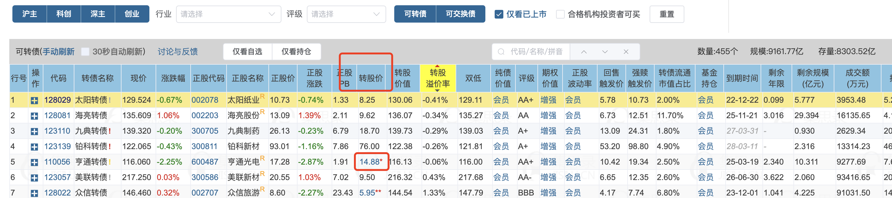

- # 一、下修时间
	- 可转债存续期间都可以下修
- # 二、下修条件
  collapsed:: true
	- 集思录债券页面有，不同可转债的下修条件是不一样的
	- 比如条件
		- 正股价格  <  转股价格*90%
		- 连续30个交易日 中有15天
	- ## 低于转股价格的50%以下的淘汰
	- 
	- 红色星号的代表下修过转股价
- # 三、对套利的影响
	- 强赎条款中： 正股价格 > 转股价格*130 时就可以触发强赎，下调转股价，更容易触发强赎
- # 四、对转股折价套利的影响
	- 因 转股价值 = 100/转股价 * 正股价
	- 1、转股价值和转股价成反比，即转股价越低，转股价值越高
	- 2、转股价值和正股价成正比，即正股价越低，转股价值越低，正股价越高，转股价值越高
- # 四、选择
	- 选择半年前或者1年期下修过转股价的
-
-