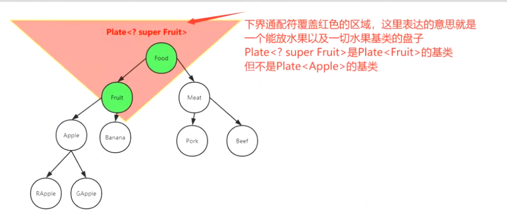

- ### 限定范围：
	- {:height 318, :width 718}
	-
- ### 实例化:
	- <? super Fruit> 限定了下界，[[#red]]==**泛型实例化的时候，接受 Fruit及其基类**== 比如
	- ```java
	  Plate<? super Fruit> lowerfruitPlate = new AIPlate<Food>();
	  ```
- ### 缺点：只能存（存 Fruit及其子类），不能取(按Object取)
	- ```java
	  由上图所示  Fruit exdents Food 
	  
	  lowerfruitPlate.set(new Apple());
	  lowerfruitPlate.set(new Banana());
	  // 不能存 Food  lowerfruitPlate.set(new Food());
	  
	  // 取出来 泛型信息丢失了，只能用Object存放
	  Object newFruit2 = lowerfruitPlate.get();
	  ```
		-