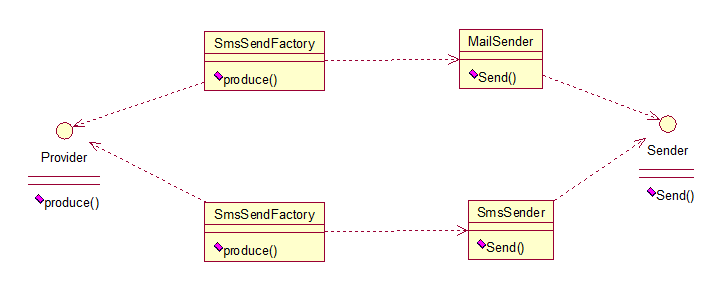

- # 背景
	- 工厂方法模式有一个问题就是，类的创建依赖工厂类，也就是说，如果想要拓展程序，必须对工厂类进行修改，这违背了闭包原则，所以，从设计角度考虑，有一定的问题，如何解决？就用到抽象工厂模式，创建多个工厂类，这样一旦需要增加新的功能，直接增加新的工厂类就可以了，不需要修改之前的代码。
	  collapsed:: true
		- 
	- 在软件开发中，经常遇到需要[[#red]]==**创建一组相关或依赖的对象的情况**==。[[#red]]==**传统的工厂模式只能创建单个对象，**==但无法处理对象家族的创建。这时，抽象方法模式就派上了用场。它通过引入一个抽象工厂接口，该接口定义了创建对象家族的方法，具体的工厂类实现该接口，并负责创建具体的对象
- # 举例
	- 假设我们正在开发一个跨平台图形用户界面（GUI）库，需要支持不同操作系统（如Windows、Mac和Linux）下的按钮和文本框。为了实现这一需求，我们可以使用抽象方法模式。
- # 角色
	- ## 抽象的GUI工厂接口（创建多个不同产品）
	  collapsed:: true
		- 该接口包含创建按钮和文本框的方法
		- ```java
		  public interface GUIFactory {
		      Button createButton();
		      TextField createTextField();
		  }
		  ```
	- ## 具体的工厂类（每个工厂创建对应的不同产品）
	  collapsed:: true
		- 来创建特定操作系统下的GUI元素
		- ```java
		  public class WindowsFactory implements GUIFactory {
		      public Button createButton() {
		          return new WindowsButton();
		      }
		      
		      public TextField createTextField() {
		          return new WindowsTextField();
		      }
		  }
		  
		  public class MacFactory implements GUIFactory {
		      public Button createButton() {
		          return new MacButton();
		      }
		      
		      public TextField createTextField() {
		          return new MacTextField();
		      }
		  }
		  ```
	- ## 抽象产品接口（多个不同没有关联的产品）
	  collapsed:: true
		- ```java
		  public interface Button {
		      void render();
		      void onClick();
		  }
		  
		  public interface TextField {
		      void render();
		      void onFocus();
		  }
		  
		  ```
	- ## 具体产品（定义不同工厂下的具体产品）
	  collapsed:: true
		- ```java
		  public class WindowsButton implements Button {
		      public void render() {
		          // 渲染 Windows 风格的按钮
		      }
		      
		      public void onClick() {
		          // 处理 Windows 风格按钮的点击事件
		      }
		  }
		  
		  public class WindowsTextField implements TextField {
		      public void render() {
		          // 渲染 Windows 风格的文本框
		      }
		      
		      public void onFocus() {
		          // 处理 Windows 风格文本框的焦点事件
		      }
		  }
		  
		  public class MacButton implements Button {
		      public void render() {
		          // 渲染 Mac 风格的按钮
		      }
		      
		      public void onClick() {
		          // 处理 Mac 风格按钮的点击事件
		      }
		  }
		  
		  public class MacTextField implements TextField {
		      public void render() {
		          // 渲染 Mac 风格的文本框
		      }
		      
		      public void onFocus() {
		          // 处理 Mac 风格文本框的焦点事件
		      }
		  }
		  
		  ```
	- ## 客户端使用
	  collapsed:: true
		- 客户端可以使用抽象工厂接口来创建对象，而无需了解具体实现细节：
		- ```java
		  GUIFactory factory;
		  
		  if (operatingSystem == "Windows") {
		      factory = new WindowsFactory();
		  } else if (operatingSystem == "Mac") {
		      factory = new MacFactory();
		  } else if (operatingSystem == "Linux") {
		      factory = new LinuxFactory();
		  }
		  
		  Button button = factory.createButton();
		  TextField textField = factory.createTextField();
		  ```
- # 应用场景
	- 当需要创建的对象是[[#red]]==**一系列相互关联或相互依赖的产品族时，**==如电器工厂中的电视机、洗衣机、空调等。
	- 系统中有多个产品族，但每次只使用其中的某一族产品。如有人只喜欢穿某一个品牌的衣服和鞋。
	- 系统中提供了产品的类库，且所有产品的接口相同，客户端不依赖产品实例的创建细节和内部结构。
- # 优缺点
	- **优缺点：**
	  抽象工厂模式除了具有工厂方法模式的优点外，其他主要优点如下。
		- 可以在类的内部对产品族中相关联的多等级产品共同管理，而不必专门引入多个新的类来进行管理。
		- 当需要产品族时，抽象工厂可以保证客户端始终只使用同一个产品的产品组。
		- 抽象工厂增强了程序的可扩展性，当增加一个新的产品族时，不需要修改原代码，满足开闭原则。
	- 缺点是：
		- 当产品族中需要增加一个新的产品时，所有的工厂类都需要进行修改。增加了系统的抽象性和理解难度。