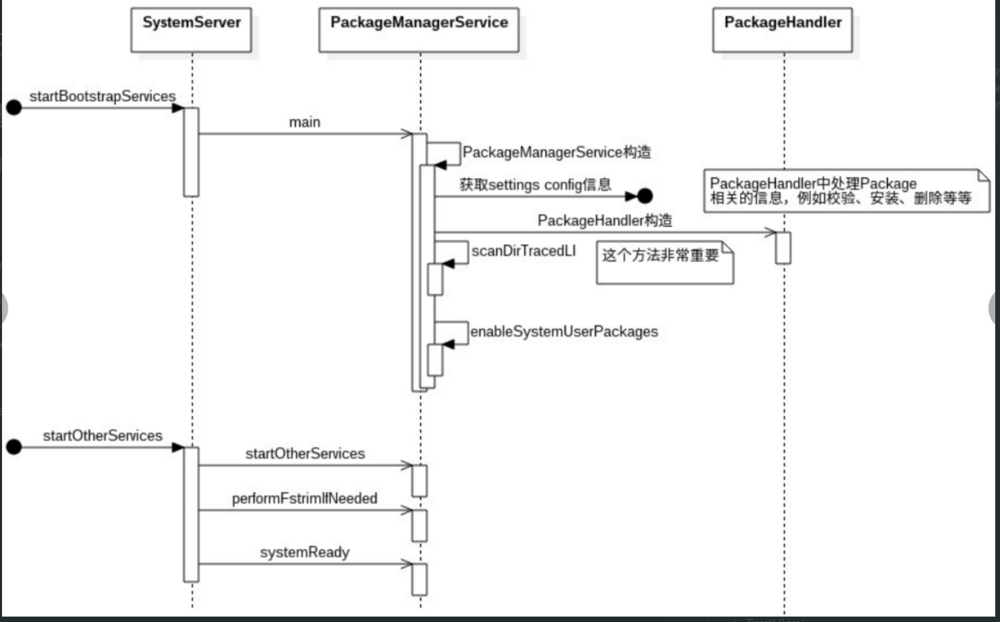
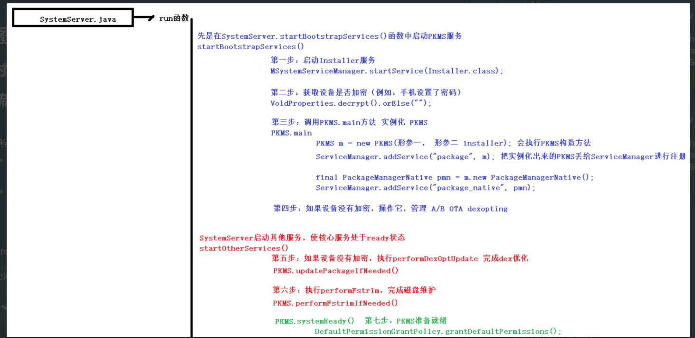

- # 一、图
	- ## 1、时序图
		- 
	- ## 2、流程图
		- 
		- 过程叙述：
			- SystemServer启动PKMS： 先是在SystemServer.startBootstrapServices()函数中启动PKMS服务，
			- 再调用startOtherServices()函数中对dex优化，磁盘管理功能，让PKMS进入systemReady状态。
- # 二、大致流程分析
  collapsed:: true
	- ## 一、启动引导服务中**startBootstrapServices**()
		- **startBootstrapServices**()首先启动Installer服务，也就是安装器，随后判断当前的设备是否处于加密状态，如果是则只是解析核心应用，接着调用PackageManagerService的静态方法main来创建pms对象
		- **第一步**： 启动Installer服务
		- **第二步**：获取设备是否加密(手机设置密码)，如果设备加密了，则只解析"core"应用
		- **第三步**： 调用PKMS main方法初始化PackageManagerService，其中调用PackageManagerService()构造函数创建了PKMS对象
		- **第四步**： 如果设备没有加密，操作它。管理A/B OTA dexopting
		- ```java
		  private void startBootstrapServices() {
		      ...
		      // 第一步：启动Installer
		      // 阻塞等待installd完成启动，以便有机会创建具有适当权限的关键目录，如/data/user。
		      // 我们需要在初始化其他服务之前完成此任务。
		      Installer installer = mSystemServiceManager.startService(Installer.class);
		      mActivityManagerService.setInstaller(installer);
		      ...
		      // 第二步：获取设别是否加密(手机设置密码)，如果设备加密了，则只解析"core"应用，
		      // mOnlyCore = true，后面会频繁使用该变量进行条件判断
		      String cryptState = VoldProperties.decrypt().orElse("");
		      if (ENCRYPTING_STATE.equals(cryptState)) {
		          Slog.w(TAG, "Detected encryption in progress - only parsing core apps");
		          mOnlyCore = true;
		      } else if (ENCRYPTED_STATE.equals(cryptState)) {
		          Slog.w(TAG, "Device encrypted - only parsing core apps");
		          mOnlyCore = true;
		      }
		      // 第三步：调用main方法初始化PackageManagerService
		      mPackageManagerService = PackageManagerService.main(mSystemContext,
		                            installer,
		                            mFactoryTestMode != FactoryTest.FACTORY_TEST_OFF, mOnlyCore);
		      // PKMS是否是第一次启动
		      mFirstBoot = mPackageManagerService.isFirstBoot();
		      // 第四步：如果设备没有加密，操作它。管理A/B OTA dexopting。
		      if (!mOnlyCore) {
		          boolean disableOtaDexopt =
		          SystemProperties.getBoolean("config.disable_otadexopt",false);
		      	OtaDexoptService.main(mSystemContext, mPackageManagerService);
		      }
		      ...
		  }
		  ```
	- ## 二、**startOtherServices**（ROM开发才会用到）
	  collapsed:: true
		- **第五步**： 执行 updatePackagesIfNeeded ，完成dex优化；
		- **第六步**： 执行 performFstrimIfNeeded ，完成磁盘维护；
		- **第七步**： 调用systemReady，准备就绪。
		- ```java
		  private void startOtherServices() {
		      ...
		      if (!mOnlyCore) {
		          ...
		          // 第五步：如果设备没有加密，执行performDexOptUpgrade，完成dex优化；
		          mPackageManagerService.updatePackagesIfNeeded();
		      }
		      ...
		      // 第六步：最终执行performFstrim，完成磁盘维护
		      mPackageManagerService.performFstrimIfNeeded();
		      ...
		      // 第七步：PKMS准备就绪
		      mPackageManagerService.systemReady();
		      ...
		  }
		  ```
	- ## [[PKMS-启动流程分析-面试]]
	- ## [[PKMS-手机开机为什么慢-面试]]
- # 三、[[PKMS启动流程之初始化细节分析]]