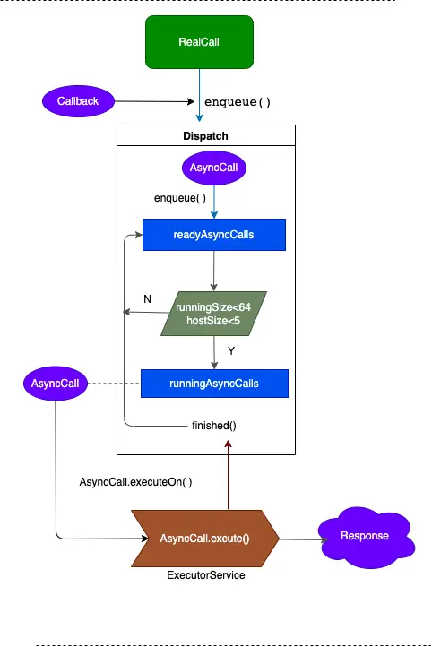
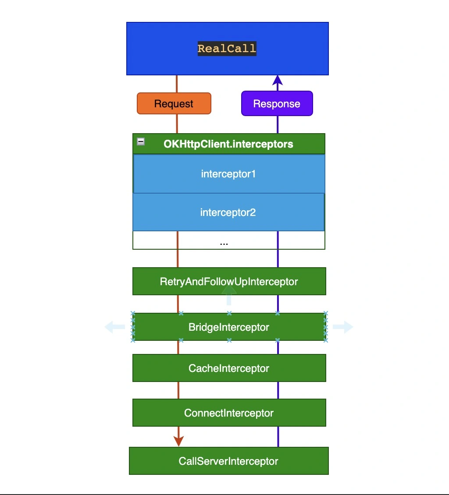

- # 前言
  collapsed:: true
	- OKhttp 是目前android主流的、 使用最广泛的网络框。
	  . 支持HTTP2，允许对同一主机的所有请求共享一个套接字
	  . 通过链接池减少了请求延迟
	  . 默认通过GZip压缩数据
	  . 缓存响应数据避免了重复请求的网络
	  . 请求失败自动重试主机的其他ip，自动重定向
	- 这篇文章介绍OKHttp的整个请求流程是怎样的，将会详细介绍请求的重试、缓存、连接池工作原理
- # Okhttp 请求流程
	- ## 1. okhttp调用流程
	  collapsed:: true
		- ```
		     //发起一个post请求
		      requestBody = new FormBody.Builder.add("name","value").build()
		      reuqust = new Request.Builder().url("url").post().build()
		      call = client.newCall(request)
		      response = call.enqueue(callback)
		  ```
		- 
		- 请求过程中包含了OkHttpClient、Request、Call、Dispatcher、Interceptors、Response，框架内部进行大量的逻辑处理，大部分逻辑集中在拦截器中，但是在进入拦截器之前还需要依靠分发器来调配请求任务
	- ## 2. Dispatcher（分发器）分发流程,内部维护请求队列与线程池，负责请求任务的分发
	  collapsed:: true
		- 
		- 发起一个请求，Dispatcher#enqueue() 把一个任务 AsyncCall 首先放入等待队列 readyAsyncCalls，然后遍历 readyAsyncCalls，如果满足下面两个条件，就移入执行队列runningAsyncCalls，交给线程池去执行。runningAsyncCalls 里的任务执行完会调用finish（）方法，从runningAsyncCalls里移除，然后重复上面的逻辑，满足条件下从等待队列里再取出一个任务放进执行对列，执行下一个任务。
		- 满足执行任务的条件:
		- 执行队列里的任务数<64
		  相同Host 的任务数<5
	- ## 3. Interceptor-拦截器
		- ### 3.1 拦截器调用流程
		  collapsed:: true
			- 线程池里的任务被执行首先调用AsyncCall 的 execute（）方法
			  collapsed:: true
				- ```
				  final class AsyncCall extends NamedRunnable {
				  
				   @Override 
				   protected void execute() {
				        ...
				        try {
				          //调这个方法返回了 response
				          Response response = getResponseWithInterceptorChain();
				          ...
				        }
				        ...
				    }
				  
				    Response getResponseWithInterceptorChain() throws IOException {
				  
				      // 把自定义拦截器和内置拦截器添加到interceptors列表里.
				      List<Interceptor> interceptors = new ArrayList<>();
				  
				      //自定义的拦截器，自定义的拦截器最先拿到Request 最后拿到 Response。先添加的先得到response
				      interceptors.addAll(client.interceptors());
				       
				      // 内置拦截器
				      interceptors.add(retryAndFollowUpInterceptor);
				      interceptors.add(new BridgeInterceptor(client.cookieJar()));
				      interceptors.add(new CacheInterceptor(client.internalCache()));
				      interceptors.add(new ConnectInterceptor(client));
				  
				      //自定义的web协议拦器
				      if (!forWebSocket) {
				        interceptors.addAll(client.networkInterceptors());
				      }
				      // 内置拦截器
				      interceptors.add(new CallServerInterceptor(forWebSocket));
				  
				      //责任链模式调用各个拦截器
				      Interceptor.Chain chain = new RealInterceptorChain(interceptors, null, null, null, 0,
				          originalRequest, this, eventListener, client.connectTimeoutMillis(),
				          client.readTimeoutMillis(), client.writeTimeoutMillis());
				  
				      return chain.proceed(originalRequest);
				    }
				  }
				  }
				  ```
			- 我们看到各种拦截器加到列表
			- 自定义的拦截器：
				- interceptors()
				- networkInterceptors()
			- 内置拦截器
			  collapsed:: true
				- RetryAndFollowUpInterceptor
				- BridgeInterceptor
				- CacheInterceptor
				- ConnectInterceptor
				- ConnectInterceptor
				- 所有拦截器通过RealInterceptorChain串成一条责任链，Request 一层一层的经过拦截器的处理，最后交给 CallServerInterceptor，然后把得到的 Response 一层一层的回传。
				- 
			- interceptors与 networkInterceptors的区别
			- 这两个集合里面都是自定义的拦截器，但是他们的执行时机是不同的，interceptors在RetryAndFollowUpInterceptor之前，networkInterceptors在ConnectInterceptor和ConnectInterceptor之间。也就是interceptors的拦截器最先请求后得到响应，networkInterceptors最后请求但是会先获得响应；另外，在一次请求过程中interceptors的拦截器只会执行一次，而networkInterceptors可能执行多次，后面看完RetryAndFollowUpInterceptor就明白了
		- ## 3.2 五大内置拦截器
			- ### 3.2.1. RetryAndFollowUpInterceptor - 重试重定向拦截器
			  collapsed:: true
				- 在交给下一个拦截器之前，负责判断用户是否取消了请求；请求失败根据条件判断是否重试，在获得了结果之后会根据相应码（30x）判断是否需要重定向。
				- 前面 getResponseWithInterceptorChain() 方法里调用了 RealInterceptorChain#proceed(）方法
				  collapsed:: true
					- ```
					  public Response proceed(Request request, StreamAllocation streamAllocation, HttpCodec httpCodec,
					    RealConnection connection) throws IOException {
					  
					    ...
					  - //1. 创建一个新的RealInterceptorChain，index+1，指向列表里的下一个interceptor
					    RealInterceptorChain next = new RealInterceptorChain(interceptors, streamAllocation, httpCodec,
					        connection, index + 1, request, call, eventListener, connectTimeout, readTimeout,
					        writeTimeout);
					    // 2. 取出一个interceptor执行intercept()方法，首先被执行的是自定义的interceptor，
					    //    自定义全部执行完之后就是RetryAndFollowUpInterceptor
					    Interceptor interceptor = interceptors.get(index);
					    Response response = interceptor.intercept(next);
					  }
					  ```
				- RetryAndFollowUpInterceptor# intercept()
				  collapsed:: true
					- ```
					  //一个死循环 
					  while (true) {
					    
					    try {
					      //  request 继续交给下一个拦截器
					      response = realChain.proceed(request, streamAllocation, null, null);
					      releaseConnection = false;
					    } catch (RouteException e) {
					      if (!recover(e.getLastConnectException(), streamAllocation, false, request)) {
					        throw e.getFirstConnectException();
					      }
					      releaseConnection = false;
					  - // 失败了，下一次循环，再执行一次
					      continue;
					    } catch (IOException e) {
					      boolean requestSendStarted = !(e instanceof ConnectionShutdownException);
					      if (!recover(e, streamAllocation, requestSendStarted, request)) throw e;
					      releaseConnection = false;
					  - //失败了，下一次循环，再执行一次
					      continue;
					    } finally {
					  - //releaseConnection = true 表示执行成功了没有异常，关闭或释放资源
					      if (releaseConnection) {
					        streamAllocation.streamFailed(null);
					        streamAllocation.release();
					      }
					    }
					  }
					  ```
				- 通过 realChain.proceed（）调用下一个拦截器的intercept() 对Request没有什么处理，仅仅是 try-catch 了一下，处理请求中的各种异常，重点逻辑就在catch里。
				- RouteException 路由异常，连接未成功请求还没发出去
				  IOException 请求发出去了，但是和服务器通信失败了（如：socket 流正在读写数据的时候断开连接）
				  俩个catch 里都调用了recover（）方法，如果方法返回 false 就会抛出异常，返回true 就会contiue 去重试。
				- 代码
				  collapsed:: true
					- ```
					  private boolean recover(IOException e, StreamAllocation streamAllocation,
					              boolean requestSendStarted, Request userRequest) {
					            streamAllocation.streamFailed(e);
					  
					            //1. OKHttpClient 是否设置允许重试 （默认允许）
					            if (!client.retryOnConnectionFailure()) return false;
					  
					            //2. 判断某一次请求体是不是UnrepeatableRequestBody这种不允许重试的特殊类型。
					            if (requestSendStarted && userRequest.body() instanceof UnrepeatableRequestBody) return false;
					  
					            // 3. 判断这个异常是否是不可重试的
					            if (!isRecoverable(e, requestSendStarted)) return false;
					  
					            // 4. 没有更多可尝试的路线。
					            if (!streamAllocation.hasMoreRoutes()) return false;
					  
					            // For failure recovery, use the same route selector with a new connection.
					            return true;
					        }
					  ```
				- 第3个if判断 isRecoverable（）方法主要做了如果是以下几个异常的处理：
					- ProtocolException 表示协议异常，响应体有误服务端出错了，不可重试的
					- SocketTimeoutException 表示连接超时，可以重试
					- CertificateException 证书异常可能损坏，不可重试
					- SSLPeerUnverifiedException 表示证书校验失败，不可重试
				- 重定向
					- 如果请求成功或者重试成功得到Response，接下来会调用followUpRequest（）方法判断响应码，如果response.code 是30x或40x的一些状态码，则从response.Location这个字段取出重定向的url，再次发起请求。
					- 重定向的次数<20,否则也会抛出 ProtocolException
					- 由于存在重试的情况，每次重试RetryAndFollowUpInterceptor之后的拦截器都会全部被调用一遍，这就是networkInterceptors里的拦截器一次请求可能多次执行的原因。
			- ### 3.2.2 BridgeInterceptor 桥接拦截器
			  collapsed:: true
				- 逻辑比较简单，负责将http协议规范的请求头补全，并添加一些默认的行为
				- 1、补全请求字段
				  collapsed:: true
					- Content-Type
					  Content-Length
					  Transfer-Encoding
					  Host
					  Connection
					  Accept-Encoding
					  User-Agent
					  Cookie
				- 2对Response 添加一些默认行为，如：获得结果后调用保存cookie接口并解析GZIP数据
			- ### 3.2.3 CacheInterceptor-缓存拦截器。
			  collapsed:: true
				- 先读取并判断是否使用缓存。获得请求结果后判断是否缓存Resopnse，只能处理get请求，需要OKHttpClient通过cache（）方法配置Cache。
				- CacheInterceptor代码片段
				  collapsed:: true
					- ```
					  public Response intercept(Chain chain) throws IOException {
					    Response cacheCandidate = cache != null
					        ? cache.get(chain.request())
					        : null;
					  
					    long now = System.currentTimeMillis();
					    //创建一个CacheStrategy，判断是否可以使用缓存
					    CacheStrategy strategy = new CacheStrategy.Factory(now, chain.request(), cacheCandidate).get();
					    Request networkRequest = strategy.networkRequest;
					    Response cacheResponse = strategy.cacheResponse;
					  }
					  ```
				- CacheStrategy 有两个成员变量：
				- networkRequest
				  cacheResponse
				  BridgeInterceptor根据这两个变量判断是使用缓存还是去网络请求
				- networkRequest	cacheResponse	结论
				  Null	not Null	直接使用缓存
				  not Null	Null	网络请求
				  Null	Null	直接gg，返回 504
				  Not Null	Not Null	网络请求，如果code = 304 表示内容无修改不返回了，更新缓存
				- CacheStrategy 如何给两个成员变量赋值的？
				  collapsed:: true
					- ```
					  private CacheStrategy getCandidate() {
					        //1. cacheResponse==null，本地没有缓存，cacheResponse=null，需要网络请求
					        if (cacheResponse == null) {
					          return new CacheStrategy(request, null);
					        }
					  
					        //2. 缓存没有握手信息，cacheResponse=null，需要网络请求
					        if (request.isHttps() && cacheResponse.handshake() == null) {
					          return new CacheStrategy(request, null);
					        }
					  
					        // 3. 通过响应码响应头缓存字段判断响应能不能缓存，如果不能，cacheResponse=null，需要网络请求
					        if (!isCacheable(cacheResponse, request)) {
					          return new CacheStrategy(request, null);
					        }
					    
					        //4. 缓存在有效期，可以直接使用缓存
					         if (!responseCaching.noCache() && ageMillis + minFreshMillis < freshMillis + maxStaleMillis) {
					    
					          return new CacheStrategy(null, builder.build());
					        }
					        ...
					  }
					  ```
			- ### 3.2.4 ConnectInterceptor—— 链接拦截器
				- 如果缓存不可用，就会来到这里，通过这个拦截器找到或新建一个链接并获取对应的socket流。
				- 涉及的对象：
				- StreamAllocation 维护一个连接池，管理“连接”的新建或复用
				- ConnectionPool 连接池，维护一个队列，管理复用的“连接”
				- RealConnection 代表一个连接，真正发起请求的逻辑都在这，包含有socket、握手信息、协议信息等
				- HttpCodec 一个接口，实现类有两个：Http1Codec、Http2Codec，负责编码HTTP请求和解码HTTP响应。
				  连接流程 ：