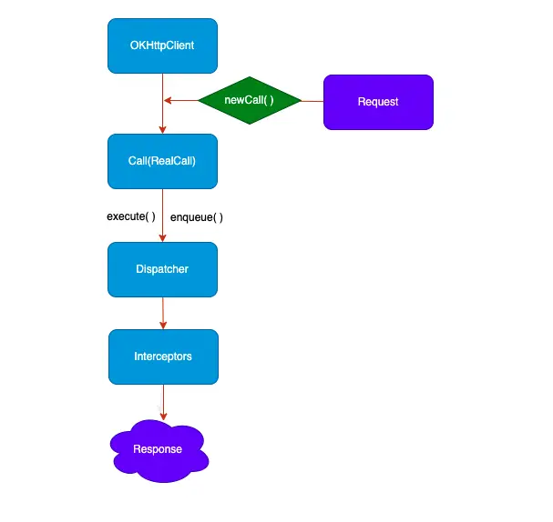

- # 前言
  collapsed:: true
	- OKhttp 是目前android主流的、 使用最广泛的网络框。
	  . 支持HTTP2，允许对同一主机的所有请求共享一个套接字
	  . 通过链接池减少了请求延迟
	  . 默认通过GZip压缩数据
	  . 缓存响应数据避免了重复请求的网络
	  . 请求失败自动重试主机的其他ip，自动重定向
	- 这篇文章介绍OKHttp的整个请求流程是怎样的，将会详细介绍请求的重试、缓存、连接池工作原理
- # Okhttp 请求流程
	- ## 1. okhttp调用流程
	  collapsed:: true
		- ```
		     //发起一个post请求
		      requestBody = new FormBody.Builder.add("name","value").build()
		      reuqust = new Request.Builder().url("url").post().build()
		      call = client.newCall(request)
		      response = call.enqueue(callback)
		  ```
		- 
		- 请求过程中包含了OkHttpClient、Request、Call、Dispatcher、Interceptors、Response，框架内部进行大量的逻辑处理，大部分逻辑集中在拦截器中，但是在进入拦截器之前还需要依靠分发器来调配请求任务
	- ## 2. Dispatcher（分发器）分发流程,内部维护请求队列与线程池，负责请求任务的分发
		- 