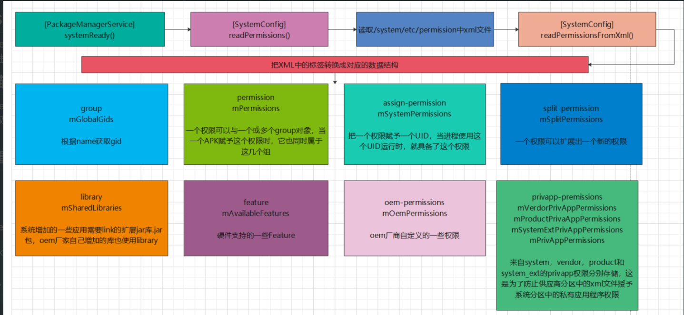
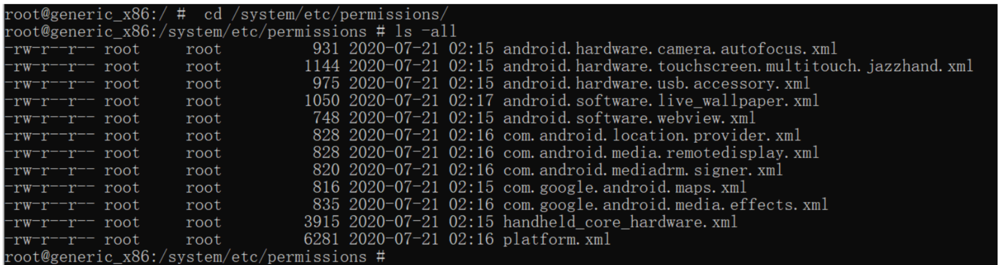

- # 一、此 “PMS之权限扫描” 学习的目标是：
	- PackageManagerService中执行systemReady()后，[[#red]]==**需要对/system/etc/permissions中的各种xml进行扫描，进行相应的权限存储，让以后可以使用**==，这就是本次“PMS只权限扫描”学习的目的
- # 二、权限扫描：
	- PackageManagerService执行systemReady()时，通过SystemConfig的readPermissionsFromXml()来扫描读取/system/etc/permissions中的xml文件,包括platform.xml和系统支持的各种硬件模块的feature主要工作:
	- ## 整体图：
		- {:height 339, :width 718}
- # 三、流程
	- ## 1、SystemConfig 的readPermissions函数：
		- 此函数目的：（扫描/system/etc/permissions中文件，调用readPermissionsFromXml()进行解析，存入SytemConfig相应的成员数组变量中）
		- ```java
		  void readPermissions(File libraryDir, int permissionFlag) {
		      ...
		      // Iterate over the files in the directory and scan .xml files
		      File platformFile = null;
		      for (File f : libraryDir.listFiles()) {
		          if (!f.isFile()) {
		              continue;
		          }
		          // 最后读取platform.xml
		          if (f.getPath().endsWith("etc/permissions/platform.xml")) {
		              platformFile = f;
		              continue;
		          }
		          ...
		          readPermissionsFromXml(f, permissionFlag);
		      }
		        // Read platform permissions last so it will take precedence
		      if (platformFile != null) {
		      	readPermissionsFromXml(platformFile, permissionFlag);
		      }
		  }
		  ```
	- ## 2、解析xml的标签节点：readPermissionsFromXml
		- 存入mGlobalGids、mPermissions、mSystemPermissions等成员变量中，供其他进行调用
		- readPermissionsFromXml
			- ```java
			  private void readPermissionsFromXml(File permFile, int permissionFlag) {
			      FileReader permReader = null;
			      permReader = new FileReader(permFile);
			      ...
			      XmlPullParser parser = Xml.newPullParser();
			      parser.setInput(permReader);
			      while (true) {
			          ...
			          String name = parser.getName();
			      	switch (name) {
			              //解析 group 标签，前面介绍的 XML 文件中没有单独使用该标签的地方
			              case "group": {
			                  String gidStr = parser.getAttributeValue(null, "gid");
			                      if (gidStr != null) {
			                      int gid = android.os.Process.getGidForName(gidStr);
			                      //转换 XML 中的 gid字符串为整型，并保存到 mGlobalGids 中
			                      mGlobalGids = appendInt(mGlobalGids, gid);
			                  } else {
			                      Slog.w(TAG, "<" + name + "> without gid in " + permFile + "
			                      at " + parser.getPositionDescription());
			                  }
			                  ...
			                  }
			              break;
			              case "permission": { //解析 permission 标签
			                  if (allowPermissions) {
			                        String perm = parser.getAttributeValue(null, "name");
			                        if (perm == null) {
			                            Slog.w(TAG, "<" + name + "> without name in " + permFile
			                            + " at " + parser.getPositionDescription());
			                            XmlUtils.skipCurrentTag(parser);
			                            break;
			                        }
			                        perm = perm.intern();
			                        readPermission(parser, perm); //调用 readPermission 处理,存入
			                        mPermissions
			                   } else {
			                      logNotAllowedInPartition(name, permFile, parser);
			                      XmlUtils.skipCurrentTag(parser);
			                   }
			              } break;
			           }
			      }
			  }
			  ```
	- ## 3、查看 XML文件
		- adb devices
		- adb shell
		- 
		- 然后在导出去：
			- ```java
			  adb pull /system/etc/permissions
			  ```
		- /system/etc/permissions中会存在很多的xml文件，例如我们看下 android.software.webview.xml的文件，内容如下：
		- 里面只只有一个feature "android.software.webview",大部分的xml都是类似的定义方式
		  collapsed:: true
			- ```xml
			  <?xml version="1.0" encoding="utf-8"?>
			  <permissions>
			  <feature name="android.software.webview" />
			  </permissions>
			  ```
		- 让我们来简单的看下/system/etc/permissions/platform.xml的内容
		  collapsed:: true
			- ```xml
			  <?xml version="1.0" encoding="utf-8"?>
			  <permissions>
			      <permission name="android.permission.BLUETOOTH_ADMIN" >
			      		<group gid="net_bt_admin" />
			      </permission>
			      
			     <permission name="android.permission.INTERNET" >
			     			 <group gid="inet" />
			      </permission>
			      
			    <permission name="android.permission.READ_LOGS" >
			    		  <group gid="log" />
			      </permission>
			      ...
			      <assign-permission name="android.permission.MODIFY_AUDIO_SETTINGS"
			      uid="media" />
			      <assign-permission name="android.permission.ACCESS_SURFACE_FLINGER"
			      uid="media" />
			      <assign-permission name="android.permission.WAKE_LOCK" uid="media" />
			      ...
			        <split-permission name="android.permission.ACCESS_FINE_LOCATION">
			      <new-permission name="android.permission.ACCESS_COARSE_LOCATION" />
			      </split-permission>
			      <split-permission name="android.permission.WRITE_EXTERNAL_STORAGE">
			      <new-permission name="android.permission.READ_EXTERNAL_STORAGE" />
			      </split-permission>
			      <split-permission name="android.permission.READ_CONTACTS"
			      targetSdk="16">
			      <new-permission name="android.permission.READ_CALL_LOG" />
			      </split-permission>
			      ...
			      <library name="android.test.base"
			      file="/system/framework/android.test.base.jar" />
			      <library name="android.test.mock"
			      file="/system/framework/android.test.mock.jar"
			      dependency="android.test.base" />
			      <library name="android.test.runner"
			      file="/system/framework/android.test.runner.jar"
			      dependency="android.test.base:android.test.mock" />
			      <!-- In BOOT_JARS historically, and now added to legacy applications. -->
			      <library name="android.hidl.base-V1.0-java"
			      file="/system/framework/android.hidl.base-V1.0-java.jar" />
			      <library name="android.hidl.manager-V1.0-java"
			      file="/system/framework/android.hidl.manager-V1.0-java.jar"
			      dependency="android.hidl.base-V1.0-java" />
			      ...
			  </permissions>
			  ```
		- ## 以上platform.xml中出现的标签种类则较为多样，它们的含义分别是：
			- ```java
			  platform.xml中出现的标签种类则较为多样，它们的含义分别是：
			  <group>:根据name获取gid
			  
			  <permission >标签：把属性name所描述的权限赋予给<group>标签中属性gid所表示的用户组，一个权限
			  可以有一个或多个group对象，当一个APK授权于这个这个权限时，它同时属于这几个组
			  
			  <assign-permission>标签：把属性name所描述的权限赋予给uid属性所表示的用户
			  
			  <split-permission>标签：一个权限可以扩展出一个新的权限
			  
			  <library>标签：除framework中动态库以外的，所有系统会自动加载的动态库
			  
			  <feature>标签：硬件支持的一些feature
			  
			  <oem-permission>标签：oem厂商自己定义的一些权限
			  
			  <privapp-permission>标签：来自system、vendor、product、system_ext的privapp权限分别存
			  储，这是防止供应商分区中的xml授权于系统分区中的私有应用权限
			  最后将上面xml解析出来的数据做如下存储：
			  
			  <group>标签gid属性的值会存放在mGlobalGids数组中;
			  
			  <permission>标签,解析得到的值会存放在mPermissions集合中;
			  
			  <assign-permission>标签解析得到的值会存放在mSystemPermissions中;
			  
			  <split-permission>存储在mSplitPermissions
			  
			  <library>标签解析得到的值会存放在mSharedLibraries中;
			  
			  <feature>存储在mAvaliableFeatures
			  
			  <oem-permission>存储在mOemPermissions
			  
			  <privapp-permission>会根据不同的存储路径，分别存储在mVendorPrivAppPermissions、
			  mProductPrivAppPermissions、mSystemExtPrivAppPermissions、mPrivAppPermissions
			  ```
- # 四、总结
	- **总结：权限扫描，扫描****/system/etc/permissions****中的****xml****，存入相应的结构体中，供之后权限管理使用
- # [[PKMS-权限扫描-面试]]