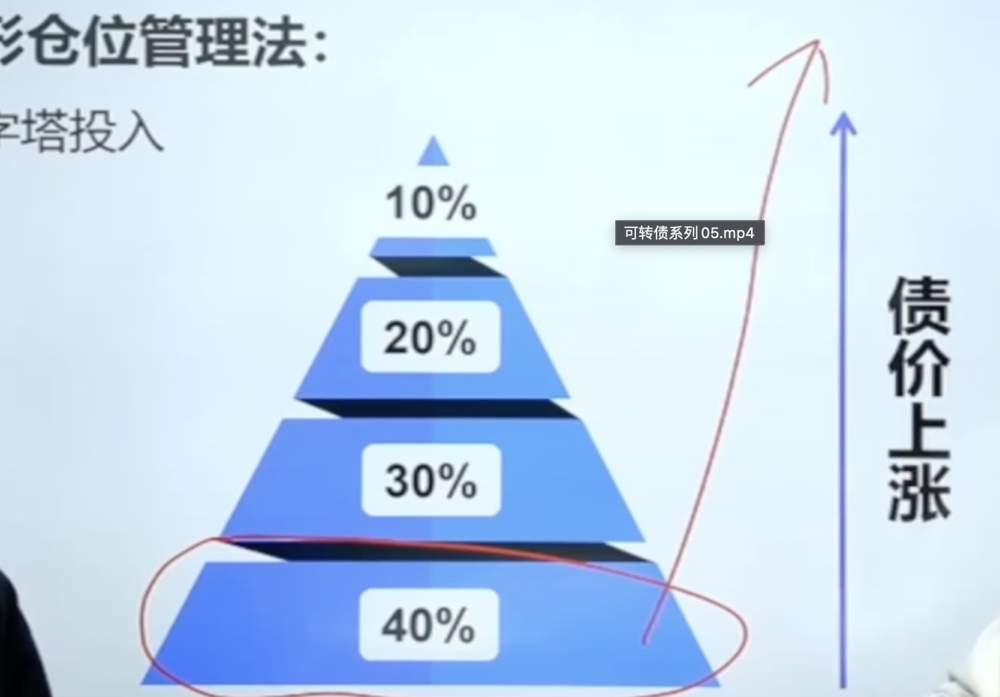
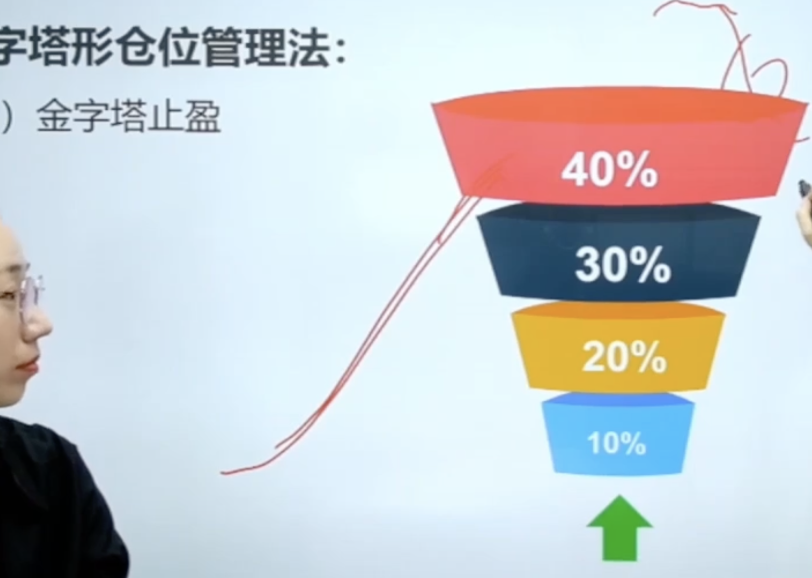

- # 一、用不满仓
- # 二、科学加仓、减仓
	- 开始买不确定啥时候上涨的可转债，可以少仓位埋伏进去。等要强赎什么的，再逐步加入
	- 比如开始 买3只可转债   各 10手埋伏着。看哪个有强赎的迹象 再加仓。
- # 三、科学止盈止损
	- 男的止盈难、女的止损难
- # 四、禁止频繁交易
-
- 上涨的，可以埋伏30%-40%
- {:height 549, :width 776}
- 止盈的下跌的  可以卖出40%
- 