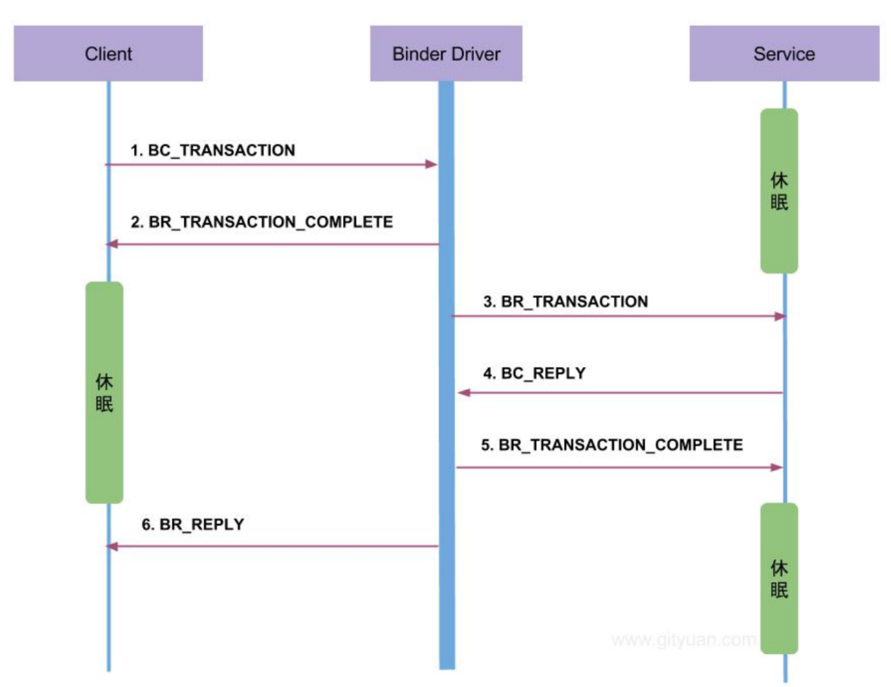

# ==命令流程==
collapsed:: true
	- 
	- ## 命令的记法
		- 向Binder驱动发送的命令就是，BinderCommond即 BC开头的
		- Binder驱动给客户端 服务端 发送的命令，BinderReply 即BR开头 命令
	- ## 命令流程 AMS添加服务举例，左侧客户端AMS 右侧服务端SM
		- 1、客户端想添加服务，给Binder驱动发送BC_TRANSACTION命令
		- 2、Binder驱动收到这个命令后
			- 给Client发送消息BR_TRANSACTION_COMPLETE，让它休眠
			- 给Service发送消息BR_TRANSACTION,让SM添加服务处理addService
		- 3、Service SM添加完服务AMS后，给Binder驱动发命令BC_REPLY
		- 4、Binder驱动收到这个命令后
			- 给Client发命令 BR_REPLY，唤醒客户端继续执行,客户端拿到BR_REPLY
			- 给Service SM发命令BR_TRANSACTION_COMPLETE
		-
- # [[注册获取服务整体流程，以AMS举例]]可看可不看
- # 梳理：注册服务ServiceManager的步骤
	- ## 1、注册AMS到SM，首先先从系统服务（SystemServer）获取到AMS实例==(AMS相当于客户端)==
	- ## 2、获取SM[[#red]]==（SM相当于服务端）==
	- AMS和MS 通过Binder通信的，通过Binder发送的命令就是下边介绍的BC_TRANSACTION
	- ##  3、执行SM.addService，注册
	-
- # 一、SytemServer
	- ## 入口函数
		- ```java
		  frameworks/base/services/java/com/android/server/SystemServer.java
		  // 167
		  public static void main(String[] args) {
		  	new SystemServer().run();
		  }
		  ```
	- ## 1-1.run创建 [[SystemServiceManager]]管理各种服务启动
		- ```java
		  frameworks/base/services/java/com/android/server/SystemServer.java
		  // 176
		  private void run() {
		      // 263 创建 SystemServiceManager 先创建一个系统管理
		      mSystemServiceManager = new SystemServiceManager(mSystemContext);
		      // 268
		      startBootstrapServices();
		      
		      xxx
		  }    
		  ```
	- ## 1-2.startBootstrapServices
		- ```java
		  frameworks/base/services/java/com/android/server/SystemServer.java
		  // 322
		  private void startBootstrapServices() {
		        // 329 通过ActivityManagerService.Lifecycle   获取 AMS 的对象
		        mActivityManagerService = mSystemServiceManager.startService(
		        								ActivityManagerService.Lifecycle.class).getService();
		        // 378 调用AMS的setSystemProcess
		        mActivityManagerService.setSystemProcess();
		  } 
		  
		  
		  ```
		- ## 反射创建ActivityManagerService.Lifecycle.class的实例，进而在构造函数创建AMS实例
			- ```java
			  SystemServiceManager.java
			  
			  public SystemService startService(String className) {
			          final Class<SystemService> serviceClass;
			          try {
			              serviceClass = (Class<SystemService>)Class.forName(className);
			          } catch (ClassNotFoundException ex) {
			              Slog.i(TAG, "Starting " + className);
			              throw new RuntimeException("Failed to create service " + className
			                      + ": service class not found, usually indicates that the caller should "
			                      + "have called PackageManager.hasSystemFeature() to check whether the "
			                      + "feature is available on this device before trying to start the "
			                      + "services that implement it", ex);
			          }
			          return startService(serviceClass);
			      }
			   
			  // 访问Lifecycle 的构造方法创造实例
			   public <T extends SystemService> T startService(Class<T> serviceClass) {
			          try {
			              final String name = serviceClass.getName();
			              Slog.i(TAG, "Starting " + name);
			              Trace.traceBegin(Trace.TRACE_TAG_SYSTEM_SERVER, "StartService " + name);
			  
			              // Create the service.
			              if (!SystemService.class.isAssignableFrom(serviceClass)) {
			                  throw new RuntimeException("Failed to create " + name
			                          + ": service must extend " + SystemService.class.getName());
			              }
			              final T service;
			              try {
			                  Constructor<T> constructor = serviceClass.getConstructor(Context.class);
			                  service = constructor.newInstance(mContext);
			              } catch (InstantiationException ex) {
			                  throw new RuntimeException("Failed to create service " + name
			                          + ": service could not be instantiated", ex);
			              } catch (IllegalAccessException ex) {
			                  throw new RuntimeException("Failed to create service " + name
			                          + ": service must have a public constructor with a Context argument", ex);
			              } catch (NoSuchMethodException ex) {
			                  throw new RuntimeException("Failed to create service " + name
			                          + ": service must have a public constructor with a Context argument", ex);
			              } catch (InvocationTargetException ex) {
			                  throw new RuntimeException("Failed to create service " + name
			                          + ": service constructor threw an exception", ex);
			              }
			  
			              startService(service);
			              return service;
			          } finally {
			              Trace.traceEnd(Trace.TRACE_TAG_SYSTEM_SERVER);
			          }
			      }
			  
			  // 调用 service.onStart(); 就是Lifecycle 的onStart
			      public void startService(@NonNull final SystemService service) {
			          // Register it.
			          mServices.add(service);
			          // Start it.
			          long time = SystemClock.elapsedRealtime();
			          try {
			              service.onStart();
			          } catch (RuntimeException ex) {
			              throw new RuntimeException("Failed to start service " + service.getClass().getName()
			                      + ": onStart threw an exception", ex);
			          }
			          warnIfTooLong(SystemClock.elapsedRealtime() - time, service, "onStart");
			      }
			  ```
		- ## 通过AMS的Lifecycle.class构造来创建AMS实例
		  collapsed:: true
			- ```java
			      public static final class Lifecycle extends SystemService {
			          private final ActivityManagerService mService;
			          private static ActivityTaskManagerService sAtm;
			  
			          public Lifecycle(Context context) {
			              super(context);
			              mService = new ActivityManagerService(context, sAtm);
			          }
			  
			          public static ActivityManagerService startService(
			                  SystemServiceManager ssm, ActivityTaskManagerService atm) {
			              sAtm = atm;
			              return ssm.startService(ActivityManagerService.Lifecycle.class).getService();
			          }
			  
			          @Override
			          public void onStart() {
			              mService.start();
			          }
			  
			          @Override
			          public void onBootPhase(int phase) {
			              mService.mBootPhase = phase;
			              if (phase == PHASE_SYSTEM_SERVICES_READY) {
			                  mService.mBatteryStatsService.systemServicesReady();
			                  mService.mServices.systemServicesReady();
			              } else if (phase == PHASE_ACTIVITY_MANAGER_READY) {
			                  mService.startBroadcastObservers();
			              } else if (phase == PHASE_THIRD_PARTY_APPS_CAN_START) {
			                  mService.mPackageWatchdog.onPackagesReady();
			              }
			          }
			  
			          @Override
			          public void onCleanupUser(int userId) {
			              mService.mBatteryStatsService.onCleanupUser(userId);
			          }
			  
			          public ActivityManagerService getService() {
			              return mService;
			          }
			      }
			  ```
	- ## 1-3.setSystemProcess
		- ```java
		  frameworks/base/services/core/java/com/android/server/am/ActivityManagerService.java
		  // 2172
		  public void setSystemProcess() {
		      // 2174 添加 AMS("activity")到 service_manager中
		      ServiceManager.addService(Context.ACTIVITY_SERVICE, this, true);
		  }
		  ```
	- ## 1-4.ServiceManager.addService。这还是在java层
		- ```java
		  frameworks/base/core/java/android/os/ServiceManager.java
		  // 87
		  public static void addService(String name, IBinder service, boolean allowIsolated) {
		      // 89 ---见后面小节（分别分析 getIServiceManager和 addService）
		      getIServiceManager().addService(name, service, allowIsolated);
		  }
		  ```
- # 二、getIServiceManager->ServiceManagerProxy
	- ## 代码
		- ```java
		  frameworks/base/core/java/android/os/ServiceManager.java
		  // 33
		  private static IServiceManager getIServiceManager() {
		      /* 采用单例形式返回 ServiceManagerProxy对象 */
		      if (sServiceManager != null) {
		      	return sServiceManager;
		      }
		      // 相当于 new ServiceManagerProxy(new BinderProxy); 
		      //---见后面小节（分别分析 asInterface和 getContextObject）
		      sServiceManager = ServiceManagerNative.asInterface(BinderInternal.getContextObject());
		      return sServiceManager;
		  }
		  ```
	- ## 2-1.BinderInternal.getContextObject,先看入参部分，内核层
		- ```java
		  frameworks/base/core/java/com/android/internal/os/BinderInternal.java
		  // 88
		  public static final native IBinder getContextObject();
		  ```
		- ### 2-1-1.android_os_BinderInternal_getContextObject
			- ```java
			  frameworks/base/core/jni/android_util_Binder.cpp
			  // 899
			  static jobject android_os_BinderInternal_getContextObject(JNIEnv* env, jobject clazz)
			  {
			      /* 1、打开 binder驱动（ProcessState是单例的），创建 BpBinder(handle) 对象，并返回 */
			      sp<IBinder> b = ProcessState::self()->getContextObject(NULL);
			      // 2、BinderProxy和 BpBinder互相绑定
			      return javaObjectForIBinder(env, b); // 返回BinderProxy
			  }
			  ```
			- ### 1、ProcessState::self()->getContextObject(NULL);
			  id:: 64a3d910-2e83-4758-ab9a-ddc8fc12701a
				- 打开 binder驱动（ProcessState是单例的），**==创建 BpBinder(handle) 对象==**，并返回
			- ### 2、javaObjectForIBinder：BinderProxy和 BpBinder互相绑定
			  collapsed:: true
				- ```c
				  frameworks/base/core/jni/android_util_Binder.cpp
				  // val 为传入的BpBinder
				  jobject javaObjectForIBinder(JNIEnv* env, const sp<IBinder>& val)
				  {
				      // 563 1、从 BpBinder中查找 BinderProxy对象，第一次为 null
				      jobject object = (jobject)val->findObject(&gBinderProxyOffsets);
				      // 576 2、创建 BinderProxy对象
				      object = env->NewObject(gBinderProxyOffsets.mClass,
				                              					gBinderProxyOffsets.mConstructor);
				      // 580 BinderProxy.mObject成员变量记录 BpBinder对象
				      env->SetLongField(object, gBinderProxyOffsets.mObject, (jlong)val.get());
				      // 587 将 BinderProxy对象信息添加到 BpBinder的成员变量 mObjects中
				      val->attachObject(&gBinderProxyOffsets, refObject,
				                                            jnienv_to_javavm(env), proxy_cleanup);
				      // 593 BinderProxy.mOrgue成员变量记录死亡通知对象
				      env->SetLongField(object, gBinderProxyOffsets.mOrgue, reinterpret_cast<jlong>
				      																(drl.get()));
				  }  
				  ```
				- BinderProxy java中是有这个类的
				- ## 作用
					- 创建BinderProxy
					- 将 BinderProxy和 BpBinder互相绑定
			- ### 总结
				- ==此方法返回了一个BinderProxy(内部持有BpBinder引用)==
	- ## 2-2.ServiceManagerNative.asInterface
		- ```java
		  frameworks/base/core/java/android/os/ServiceManagerNative.java
		  // 33
		  static public IServiceManager asInterface(IBinder obj)
		  {
		      // 38 因为 obj为 BinderProxy，默认返回 null
		      IServiceManager in = (IServiceManager)obj.queryLocalInterface(descriptor);
		      // 44 创建 ServiceManagerProxy
		      return new ServiceManagerProxy(obj);
		  }
		  ```
		- ## 总结：返回一个ServiceManagerProxy
		  collapsed:: true
			- ## ServiceManagerProxy
				- ```java
				  frameworks/base/core/java/android/os/ServiceManagerNative.java$ServiceManagerProxy.java
				  // 109
				  class ServiceManagerProxy implements IServiceManager {
				  // mRemote为 BinderProxy对象
				  public ServiceManagerProxy(IBinder remote) {
				  	mRemote = remote;
				  }
				  ```
	- ## 总结
		- getIServiceManager（） 相当于new ==ServiceManagerProxy==(new BinderProxy); 详细看上边代码
- ## 那么相当于执行ServiceManagerProxy.addService
- # 三、SMP.addService
	- ```java
	  frameworks/base/core/java/android/os/ServiceManagerNative.java$ServiceManagerProxy.java
	  // 142
	  public void addService(String name, IBinder service, boolean allowIsolated)
	  																	throws RemoteException {
	  { 
	      Parcel data = Parcel.obtain();
	      Parcel reply = Parcel.obtain();
	      // 重点1：此处 service == AMS
	      data.writeStrongBinder(service); // 相当于把AMS 放入 data里边去
	    
	     	// 重点2：mRemote为 BinderProxy对象
	  	mRemote.transact(ADD_SERVICE_TRANSACTION, data, reply, 0);
	  }
	  ```
	- # 3-1、Parcel.writeStrongBinder：相当于把AMS 放入 data里边去
	  collapsed:: true
		- ```java
		  frameworks/base/core/java/android/os/Parcel.java
		  // 583
		  public final void writeStrongBinder(IBinder val) {
		  	nativeWriteStrongBinder(mNativePtr, val);
		  }
		  ```
		- nativeWriteStrongBinder映射对应的Native 层方法：android_os_Parcel_writeStrongBinder
		- # 3-1-1.android_os_Parcel_writeStrongBinder
			- ```java
			  frameworks/base/core/jni/android_os_Parcel.cpp
			  // 298
			  static void android_os_Parcel_writeStrongBinder(JNIEnv* env, jclass clazz, jlong
			  														nativePtr, jobject object)
			  {
			        // 300 将java层 Parcel转换为 native层 Parcel
			        Parcel* parcel = reinterpret_cast<Parcel*>(nativePtr);
			        // 302  writeStrongBinder这个就是 native 层的 Parcel
			        // ---见后面小节（分别分析 ibinderForJavaObject和 writeStrongBinder）
			        const status_t err = parcel->writeStrongBinder(ibinderForJavaObject(env,
			        																	object));
			  }
			  ```
			- ## 3-2-1.ibinderForJavaObject： 创建一个 JavaBBinder 对象并返回
				- ```java
				  frameworks/base/core/jni/android_util_Binder.cpp
				  // 603
				  sp<IBinder> ibinderForJavaObject(JNIEnv* env, jobject obj)
				  {  
				        // 607   // 是否是 Java层的 Binder对象，此处是 AMS，if命中
				        if (env->IsInstanceOf(obj, gBinderOffsets.mClass)) { 
				  
				            JavaBBinderHolder* jbh = (JavaBBinderHolder*)
				            env->GetLongField(obj, gBinderOffsets.mObject);
				            // 返回 JavaBBinder对象
				            return jbh != NULL ? jbh->get(env, obj) : NULL; 
				        }
				  }
				  ```
				- ### 3-2-1-1.JavaBBinderHolder.get
				  collapsed:: true
					- ```java
					  frameworks/base/core/jni/android_util_Binder.cpp$JavaBBinderHolder.cpp
					  // 317
					  sp<JavaBBinder> get(JNIEnv* env, jobject obj)
					  {
					  	// 320
					      sp<JavaBBinder> b = mBinder.promote(); // 将弱指针升级为强指针，首次进来返回空指针
					      if (b == NULL) {
					      b = new JavaBBinder(env, obj); // 创建一个 JavaBBinder 对象并返回
					  }
					  ```
				- ## 记住：writeStrongBinder的参数是 ==JavaBBinder对象==。
			- ## 3-2-2.(Parcel.cpp)parcel->writeStrongBinder
			  collapsed:: true
				- ```java
				  frameworks/native/libs/binder/Parcel.cpp
				  // 872
				  status_t Parcel::writeStrongBinder(const sp<IBinder>& val)
				  {
				  	return flatten_binder(ProcessState::self(), val, this);
				  }
				  ```
				- ### 3-2-2-1.flatten_binder
					- ```c
					  frameworks/native/libs/binder/Parcel.cpp
					  // 205
					  status_t flatten_binder(const sp<ProcessState>& /*proc*/,
					  							const sp<IBinder>& binder, Parcel* out)
					  {
					      // 208
					      flat_binder_object obj;
					      // 212 当前进程有 Binder，所以本地 Binder不为空
					      IBinder *local = binder->localBinder();
					      // 224 Binder对象扁平化，转换成 flat_binder_object对象
					      obj.type = BINDER_TYPE_BINDER;
					      obj.binder = reinterpret_cast<uintptr_t>(local->getWeakRefs());
					      obj.cookie = reinterpret_cast<uintptr_t>(local);
					      // 234
					      return finish_flatten_binder(binder, obj, out);
					  }
					  ```
					- 作用：将binder信息保存到flat_binder_object对象中
				- ### 3-2-2-2.finish_flatten_binder
					- ```c
					  frameworks/native/libs/binder/Parcel.cpp
					  // 199
					  inline static status_t finish_flatten_binder(const sp<IBinder>& /*binder*/,
					                                               const flat_binder_object& flat,
					                                               Parcel* out)
					  {
					        // 将 flat_binder_object写入 out
					        return out->writeObject(flat, false);
					  }
					  ```
					- 作用：将 flat_binder_object写入 out（data）
	- # 3-2、BinderProxy.transact（mRemote为 BinderProxy对象）（BinderProxy为Binder.java里的）
		- ```java
		  frameworks/base/core/java/android/os/ServiceManagerNative.java$ServiceManagerProxy.java
		  // 142
		  public void addService(String name, IBinder service, boolean allowIsolated)
		  															throws RemoteException {
		      // 150 mRemote为 BinderProxy对象
		      mRemote.transact(ADD_SERVICE_TRANSACTION, data, reply, 0);
		  }
		  ```
		- # 3-1.BinderProxy.transact
		  collapsed:: true
			- ```java
			  frameworks/base/core/java/android/os/Binder.java$BinderProxy.java
			  // 501
			  public boolean transact(int code, Parcel data, Parcel reply, int flags) throws
			  																RemoteException {
			      // 503  调用映射的 Native方法
			      return transactNative(code, data, reply, flags);
			  }  
			  ```
		- # 3-2.android_os_BinderProxy_transact（Native映射）
		  collapsed:: true
			- ```c
			  frameworks/base/core/jni/android_util_Binder.cpp
			  // 1083
			  static jboolean android_os_BinderProxy_transact(JNIEnv* env, jobject obj,
			  				jint code, jobject dataObj, jobject replyObj, jint flags) // throws
			  							RemoteException
			  {
			          // 1091 获取 data对象
			          Parcel* data = parcelForJavaObject(env, dataObj);
			          // 1095 获取 reply对象
			          Parcel* reply = parcelForJavaObject(env, replyObj);
			          // 1100 获取 BpBinder 对象
			          IBinder* target = (IBinder*)env->GetLongField(obj, gBinderProxyOffsets.mObject);
			          // 1124  BpBinder. transact
			          status_t err = target->transact(code, *data, reply, flags);
			  }
			  ```
		- # 3-3.BpBinder::transact
		  collapsed:: true
			- ```c
			  frameworks/native/libs/binder/BpBinder.cpp
			  // 159
			  status_t BpBinder::transact(uint32_t code, const Parcel& data, Parcel* reply,
			                              uint32_t flags)
			  {  
			      // 164
			      status_t status = IPCThreadState::self()->transact(mHandle, code, data, 
			                                                         reply, flags);
			  }  
			  ```
		- # 3-4.IPCThreadState::transact
			- ```c
			  frameworks/native/libs/binder/IPCThreadState.cpp
			  // 548
			  status_t IPCThreadState::transact(int32_t handle,
			  												uint32_t code, const Parcel& data,
			  												Parcel* reply, uint32_t flags)
			  {
			          // 552 数据错误检查
			        status_t err = data.errorCheck();
			        // 554
			        flags |= TF_ACCEPT_FDS;  
			        // TF_ACCEPT_FDS = 0x10：允许回复中包含文件描述符
			        // TF_ONE_WAY：当前业务是异步的，不需要等待
			        // TF_ROOT_OBJECT：所包含的内容是根对象
			        // TF_STATUS_CODE：所包含的内容是 32-bit 的状态值
			    
			        // 566 整理数据，并把结果存入 mOut 中。（在 talkWithDriver方法中才会将命令真正发送给
			        // Binder驱动）
			        err = writeTransactionData(BC_TRANSACTION, flags, handle, code, data, NULL);
			        // 574
			        if ((flags & TF_ONE_WAY) == 0) { // 不是异步，if命中
			            if (reply) { // 不为空
			            		err = waitForResponse(reply); // 等待回应事件
			            }
			        }
			  }  
			  ```
			- ## 3-4-1.writeTransactionData
				- ```c
				  frameworks/native/libs/binder/IPCThreadState.cpp
				  // 904  cmd 传入的 BC_TRANSACTION
				  status_t IPCThreadState::writeTransactionData(int32_t cmd, uint32_t binderFlags,
				  		int32_t handle, uint32_t code, const Parcel& data, status_t* statusBuffer)
				  {
				      // 934
				      mOut.writeInt32(cmd); // mOut写入命令为 BC_TRANSACTION
				      mOut.write(&tr, sizeof(tr)); // 写入 binder_transaction_data数据
				  }
				  ```
				- ## ==作用==：mOut写入命令为 BC_TRANSACTION
					- AMS和MS 通过Binder通信的，通过Binder发送的命令就是BC_TRANSACTION
			- ## 3-4.2.IPCThreadState::waitForResponse--1
			  collapsed:: true
				- ```c
				  frameworks/native/libs/binder/IPCThreadState.cpp
				  // 712
				  status_t IPCThreadState::waitForResponse(Parcel *reply, status_t *acquireResult)
				  {
				      // 717 循环等待结果
				      while (1) {
				      	if ((err=talkWithDriver()) < NO_ERROR) break;
				  }      
				  ```
				- ## 3-5-1.==talkWithDriver==重要
					- ```c
					  frameworks/native/libs/binder/IPCThreadState.cpp
					  // 803
					  status_t IPCThreadState::talkWithDriver(bool doReceive)
					        // 812 读的 buffer是否为空。现在读为 null
					        const bool needRead = mIn.dataPosition() >= mIn.dataSize();
					        // 817 // 读的时候不能写 mOut
					        const size_t outAvail = (!doReceive || needRead) ? mOut.dataSize() : 0; 
					        bwr.write_size = outAvail;
					   		// 在 bwr中填写需要 write的大小和内容
					        bwr.write_buffer = (uintptr_t)mOut.data();
					        if (doReceive && needRead) {
					              bwr.read_size = mIn.dataCapacity();
					              bwr.read_buffer = (uintptr_t)mIn.data();
					        } else { // needRead为 null，走 else
					              bwr.read_size = 0;
					              bwr.read_buffer = 0;
					          }
					        // 851// while循环条件不会成立，只执行一次
					        do { 
					        		/* 856 写入命令 BC_TRANSACTION */ 进入Binder驱动层
					        		if (ioctl(mProcess->mDriverFD, BINDER_WRITE_READ, &bwr) >= 0)
					        } while (err == -EINTR);
					  ```
					- ### 进入驱动层：ioctl 会进入驱动层->binder_ioctl_write_read
				- ## 3-5-2.binder_ioctl_write_read--1先看用户写入数据+唤醒SM
					- ```c
					  kernel/drivers/staging/android/binder.c
					  // 3136
					  static int binder_ioctl_write_read(struct file *filp,
					  									unsigned int cmd, unsigned long arg,
					  									struct binder_thread *thread)
					  {
					        // 3161 通过这个函数写入用户的数据
					        ret = binder_thread_write(proc, thread,
					                                bwr.write_buffer,
					                                bwr.write_size,
					                                &bwr.write_consumed);
					  }
					  ```
					- ### 3-5-2-1.binder_thread_write
						- ```c
						  kernel/drivers/staging/android/binder.c
						  // 2250
						  static int binder_thread_write(struct binder_proc *proc,
						                              struct binder_thread *thread,
						                              binder_uintptr_t binder_buffer, size_t size,
						                              binder_size_t *consumed)
						    // 2442
						    case BC_TRANSACTION:
						                // 此处 cmd == BC_TRANSACTION，第四个参数为false
						                binder_transaction(proc, thread, &tr,cmd == BC_REPLY, 0);
						    
						  ```
					- ### 3-5-2-2.binder_transaction
						- ```c
						  kernel/drivers/staging/android/binder.c
						  // 1829
						  static void binder_transaction(struct binder_proc *proc,
						                              struct binder_thread *thread,
						                              struct binder_transaction_data *tr, int reply,
						                              binder_size_t extra_buffers_size)
						        struct binder_transaction *t;
						        struct binder__work *tcomplete;
						        // 1861 此处 reply为 false（cmd == BC_TRANSACTION）
						        if (reply) {
						        
						        } else {
						            // handle = 0
						            // 不命中 if，handle不为 0，才会命中 if
						            if (tr->target.handle) { 
						              
						            } else { // 此处走 else
						            /* 获取目标对象的 target_node，目标是 service_manager，
						            				所以可以直接使用全局变量binder_context_mgr_node */
						            		target_node = context->binder_context_mgr_node;
						            }
						            /* 1919 target_proc为 service_manager进程 */
						            target_proc = target_node->proc;
						        }
						        // 1954 找到 service_manager进程的 todo队列
						        target_list = &target_proc->todo;
						        target_wait = &target_proc->wait;
						        // 1960 生成一个 binder_transaction 变量（即变量 t），用于描述本次要进行的
						        // transaction（最后将其加入 target_thread->todo）。
						        // 这样当目标对象被唤醒时，它就可以从这个队列中取出需要做的工作。
						        t = kzalloc(sizeof(*t), GFP_KERNEL);
						        // 1967 生成一个binder_work变量（即变量 tcomplete），用于说明当前调用者线程有一宗未完成的
						        //transaction（它最后会被添加到本线程的 todo队列中）
						        tcomplete = kzalloc(sizeof(*tcomplete), GFP_KERNEL);
						        
						        // 1996 给 transaction结构体赋值，即变量 t
						  		// 非 oneway的通信方式，把当前 thread保存到transaction的 from字段
						        if (!reply && !(tr->flags & TF_ONE_WAY)) 
						        		t->from = thread;
						        else
						        		t->from = NULL;
						        t->sender_euid = task_euid(proc->tsk);
						        t->to_proc = target_proc; // 此次通信目标进程为 service_manager进程
						        t->to_thread = target_thread;
						        t->code = tr->code; // 此次通信 code = ADD_SERVICE_TRANSACTION
						        t->flags = tr->flags; // 此次通信 flags = 0
						        t->priority = task_nice(current);
						  
						        // 2009 从 service_manager进程中分配 buffer(为完成本条 transaction
						  		//申请内存，从 binder_mmap开辟的空间中申请内存)
						        t->buffer = binder_alloc_buf(target_proc, tr->data_size,
						        tr->offsets_size, extra_buffers_size,
						        !reply && (t->flags & TF_ONE_WAY));
						        // 2028 分别拷贝用户空间的 binder_transaction_data中 
						        //     ptr.buffer和 ptr.offsets到内核
						        // 这里开始第一次有效数据的拷贝
						        if (copy_from_user(t->buffer->data, (const void __user *)(uintptr_t)
						        								tr->data.ptr.buffer, tr->data_size)) {
						        }
						        if (copy_from_user(offp, (const void __user *)(uintptr_t)
						        							tr->data.ptr.offsets, tr->offsets_size)) {
						        }
						        // 2059
						        for (; offp < off_end; offp++) {
						            switch(hdr->type){
						              // 2075
						              case BINDER_TYPE_BINDER:
						              case BINDER_TYPE_WEAK_BINDER: {
						                    struct flat_binder_object *fp;
						                    fp = to_flat_binder_object(hdr);
						                    /* 创建 binder_ref，service_manager的 binder引用对象--
						                    -见后面小节 */
						                    ret = binder_translate_binder(fp, t, thread);
						                    if (ret < 0) {
						                        return_error = BR_FAILED_REPLY;
						                        goto err_translate_failed;
						                    }
						               } break;
						        		}
						        // 2187
						        if(reply)  {
						          
						        } else if (!(t->flags & TF_ONE_WAY)) {
						        		// 2191// 记录本次 transaction,以备后期查询
						           	//（service_manager通过这个知道是谁调用的，从而返回数据）
						        		thread->transaction_stack = t;
						        }
						        // 2201
						          // 1、设置 t的类型为 BINDER_WORK_TRANSACTION 给sm做事
						        t->work.type = BINDER_WORK_TRANSACTION; 
						        // 将 t加入目标的处理队列中
						        list_add_tail(&t->work.entry, target_list); 
						        //2、 给client发送命令 BINDER_WORK_TRANSACTION_COMPLETE-让client 挂起
						        tcomplete->type = BINDER_WORK_TRANSACTION_COMPLETE;
						         // 当前线程有一个未完成的操作
						        list_add_tail(&tcomplete->entry, &thread->todo);
						        // 唤醒 SM  
						        if (target_wait) // sm是等待状态，现在是要唤醒
						              // 唤醒目标，即 service_manager
						            wake_up_interruptible(target_wait);
						  ```
						- #### 3-5-2-2-1.binder_translate_binder
							- ```c
							  kernel/drivers/staging/android/binder.c
							  // 1564
							  static int binder_translate_binder(struct flat_binder_object *fp,
							                                      struct binder_transaction *t,
							                                      struct binder_thread *thread)
							  {
							      // 1592 创建一个 binder_ref
							      ref = binder_get_ref_for_node(target_proc, node);
							      // 1596 改变类型为 BINDER_TYPE_HANDLE
							      if (fp->hdr.type == BINDER_TYPE_BINDER)
							          fp->hdr.type = BINDER_TYPE_HANDLE;
							  }
							  ```
							- 作用：改变类型为 BINDER_TYPE_HANDLE
				- ## 3-5-2.binder_ioctl_write_read--2--service_manager已被唤醒
					- ```c
					  kernel/drivers/staging/android/binder.c
					  // 3136
					  static int binder_ioctl_write_read(struct file *filp,
					                                      unsigned int cmd, unsigned long arg,
					                                      struct binder_thread *thread)
					  {
					   // 3174
					  ret = binder_thread_read(proc, thread, bwr.read_buffer,
					                                      bwr.read_size,
					                                      &bwr.read_consumed,
					                                      filp->f_flags & O_NONBLOCK);
					  ```
					- ### 3-5-2-3.binder_thread_read
						- ```c
						  kernel/drivers/staging/android/binder.c
						  // 2652
						  static int binder_thread_read(struct binder_proc *proc,
						                                struct binder_thread *thread,
						                                binder_uintptr_t binder_buffer, size_t size,
						                                binder_size_t *consumed, int non_block)
						  // 2664 如果 consumed==0，则写入一个 BR_NOOP
						  if (*consumed == 0) {
						  	if (put_user(BR_NOOP, (uint32_t __user *)ptr))
						  // 2739 前面把一个 binder_work添加到 thread->todo队列中
						  //  ，所以 w不为空，类型为 BINDER_WORK_TRANSACTION_COMPLETE
						  if (!list_empty(&thread->todo)) {
						  	w = list_first_entry(&thread->todo, struct binder_work,entry);
						  // 2760 写入命令 BR_TRANSACTION_COMPLETE
						  case BINDER_WORK_TRANSACTION_COMPLETE: {
						  	cmd = BR_TRANSACTION_COMPLETE;
						  	if (put_user(cmd, (uint32_t __user *)ptr))
						  ```
		- # 3-5.IPCThreadState::waitForResponse--2
		  collapsed:: true
			- ```c
			  frameworks/native/libs/binder/IPCThreadState.cpp
			  // 712
			  status_t IPCThreadState::waitForResponse(Parcel *reply, status_t *acquireResult)
			    // 786 处理 BR_NOOP命令，什么也没干
			    default:
			        err = executeCommand(cmd);
			    // 718 while循环，继续执行 talkWithDriver方法
			    if ((err=talkWithDriver()) < NO_ERROR) break;
			    // 812 因为 mIn中有数据，所以 needRead为 false，导致 bwr.write_size和
			    //bwr.read_size都为0，直接返回
			    const bool needRead = mIn.dataPosition() >= mIn.dataSize();
			    // 731 处理 BR_TRANSACTION_COMPLETE命令
			    case BR_TRANSACTION_COMPLETE:
			  		// 当前为同步，不会进入 if，继续while循环
			        if (!reply && !acquireResult) goto finish; 
			        // 再次执行 talkWithDriver方法，这个时候 bwr.write_size==0,bwr.read_size还是大于
			       // 0，所以直接执行驱动中 binder_thread_read
			  	if ((err=talkWithDriver()) < NO_ERROR) break;
			  ```
		- # 3-6.binder_thread_read--Client线程进入等待
		  collapsed:: true
			- ```c
			  kernel/drivers/staging/android/binder.c
			  // 2652
			  static int binder_thread_read(struct binder_proc *proc,
			                                struct binder_thread *thread,
			                                binder_uintptr_t binder_buffer, size_t size,
			                                binder_size_t *consumed, int non_block)
			  // 2664 放入 BR_NOOP命令
			  if (*consumed == 0) {
			  		if (put_user(BR_NOOP, (uint32_t __user *)ptr))
			  // 2671 此时 wait_for_proc_work为false
			  wait_for_proc_work = thread->transaction_stack == NULL &&list_empty(&thread->todo);
			  // 2717
			  if (non_block) { // 是阻塞模式的，所以 if不会命中
			  
			  } else // client 进入等待，直到 service_manager 来唤醒
			  	ret = wait_event_freezable(thread->wait, binder_has_thread_work(thread));
			  ```
		- # 3-7.binder_thread_read--service_manager开始处理消息
			- ```c
			  kernel/drivers/staging/android/binder.c
			  // 2652
			  static int binder_thread_read(struct binder_proc *proc,
			                                struct binder_thread *thread,
			                                binder_uintptr_t binder_buffer, size_t size,
			                                binder_size_t *consumed, int non_block)
			  // 2757 主要是把用户的请求复制到 service_manager中并对各种队列进行调整
			  case BINDER_WORK_TRANSACTION: {
			  	t = container_of(w, struct binder_transaction, work);
			      // 2898 设置命令为 BR_TRANSACTION
			      cmd = BR_TRANSACTION;
			  ```
		- # 3-8.binder_loop
			- ```c
			  frameworks/native/cmds/servicemanager/binder.c
			  // 372
			  void binder_loop(struct binder_state *bs, binder_handler func)
			      // 397 对 getService请求进行解析
			      res = binder_parse(bs, 0, (uintptr_t) readbuf, bwr.read_consumed, func);
			  ```
		- # 3-9.binder_parse
			- ```c
			  frameworks/native/cmds/servicemanager/binder.c
			  // 204
			  int binder_parse(struct binder_state *bs, struct binder_io *bio,
			  								uintptr_t ptr, size_t size, binder_handler func)
			        // 230
			        case BR_TRANSACTION: {
			        // 237
			        if (func) {
			            // 243 为 reply初始化
			            bio_init(&reply, rdata, sizeof(rdata), 4);
			            // 245// 由 svcmgr_handler 处理请求
			            res = func(bs, txn, &msg, &reply); 
			            // 将 reply发给binder驱动
			            binder_send_reply(bs, &reply, txn->data.ptr.buffer, res);
			  }
			  ```
			- ## 3-9-1.service_manager：svcmgr_handler
				- ```c
				  frameworks/native/cmds/servicemanager/service_manager.c
				  // 251
				  int svcmgr_handler(struct binder_state *bs,
				                      struct binder_transaction_data *txn,
				                      struct binder_io *msg,
				                      struct binder_io *reply)
				  // 309
				  case SVC_MGR_ADD_SERVICE:
				      // 316 注册指定服务
				      if (do_add_service(bs, s, len, handle, txn->sender_euid,
				                         allow_isolated, txn->sender_pid))
				  ```
				- ### 3-9-1-1.do_add_service
				  id:: 64a3c9f7-95b8-418f-bf37-5a04b5c17b19
				  collapsed:: true
					- ```c
					  frameworks/native/cmds/servicemanager/service_manager.c
					  // 201
					  int do_add_service(struct binder_state *bs,
					  					const uint16_t *s, size_t len,
					                     uint32_t handle, uid_t uid, int allow_isolated,
					  					pid_t spid)
					      // 214
					      if (!svc_can_register(s, len, spid, uid)) {
					      // 220 查找服务在不在sm里
					      si = find_svc(s, len);
					      if (si) {
					          if (si->handle) {
					              // 服务已注册时，释放相应的服务
					              svcinfo_death(bs, si); 
					          }
					            // 重新放入新的handle
					          si->handle = handle; 
					      } else {
					          si = malloc(sizeof(*si) + (len + 1) * sizeof(uint16_t));
					  
					          if (!si) { // 内存不足，无法分配足够内存
					              return -1;
					          }
					          si->handle = handle;
					          si->len = len;
					          memcpy(si->name, s, (len + 1) * sizeof(uint16_t));// 内存拷贝服务信息
					          si->name[len] = '\0';
					          si->death.func = (void*) svcinfo_death;
					          si->death.ptr = si;
					          si->allow_isolated = allow_isolated;
					          si->next = svclist; // svclist保存所有已注册的服务
					          svclist = si;
					      }
					  /* 以 BC_ACQUIRE命令，handle为目标的信息，通过 ioctl发送给 binder驱动，binder_ref强引用
					  加 1操作 */
					  binder_acquire(bs, handle);
					  /* 以 BC_REQUEST_DEATH_NOTIFICATION命令的信息，通过 ioctl发送给 binder驱动，主要用于清
					  理内存等收尾工作 */
					  binder_link_to_death(bs, handle, &si->death);
					  ```
			- ## 3-9-2.binder_send_reply
				- ```c
				  frameworks/native/cmds/servicemanager/binder.c
				  // 170
				  void binder_send_reply(struct binder_state *bs,
				                        struct binder_io *reply,
				                        binder_uintptr_t buffer_to_free,
				                        int status)
				      // 182
				      data.cmd_free = BC_FREE_BUFFER; // free buffer命令
				      data.buffer = buffer_to_free;
				      data.cmd_reply = BC_REPLY; // reply命令
				      data.txn.target.ptr = 0;
				      data.txn.cookie = 0;
				      data.txn.code = 0;
				      if (status) { // status == 0
				      } else {
				          data.txn.flags = 0;
				          data.txn.data_size = reply->data - reply->data0;
				          data.txn.offsets_size = ((char*) reply->offs) - ((char*) reply->offs0);
				          data.txn.data.ptr.buffer = (uintptr_t)reply->data0;
				          data.txn.data.ptr.offsets = (uintptr_t)reply->offs0;
				      }
				      binder_write(bs, &data, sizeof(data)); // 向 Binder驱动通信
				  ```
				- ### 3-9-2-1. binder_thread_write
					- ```c
					  kernel/drivers/staging/android/binder.c
					  // 2250
					  static int binder_thread_write(struct binder_proc *proc,
					                                struct binder_thread *thread,
					                                binder_uintptr_t binder_buffer, size_t size,
					                                binder_size_t *consumed)
					  binder_transaction(proc, thread, &tr,cmd == BC_REPLY, 0);
					  ```