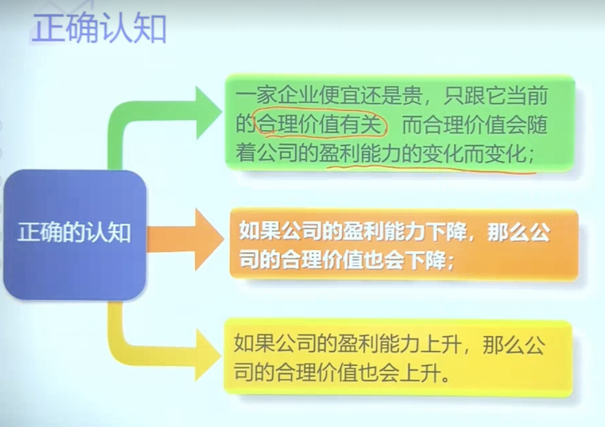
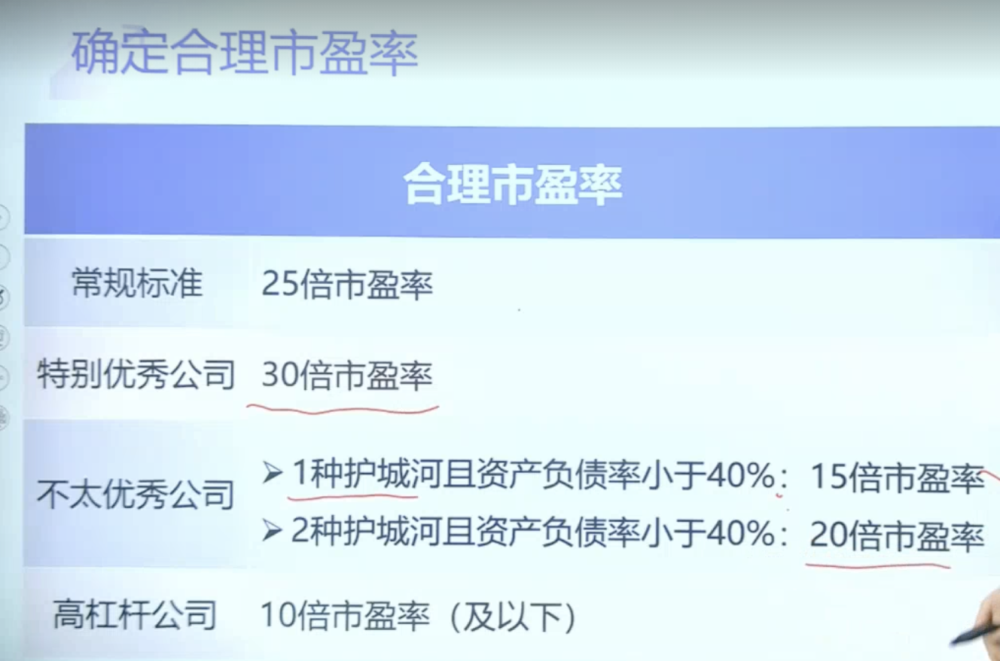
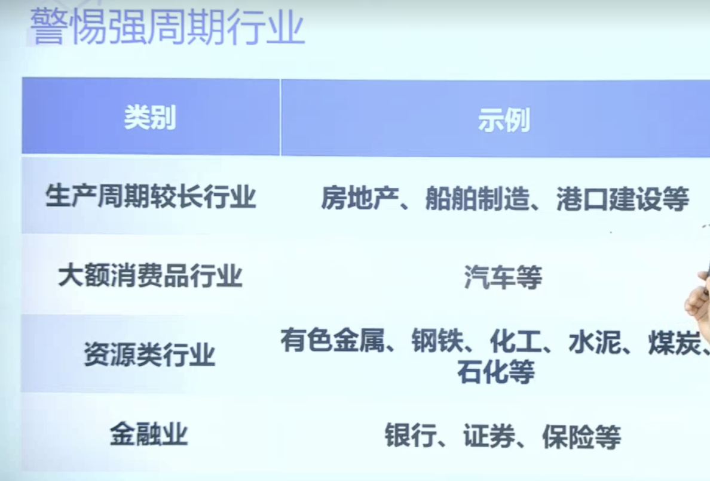
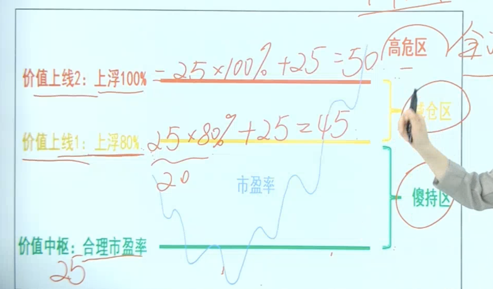
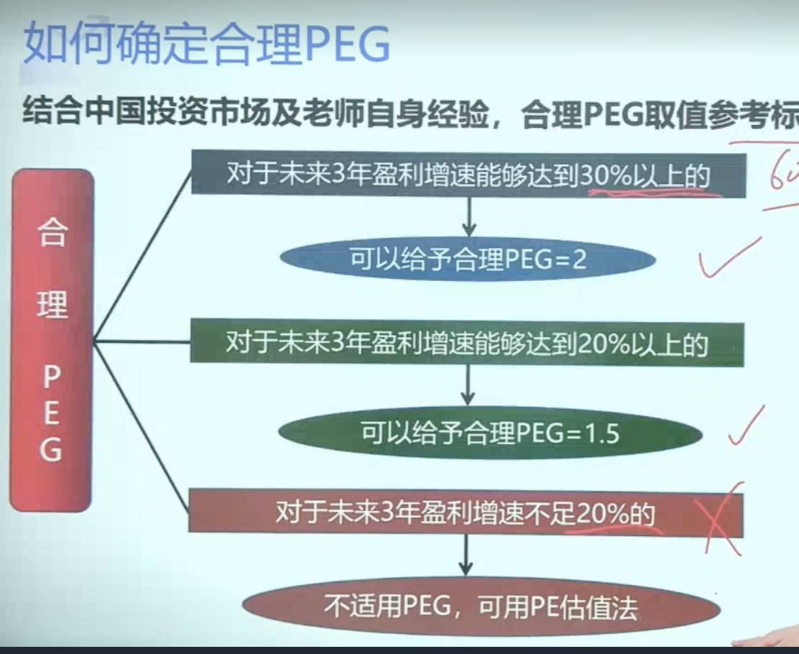

- # PE 市盈率估值法(为主)
  collapsed:: true
	- ### 一、什么是市盈率估值法
	  collapsed:: true
		- 前言
		  collapsed:: true
			- 
		- ==试用条件==
			- 市盈率估值法，主要适用于盈利稳定的好公司，而且最好是低资产负债率[小于40%]的公司
		- 方法
			- 相关公式
				- ==市值== = 市盈率PE*净利润
				- EPS(每股净利润) = 净利润/总股本
				- 股价 = ==市值==/总股本  = 市盈率PE X 净利润/总股本 = PE X EPS
			- 估值
				- 3年后的合理[市值] = 合理[市盈率] X 3年后的[净利润]
	- ### 二、如何确定合理市盈率与合理净利润
	  collapsed:: true
		- ### 一、确定合理的市盈率
		  collapsed:: true
			- 
			- 合理市盈率为上限为25  (因为无风险收益率为4%  需要25年回本)
				- 好公司标准： 给出25倍市盈率
				  collapsed:: true
					- 1、护城河多且宽(3个及以上算宽)
					- 2、全国性的行业龙头
					- 3、行业增速高于10%
					- 4、细分行业规模高于100亿
				- 不是很好，护城河不够宽/行业增速不理想-> 市盈率打折(越不符合标准的公司，打折越低)
					- 25倍打8折   20倍
					- 25倍打6折   15倍
			- 1、对于盈利稳健、低资产负债率的好公司，合理市盈率25倍
			- 2、对于极其优秀的公司[]，合理市盈率可以放宽到30倍
			- 3、银行、保险、证券、地产等高杠杆的公司，合理市盈率给10倍及以下
			- ### 问题
				- ### 一、好公司很少有在25倍市盈率以下的，都偏高，怎么办？
					- 雪球app中 个股可以看见[财务] -> 选市盈率-> 切到5年 看历史市盈率，其中 分位值 20 是比历史20%都高，100%的话就是历史最高值
				-
		- ### 二、确定合理净利润
		  collapsed:: true
			- 条件
				- 1、净利润的含金量是否大于100%？
				- 2、净利润未来3年是否能持续增长？
					- 看过去的增幅 预估下
				- 3、净利润未来3年每年增长率预计是多少？
					- 通过微淼->分析工具->估值计算器 直接用
			-
	- ### 三、实操
	  collapsed:: true
		- 通过微淼->分析工具->估值计算器
	- ==# 警惕强周期行业==   [有些难扛过寒冬]
	  collapsed:: true
		- 第一类，生产周期较长的行业，房地产，船舶制造，港口建设
		- 第二类，大额消费品行业，比如汽车行业
		- 第三类，资源类行业，如有色金属，钢铁，化工，水泥，煤炭，石化等
		- 第四类，金融业，比如银行、证券、保险
		- {:height 449, :width 650}
	- ### 四、稳定经营型和价值成长型投资策略
	  collapsed:: true
		- 5-1 稳定经营型行业---->赚取稳定经营收益，分红
		  collapsed:: true
			- 产能：
				- 1 交通运输行业  [飞机 火车]  量，稳定，价格是涨的
				- 2 酒   每年的量是一定的
			- 需求：
				- 通信行业
					- 电信，移动，联通
			- 警惕：不专一的，多元化的风险
			-
		- 5-2价值成长型行业
		  collapsed:: true
			- 行业上升期，拥有护城河
			- 医药行业
			- 消费品行业
			- 新能源行业
	-
	- ==价值中枢，卖==
	  collapsed:: true
		- 根据市盈率
			- PE 25-40 持有
			- PE  40-50 减仓
			- 
		-
- # PEG估值法(为辅)
	- 概念：市盈率相对盈利增长比率
	- 不适合PEG法
		- 1、 强周期性：钢铁，有色，煤炭，化工，石油
		- 2、金融行业，银行 保险 券商
		- 3、亏损类的行业
	- 前提条件：高成长的公司,PE高于30的
		- 1、行业处于成熟期或者成长期，行业复合增长率大于0%
		- 2、公司过去五年净利润(归母净利润)复合增速大于20%
		- 3、公司财务指标没有重大暴雷风险
		  collapsed:: true
			- 毛利率低的低于25%：看行业是否整体都低
		- 4、公司要有护城河
	- ==公式：==PEG = TTM市盈率(PE)/公司未来3年净利润增速预测值(G) [合理PEG =1.5]
		- 微淼计算器->分析工具->估值计算器-> PEG估值法
			- 能看到TTM市盈率 和 未来3年盈利增速预测
		- 公司未来3年盈利增速进行打折
		  collapsed:: true
			- 1、盈利增速平均值>=20%    不打折
			- 2、盈利增速平均值>30%     打8折
			- 3、盈利增速平均值>40%     打7折
			- 4、盈利增速平均值>50%     打6折
			-
		- 计算出PEG 与 合理PEG[1.5]对比
			- 1、计算出的PEG<1.5    低估
			- 2、计算出的PEG=1.5    合理
			- 3、计算出的PEG>1.5    高估
	- 举例： 一票 3年盈利增速29% 综上不打折，TTM = 51，那么 计算出PEG = 51/29 = 1.75 大于1.5高估
	- ## 如何确定合理的PEG
		- {:height 540, :width 650}
	-
	-
-
-