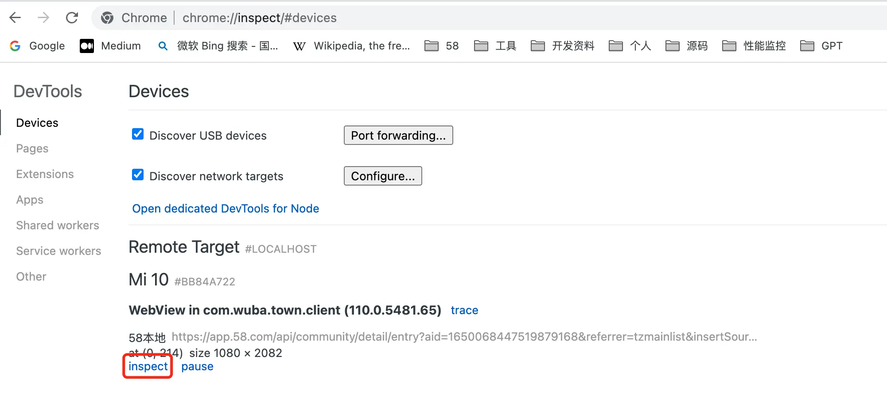

- # I. 介绍
  collapsed:: true
	- ## A. Lighthouse的概述 [Lighthouse官方文档](https://developer.chrome.com/docs/lighthouse/overview/)
	  collapsed:: true
		- Lighthouse 是一个网站性能测评工具， 它是 Google Chrome 推出的一个开源自动化工具，能够对 PWA 和网页多方面的效果指标进行评测，并给出最佳实践的建议以帮助开发者改进网站的质量
		- 它能够生成一个有关页面性能的报告，通过报告我们就可以知道需要采取哪些措施来改进应用的性能和体验。
		- 
	- ## B、Lighthouse的重要性
	  collapsed:: true
		- Lighthouse在Web开发中有重要的作用：
		- 帮助开发人员优化Web应用程序的性能。Lighthouse可以评估应用程序的加载速度、响应时间、资源使用情况等方面，从而帮助开发人员识别和解决性能问题，提高用户体验。
		- 提高Web应用程序的可访问性。Lighthouse可以评估应用程序的可访问性，帮助开发人员识别和解决一些常见的可访问性问题，如语义化的HTML、无障碍文本、键盘导航等，提高Web应用程序的可访问性，使得更多的人能够访问应用程序。
		- 优化Web应用程序的SEO。Lighthouse可以评估应用程序的SEO，帮助开发人员识别和解决一些常见的SEO问题，如页面标题、描述、关键字、图片alt属性等，从而提高应用程序在搜索引擎中的排名。
		- 提高Web应用程序的可靠性。Lighthouse可以评估应用程序的可靠性，帮助开发人员识别和解决一些常见的可靠性问题，如错误处理、网络请求失败、性能问题等，提高应用程序的可靠性。
		- 为Web开发人员提供了一个标准化的评估工具。Lighthouse是一个开源工具，由Google维护，具有标准化和通用性，可以帮助Web开发人员评估应用程序的各个方面，从而提高应用程序的质量和用户体验。
	- ## C. 本文的目的
		- 近期针对我们应用中H5载体页进行全链路的加载速度优化，使用到了Lighthouse工具，对Web页面进行了性能分析，发现加载性能问题，推动优化解决，过程中发现Lighthouse确实一个优秀的开源工具，跟大家分享一下它的使用（了解的可以略过此文章）和相关原理，同时讲解一下Web页面的一些性能关键指标。
- # II. Lighthouse的使用方式
	- 目前官方提供了4种使用方式：
	  Chrome 开发者工具（DevTools）
	  Node CLI
	  Chrome 插件扩展
	  Node Module
	- ## 方式一：Chrome 开发者工具（DevTools）
		- 1.同城或本地APP的debug包打开 -> 开发者选项(建议使用58Flipper) -> webview远程调试
		  collapsed:: true
			- 
		- 2.在chrome浏览器输入“chrome://inspect/#devices”，打开一个H5载体页可以看到如下操作界面：
		  collapsed:: true
			- 
		- 3、点击应用的“inspect”按钮就进入到移动设备的调试界面           
		  collapsed:: true
			- 
		- 4、找到Lighthouse-点击 “分析加载网页情况（generate report）”,它会对页面进行相关性能的检查，最终生成报告
		  collapsed:: true
			- 
	- ## 方式二：Node CLI
		- LightHouse使用命令行工具可以帮助你批量运行Lighthouse，自动生成报告，方便你在CI/CD过程中集成。要使用LightHouse，请按照以下步骤操作：
		- 首先，您需要安装Node.js。在安装完成后，在终端中输入以下命令以安装LightHouse：
		- ```
		  $:npm install -g lighthouse
		  ```
		  然后，使用以下命令运行LightHouse:
		- ```
		  ```
		  其中，<URL>是您要测试的网页的网址。请注意，LightHouse默认使用Chrome来运行测试。
		- 运行测试后，LightHouse将自动生成一份报告，其中包含有关页面性能、可访问性和可靠性的详细信息。您可以在终端中查看报告，也可以将报告保存为HTML文件并在浏览器中打开。