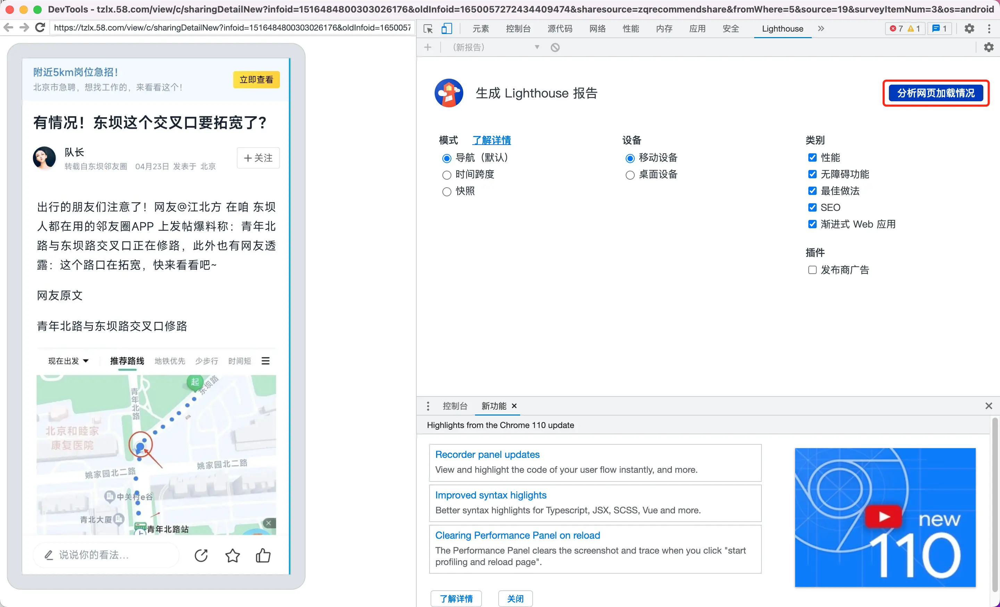
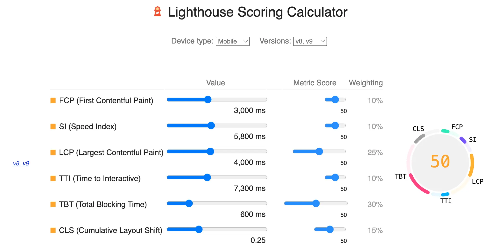

- # I. 介绍
  collapsed:: true
	- ## A. Lighthouse的概述 [Lighthouse官方文档](https://developer.chrome.com/docs/lighthouse/overview/)
	  collapsed:: true
		- Lighthouse 是一个网站性能测评工具， 它是 Google Chrome 推出的一个开源自动化工具，能够对 PWA 和网页多方面的效果指标进行评测，并给出最佳实践的建议以帮助开发者改进网站的质量
		- 它能够生成一个有关页面性能的报告，通过报告我们就可以知道需要采取哪些措施来改进应用的性能和体验。
		- 
	- ## B、Lighthouse的重要性
	  collapsed:: true
		- Lighthouse在Web开发中有重要的作用：
		- 帮助开发人员优化Web应用程序的性能。Lighthouse可以评估应用程序的加载速度、响应时间、资源使用情况等方面，从而帮助开发人员识别和解决性能问题，提高用户体验。
		- 提高Web应用程序的可访问性。Lighthouse可以评估应用程序的可访问性，帮助开发人员识别和解决一些常见的可访问性问题，如语义化的HTML、无障碍文本、键盘导航等，提高Web应用程序的可访问性，使得更多的人能够访问应用程序。
		- 优化Web应用程序的SEO。Lighthouse可以评估应用程序的SEO，帮助开发人员识别和解决一些常见的SEO问题，如页面标题、描述、关键字、图片alt属性等，从而提高应用程序在搜索引擎中的排名。
		- 提高Web应用程序的可靠性。Lighthouse可以评估应用程序的可靠性，帮助开发人员识别和解决一些常见的可靠性问题，如错误处理、网络请求失败、性能问题等，提高应用程序的可靠性。
		- 为Web开发人员提供了一个标准化的评估工具。Lighthouse是一个开源工具，由Google维护，具有标准化和通用性，可以帮助Web开发人员评估应用程序的各个方面，从而提高应用程序的质量和用户体验。
	- ## C. 本文的目的
		- 近期针对我们应用中H5载体页进行全链路的加载速度优化，使用到了Lighthouse工具，对Web页面进行了性能分析，发现加载性能问题，推动优化解决，过程中发现Lighthouse确实一个优秀的开源工具，跟大家分享一下它的使用（了解的可以略过此文章）和相关原理，同时讲解一下Web页面的一些性能关键指标。
- # II. Lighthouse的使用方式
  collapsed:: true
	- 目前官方提供了4种使用方式：
	  Chrome 开发者工具（DevTools）
	  Node CLI
	  Chrome 插件扩展
	  Node Module
	- ## 方式一：Chrome 开发者工具（DevTools）
		- 1.同城或本地APP的debug包打开 -> 开发者选项(建议使用58Flipper) -> webview远程调试
		  collapsed:: true
			- 
		- 2.在chrome浏览器输入“chrome://inspect/#devices”，打开一个H5载体页可以看到如下操作界面：
		  collapsed:: true
			- 
		- 3、点击应用的“inspect”按钮就进入到移动设备的调试界面           
		  collapsed:: true
			- 
		- 4、找到Lighthouse-点击 “分析加载网页情况（generate report）”,它会对页面进行相关性能的检查，最终生成报告
		  collapsed:: true
			- 
	- ## 方式二：Node CLI
		- LightHouse使用命令行工具可以帮助你批量运行Lighthouse，自动生成报告，方便你在CI/CD过程中集成。要使用LightHouse，请按照以下步骤操作：
		- 首先，您需要安装Node.js。在安装完成后，在终端中输入以下命令以安装LightHouse：
		- ```
		  $:npm install -g lighthouse
		  ```
		  然后，使用以下命令运行LightHouse:
		- ```
		  $:lighthouse <URL>
		  ```
		  其中，<URL>是您要测试的网页的网址。请注意，LightHouse默认使用Chrome来运行测试。
		- 运行测试后，LightHouse将自动生成一份报告，其中包含有关页面性能、可访问性和可靠性的详细信息。您可以在终端中查看报告，也可以将报告保存为HTML文件并在浏览器中打开。
	- ## 方式三：Chrome 插件扩展
	  collapsed:: true
		- collapsed:: true
		  1. 安装 Lighthouse 插件。打开 Chrome 浏览器，点击三个点的菜单，选择“更多工具”->“扩展程序”，然后搜索 Lighthouse 并安装。
			- 
		- 2. 打开需要检测的网页，点击 Lighthouse 插件图标，选择“生成报告”即可。Lighthouse 会进行全方位的检测，并在生成报告之后提供一些优化建议。
			- 
	- ## 方式四：Node Module
		- 将Lighthouse 集成到现有node.js工程项目中使用，以实验集成到avm中为例：
		- 1. 项目目录中使用以下命令配置
		- ```
		  $ yarn add Lighthouse
		  ```
		  2. 因为我们项目中使用commonjs，第三方模块导入使用requite语句，暂不支持import，所有项目中使用Lighthouse的版本9.6.8及以下
		- ```
		  "dependencies": {
		    ...
		    "lighthouse": "9.6.8"
		  },
		  ```
		- collapsed:: true
		  3. 项目中添加功能代码
			- ```
			  const express = require("express");
			  const router = express.Router();
			  const fs = require('fs');
			  const lighthouse = require('lighthouse');
			  const chromeLauncher = require('chrome-launcher');
			  const launchChromeAndRunLighthouse = async (url, opts, config = null) => {
			    return chromeLauncher.launch({ chromeFlags: opts.chromeFlags }).then(chrome => {
			        opts.port = chrome.port;
			        return lighthouse(url, opts,config).then(results => {
			            return chrome.kill().then(() => results.report);
			        });
			    });
			  };
			  const runLighthouse = async () => {
			    const opts = {
			        chromeFlags: ['--headless', '--no-sandbox'],
			        output: 'html',
			        onlyCategories: ['performance'],
			        logLevel: 'info',
			    };
			    const result = await launchChromeAndRunLighthouse('https://baidu.com', opts);
			    console.log(result);
			    return result
			  };
			  router.get('/lighthouse_report', async function (req, res) {
			    const reportHtml = await runLighthouse();
			    fs.writeFileSync('lhreport.html', reportHtml);
			    res.send(reportHtml);
			    });
			  ```
		- collapsed:: true
		  4. 接口请求node服务，便可产出性能报告
			- 
		-
- # III. Lighthouse的分析报告
  collapsed:: true
	- 接下来我们通过分析一个实际的案例报告来讲解Lighthouse的主要功能，Lighthouse的主要包括四部分：性能评估、可访问性评估、最佳实践评估、SEO评估；
	- collapsed:: true
	  1. 性能评估：Lighthouse会评估页面的性能，并给出改进建议。这包括加载速度、渲染速度、JavaScript执行时间等方面。
		- 
	- 优化建议
	  collapsed:: true
		- 
	- 可访问性评估：Lighthouse会检查网站的可访问性，例如，是否提供文本替代方案、是否提供足够的对比度等。
	  collapsed:: true
		- 
	- 最佳实践评估：Lighthouse会检查网站是否符合最佳实践，例如是否使用HTTP/2、是否启用Gzip压缩等。
	  collapsed:: true
		- 
	- SEO评估：Lighthouse会检查网站是否符合SEO标准，例如是否有足够的meta标签、是否有正确的网站结构等。
	  collapsed:: true
		- 
- # IV. Lighthouse报告的性能评估
	- 对于Web页面的优化我们更关注的是Lighthouse的性能评估，接下来我们重点讲解一下这部分。
	- ## 1. 第一部分性能诊断
		- 
		- 当前示例性能评分49分，那是怎么计算的呢？
		- {:height 365, :width 716}
			- Lighthouse 最新版的提供了 6 个性能指标：FCP、SI、LCP、TTI、TBT 和 CLS；权重分别是 10%，10%，25%，10%，30% 和 15%。Lighthouse 会根据权重计算得到一个分数值。其中不同版本存在差异，详情请看[Lighthouse Scoring Calculator](https://googlechrome.github.io/lighthouse/scorecalc/#FCP=3000&SI=5800&FMP=4000&TTI=7300&FCI=6500&LCP=4000&TBT=600&CLS=0.25&device=mobile&version=8)
		- FCP (First Contentful Paint) 首次内容绘制
			- 首次内容绘制 (FCP) 指标测量页面从开始加载到页面内容的任何部分在屏幕上完成渲染的时间。对于该指标，"内容"指的是文本、图像（包括背景图像）、<svg>元素或非白色的<canvas>元素
		- {:height 286, :width 716}
		- 为了提供良好的用户体验，网站应该努力将首次内容绘制控制在1.8 秒或以内
		- 
		- ### FP (First Paint) 首次绘制
		  是Paint Timing API的一部分，是页面导航与浏览器将该网页的第一个像素渲染到屏幕上所用的中间时，渲染是任何与输入网页导航前的屏幕上的内容不同的内容，例如背景图或Loading
		- ### SI (Speed Index)首屏展示平均值
		  SI (Speed Index): 指标用首屏内容展现的平均速度, 单位是时间。
		- 绿色（良好）——0 到 3.4 秒
		  橙色（中等）——3.4 到 5.8 秒
		  红色（慢） – 超过 5.8 秒
		- ### LCP (Largest Contentful Paint) 最大内容渲染
			- 衡量viewport内可见的最大内容元素的渲染时间。元素包括img、video、div及其他块级元素。
			  LCP的数据会通过PerformanceEntry对象记录, 每次出现更大的内容渲染, 则会产生一个新的PerformanceEntry对象.(2019年11月新增)。
			- {:height 274, :width 685}
			- 根据google建议，为了给用户提供更好的产品体验，LCP应该低于2.5s。
			- 
			- ### TTI (Time to Interactive) 可交互时间
			  是指从页面开始加载到用户能够与页面交互的时间，即网页完全加载并响应用户输入的时间。
			- 
			- TBT (Total Blocking Time) 页面阻塞总时长
			  总阻塞时间 (TBT) 指标测量[First Contentful Paint](https://web.dev/fcp/) 首次内容绘制 (FCP)与[Time to Interactive](https://web.dev/tti/) 可交互时间 (TTI)之间的总时间，这期间，主线程被阻塞的时间过长，无法作出输入响应。