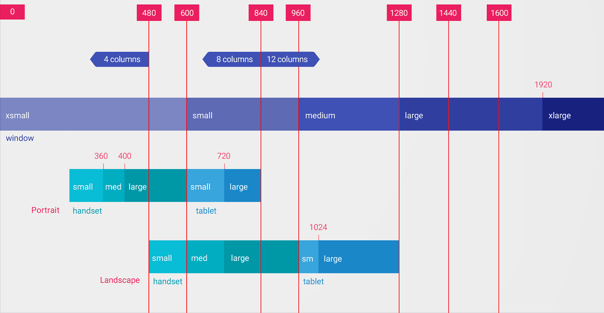

# 简介
	- 使用“最小宽度”屏幕尺寸限定符，您可以为具有最小宽度（以密度无关像素 dp 或 dip 为度量单位）的屏
	  幕提供备用布局。
	  通过将屏幕尺寸描述为密度无关像素的度量值，Android 允许您创建专为非常具体的屏幕尺寸而设计的
	  布局，同时让您不必对不同的像素密度有任何担心。
	- 例如，您可以创建一个名为 main_activity 且针对手机和平板电脑进行了优化的布局，方法是在目录
	  中创建该文件的不同版本，如下所示：
	- ```java
	  res/layout/main_activity.xml # For handsets (smaller than 600dp available width)
	  res/layout-sw600dp/main_activity.xml # For 7” tablets (600dp wide and bigger)
	  ```
- # 原理
	- 最小宽度限定符指定屏幕两侧的最小尺寸，而不考虑设备当前的屏幕方向，因此这是一种指定布局可用
	  的整体屏幕尺寸的简单方法。且使用Dp为单位
- # 下面是其他最小宽度值与典型屏幕尺寸的对应关系：
  collapsed:: true
	- 320dp：典型手机屏幕（240x320 ldpi、320x480 mdpi、480x800 hdpi 等）。
	- 480dp：约为 5 英寸的大手机屏幕 (480x800 mdpi)。
	- 600dp：7 英寸平板电脑 (600x1024 mdpi)。
	- 720dp：10 英寸平板电脑（720x1280 mdpi、800x1280 mdpi 等）。
	- 提供了一个更详细的视图，说明了不同屏幕 dp 宽度与不同屏幕尺寸和方向的一般对应关系。
		- 
	- 建议的宽度断点以支持不同的屏幕尺寸
- # 注意
	- 1、[[#red]]==**最小宽度限定符的所有数值都是DP密度无关像素**==
		- 因为重要的是系统考虑像素密度（而不是原始像素分辨率）之后可用的屏幕空间量。
	- 2、您使用这些限定符指定的尺寸不是实际屏幕尺寸，而是 Activity 窗口可用的宽度或高度（以 dp
	  为单位）。
		- Android 系统可能会将部分屏幕用于系统界面（如屏幕底部的系统栏或顶部的状态栏），因
		  此部分屏幕可能不可供您的布局使用。如果您的应用在多窗口模式下使用，则它只能使用该窗口的尺
		  寸。对该窗口进行大小调整时，它会使用新窗口尺寸触发配置更改，以便系统可以选择适当的布局文
		  件。因此，在声明尺寸时，您应具体说明 Activity 需要的尺寸。在声明为布局提供的空间时，系统会考虑系统界面使用的所有空间