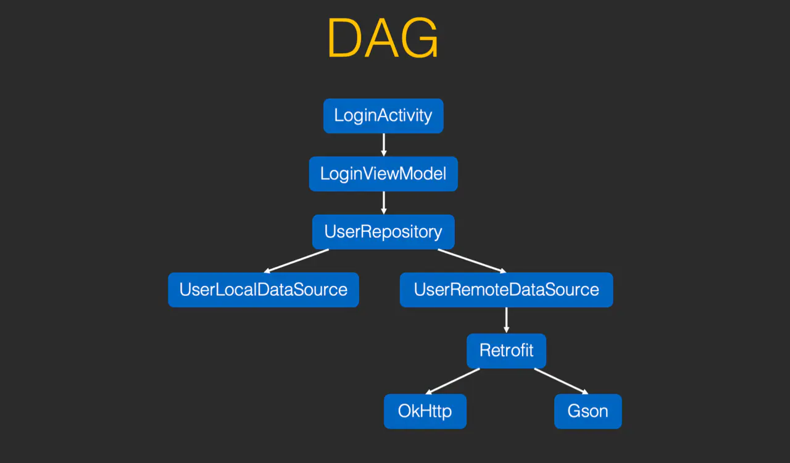
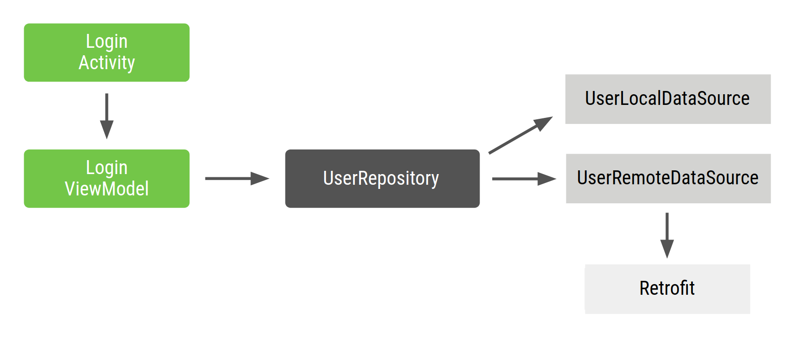

- 依赖注入是高级开发攻城狮中听到最多的名词，什么是依赖注入，如何依赖注入，Hilt如何做到的依赖注入？看完本文你会有一些理解。
- ## 依赖注入是什么?
	- 实际上依赖注入不是什么高大上的能力或过程，它就是一种设置变量的方式。简单的说，依赖注入就是内部的类在外部实例化了。也就是不需要自己去做实例化工作了，而是交给外部容器来完成，最后注入到调用者这边，形成依赖注入。
- ## 依赖注入方式
  collapsed:: true
	- 下面我们以一个登录页面为例，登录页面LoginActivity内部变量引用如下图：
	  collapsed:: true
		- 
	- LoginActivity中需要引用LoginViewModel，LoginViewModel内部包含了UserRepository,Repository呢需要传入2中数据来源：UserLocalDataSource和UserRemoteDataSource
	  collapsed:: true
		- 
	- LoginActivity 是登录流程的入口点，用户与 Activity 进行交互。因此，LoginActivity 需要创建 LoginViewModel 及其所有依赖项。
	- 以Repository看一下Repository类的2种设置DataSource方式：
	  collapsed:: true
		- ```
		  class UserRepository{
		    //方式1：内部直接初始化DataSource
		    val userLocalDataSource = UserLocalDataSource()
		    val userRemoteDataSource = UserRemoteDataSource()
		    //...todo...
		    fun getUserDataFromLocal(userID:String){
		      var user = userLocalDataSource.loadUserById(userID)
		      //...
		    }
		  }
		  ```
		- ```
		  //方式2：通过构造函数初始化DataSource
		  class UserRepository(val userLocalDataSource:UserLocalDataSource,
		                       val userRemoteDataSource:UserRemoteDataSource){
		    //...todo...
		    fun getUserDataFromLocal(userID:String){
		      var user = userLocalDataSource.loadUserById(userID)
		      //...
		    }
		  }
		  ```
	- 上面的2种方式最大的区别就是DataSource是由Repository类内部初始化实现还是由外部构造好后传入Repository。像这样通过构造函数的方式传入类对象，是依赖注入的方式。同样的使用setXXX()方法也是注入。
	- 另外我们熟悉的创建类型的设计模式如：1.Builder模式 2.工厂模式也是依赖注入。
	  collapsed:: true
		- ```
		  //bulider模式
		  val user = User.Builder()
		  	.name("Tom")
		  	.age(19)
		  	.build()
		  
		  //工厂模式
		  class UserFactory{
		    fun newUser:User{
		      val user = User()
		      user.name = "Tom"
		      user.age = 19
		      return user
		    }
		  }
		  ```
	- 这些都属于由外部来提供依赖的初始化，都是依赖注入，只是我们的说法不一样而已。
- ## 依赖注入优点
  collapsed:: true
	- 从外部初始化类对象这个角度来说，我们一直在使用依赖注入。那这样注入有什么好处呢。
	- ### 重用类以及分离依赖项
	  collapsed:: true
		- 首先从代码分层角度来说，使用注入类提高了类的重用性并且能够分离依赖项。更容易换掉依赖项的实现。由于控制反转，代码重用得以改进，并且类不再控制其依赖项的创建方式，而是支持任何配置。
	- ### 重构容易
	  collapsed:: true
		- 依赖项成为 API Surface 的可验证部分，因此可以在创建对象时或编译时进行检查，而不是作为实现详情隐藏。
	- ### 易于测试
	  collapsed:: true
		- 类不管理其依赖项，因此在测试时，您可以传入不同的实现以测试所有不同用例。
		- 总结一下：我们在写代码的时候，多多少少都会用到依赖注入，因为通过外部初始化依赖的对象就是依赖注入，并不是引用了Hilt库或Dagger库才叫依赖注入！
-
- 相关框架
	- [[Hilt]]