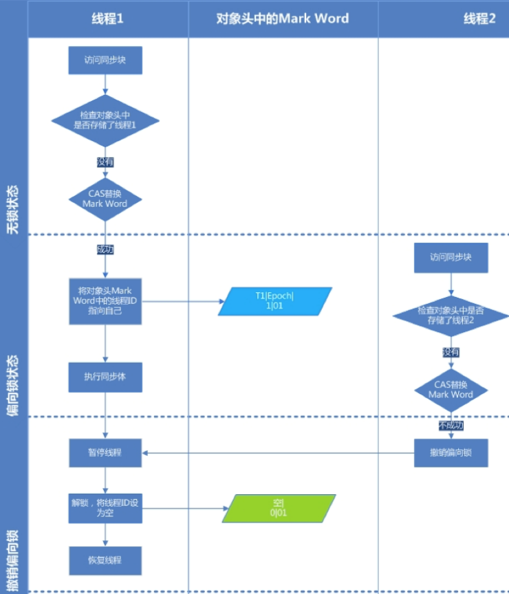

- ## 引入背景：
	- 大多数情况下锁不仅不存在多线程竞争，而且总是由同一线程多次获得，为了让线程获得锁的代价更低而引入了偏向锁，减少不必要的CAS操作。
- ## 概念
	- 偏向锁，顾名思义，==**它会偏向于第一个访问锁的线程**==
	- [[#red]]==**如果在运行过程中，同步锁只有一个线程访问，不存在多线程争用的情况**==，则线程是不需要触发同步的，减少加锁／解锁的一些CAS操作（比如等待队列的一些CAS操作），[[#red]]==**这种情况下，就会给线程加一个偏向锁**==。
	- 如果在运行过程中，[[#red]]==**遇到了其他线程抢占锁**==，则持有偏向锁的线程会被挂起，JVM会消除它身上的偏向锁，[[#red]]==**将锁恢复到标准的轻量级锁**==。它通过消除资源无竞争情况下的同步原语，进一步提高了程序的运行性能。
- ## 偏向锁获取过程：
  collapsed:: true
	- 步骤1、 访问Mark Word中偏向锁的标识是否设置成1，锁标志位是否为01，确认为可偏向状态。
	- 步骤2、 如果为可偏向状态，则测试线程ID是否指向当前线程，如果是，进入步骤5，否则进入步骤3。
	- 步骤3、 如果线程ID并未指向当前线程，则通过CAS操作竞争锁。如果竞争成功，则将Mark Word中线程ID设置为当前线程ID，然后执行5；如果竞争失败，执行4。
	- 步骤4、 如果CAS获取偏向锁失败，则表示有竞争。当到达全局安全点（safepoint）时获得偏向锁的线程被挂起，偏向锁升级为轻量级锁，然后被阻塞在安全点的线程继续往下执行同步代码。（撤销偏向锁的时候会导致stop the word）
	- 步骤5、 执行同步代码。
	- 
- ## 偏向锁的释放：
	- 偏向锁的撤销在上述第四步骤中有提到。偏向锁只有遇到其他线程尝试竞争偏向锁时，持有偏向锁的线程才会释放偏向锁，线程不会主动去释放偏向锁。
	- 偏向锁的撤销，需要等待全局安全点（在这个时间点上没有字节码正在执行），它会首先暂停拥有偏向锁的线程，判断锁对象是否处于被锁定状态，撤销偏向锁后恢复到未锁定（标志位为“01”）或轻量级锁（标志位为“00”）的状态。
- ## 偏向锁的适用场景
  collapsed:: true
	- 始终只有一个线程在执行同步块，在它没有执行完释放锁之前，没有其它线程去执行同步块，在锁无竞争的情况下使用，一旦有了竞争就升级为轻量级锁，升级为轻量级锁的时候需要撤销偏向锁，撤销偏向锁的时候会导致stop the word操作；
	- 在有锁的竞争时，偏向锁会多做很多额外操作，尤其是撤销偏向所的时候会导致进入安全点，安全点会导致stw，导致性能下降，这种情况下应当禁用。
- ## jvm开启/关闭偏向锁
  collapsed:: true
	- 开启偏向锁：-XX:+UseBiasedLocking -XX:BiasedLockingStartupDelay=0
	- 关闭偏向锁：-XX:-UseBiasedLocking