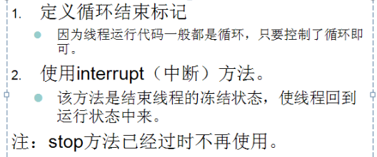
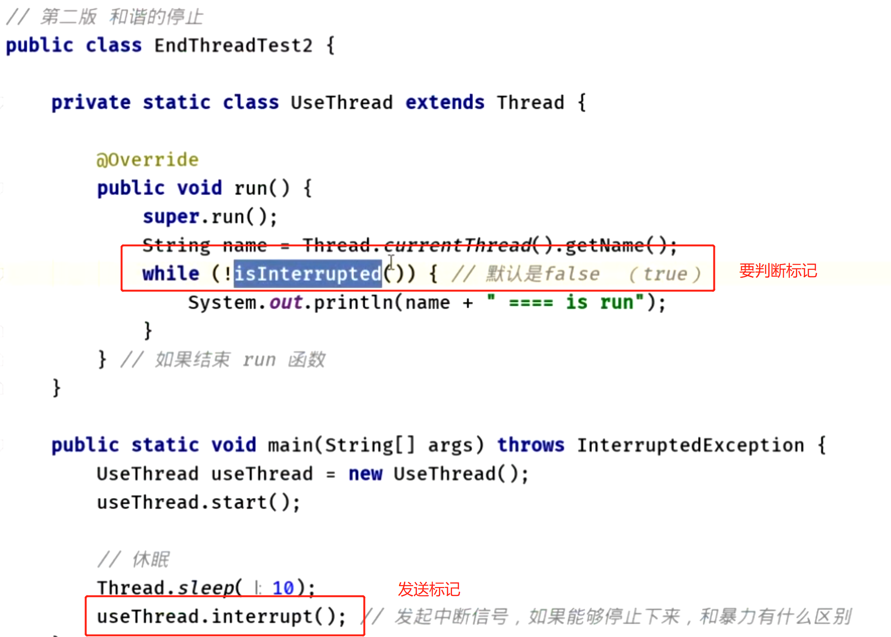
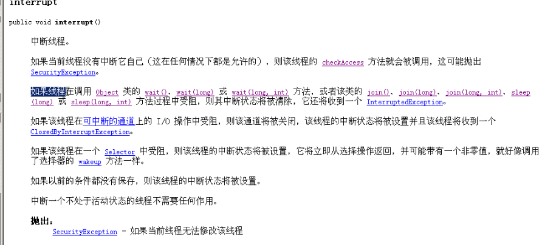

- 
-
- ## 方式一循环标记终止：
  collapsed:: true
	- 代码示例
	  collapsed:: true
		- ```java
		  class StopThread implements Runnable
		  {
		  	private boolean flag = true;
		  	public synchronized void run()
		  	{
		  		while(flag)
		  		{
		  			try
		  			{
		  				wait();//t0 t1
		  			}
		  			catch (InterruptedException e)
		  			{
		  				System.out.println(Thread.currentThread().getName()+"....."+e);
		  				flag = false;
		  			}
		  			
		  			System.out.println(Thread.currentThread().getName()+"......++++");
		  		}
		  	}
		  	public void setFlag()
		  	{
		  		flag = false;
		  	}
		  }
		  
		  
		  
		  class StopThreadDemo 
		  {
		  	public static void main(String[] args) 
		  	{
		  		StopThread st = new StopThread();
		  
		  		Thread t1 = new Thread(st);
		  		Thread t2 = new Thread(st);
		  
		  		t1.start();
		  		t2.setDaemon(true);
		  		t2.start();
		  
		  
		  		int num = 1;
		  		for(;;)
		  		{
		  			if(++num==50)
		  			{
		  //				st.setFlag();
		  				t1.interrupt();
		  //				t2.interrupt();
		  				break;
		  			}
		  			System.out.println("main...."+num);
		  		}
		  
		  		System.out.println("over");
		  	}
		  }
		  ```
	- 缺点：
		- 有停不下来的情况
		- 但是如果线程处于了冻结状态（wait），无法读取标记
- ## 方式二：interrupt(中断)
  collapsed:: true
	- 使用：
	  collapsed:: true
		- 
	- 
	- 可以使用interrupt()方法将线程从冻结状态强制恢复到运行状态中来，[[#red]]==**让线程具备cpu的执行资格**==。
	- 如果[[#red]]==**线程sleep时，调用了interrupt，会发生异常 InterruptedException，这里会把中断标记清除**==，要想停止线程，需要捕获异常[[#red]]==**再次 发送interrupt才可以**==，记得要处理
	-