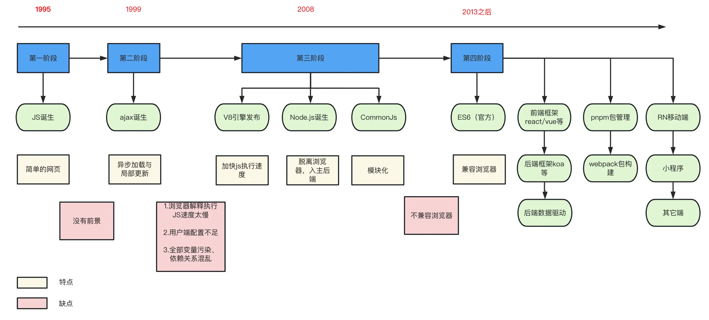

- # 1. 背景
	- 2016年1月微信推出小程序，同年9月份正式上线。从那时起，小程序以其轻量级的优势迅速成为了移动互联网领域的一个重要发展趋势。
	- 随着小程序在微信中的成功，其它社交平台和支付平台也纷纷推出了自己的小程序。
- # 2. 引言
  collapsed:: true
	- 微信、百度、字节等都有各自的小程序平台，为了实现一套代码运行在Web端、Android、ios、小程序平台，端平台框架应运而生。
	- Taro就是开发多端应用的前端开发框架之一，可以支持编译成各种小程序、H5、RN等多个平台。
	- Taro支持React架构或者Vue架构,同时提供了一系列独有的Api和组件。
	  Taro提供了一系列的工具和插件，同时支持扩展编译平台。
	  正所谓“工欲善其事，必先利其器”，一个优秀的工具是实现功能的捷径，借助Taro我们可以搭建一个Wuba编译平台插件，那么首先我们需要了解javaScript打包如何进行配置。
- # 3. 插件
  collapsed:: true
	- ## 3.1 插件目录组织
	  collapsed:: true
		- 
	- 这里主要介绍package.json、rollup.config.json、tsconfig.json这三个配置文件。
	- ## 3.2 配置文件
		- 下面是一个插件的配置demo
		  collapsed:: true
			- 
		- package.json
		  collapsed:: true
			- ```
			  //package.json文件
			  
			  {
			    "name": "taro-plugin-hybrid",
			    "version": "1.0.0",
			    "private": true,      //发布配置:私有的，不发送到公共npm上
			    "main": "./dist/index.js",    //插件入口
			    "dependencies": {
			      "@tarojs/service": "^3.6.2",
			      "rimraf": "^4.4.0",
			      "typescript": "^4.9.5"
			      ...
			    },
			    "devDependencies": {
			      "@babel/core": "^7.8.0",
			      "@babel/preset-env": "^7.20.2",
			      "babel-loader": "^9.1.2",
			      "rollup": "^3.20.0",
			      "rollup-plugin-commonjs": "^10.1.0",
			      "rollup-plugin-node-resolve": "^5.2.0",
			      "rollup-plugin-typescript2": "^0.34.1",
			      "ts-loader": "^9.4.2",
			      "tslib": "^2.5.0",
			      "typescript": "^4.9.5",
			      ...
			    },
			    "scripts": {  //配置执行脚本命令的地方
			      "clean:dist": "rimraf dist",
			      "build:types": "pnpm run clean:dist && tsc -b ./tsconfig.types.json",
			      "build": "rollup -c",
			      "dev": "rollup -w -c",
			      "clear": "pnpm run clean:dist"
			    },
			    "files": [    //插件要执行的文件目录
			      "dist"
			    ]
			  }
			  ```
		- tsconfig.json文件
		  collapsed:: true
			- ```
			  //tsconfig.json文件
			  
			  {
			    "include": [  //源文件目录
			      "./src"
			    ],
			  
			    "compilerOptions": {
			      "target": "ES5",    //ts目标版本,es3、es4...
			      "module": "ES6",    // 模块化规范:commonJs、es4、AMD...
			      "declaration": true,    //声明文件
			      "declarationDir": "./dist", //声明文件文件夹
			      "outDir": "./dist", //输出目录
			      "strict": true, //开启严格模式
			      ...
			    }
			  }
			  
			  ```
		- //rollup.config.mjs文件
		  collapsed:: true
			- ```
			  export default  [
			      // //配置es6,用于支持浏览器展示
			      // {
			      //     input: 'src/index.ts',  //要打包的文件源路径
			      //     output: {   //      文件输出配置
			      //         dir: 'dist2',
			      //         format:'es',   //文件的输出格式(CommJs规范,是Node.js的官方模块化规范)
			      //         entryFileName: '[name].mjs.js',
			      //         sourcemap:true  //生成map文件方便调试
			      //     },
			      //     plugins:[ typescript({
			      //         tsconfig:"tsconfig.json"
			      //     }), commonjs(), nodeResolve()],
			      // },
			  
			  
			      {
			          input: 'src/index.ts',  //要打包的文件源路径
			          output: {   //      文件输出配置
			              dir: 'dist',
			              format:'cjs',   //文件的输出格式(CommJs规范,是Node.js的官方模块化规范)
			              entryFileName: '[name].cjs.js',
			              sourcemap:true  //生成map文件方便调试
			          },
			          
			          plugins:[ typescript({  //支持的插件
			              tsconfig:"tsconfig.json"
			          }), commonjs(), nodeResolve()],
			      },
			  
			  ];
			  ```
		- 看到这些配置文件是不是非常头大？你可能会产生一些问题：
		- package.json中这么多插件我该选择哪个？
		  tsconfig.json中target与moudle我该选哪个？
		  rollup.config.mjs中format格式选哪个？.cjs.js后缀是什么意思？commonjs与nodeResolve插件为什么要用？文件名的后缀为什么是.mjs?
		  …
		  前端插件千千万，如果一个一个了解，不但花费时间多，而且容易忘记。当我们在浏览器中打开html文件时，有时会发生一些莫名其妙的问题，难以排查。为了让我们快速了解插件与进行问题排查。我们不但需要对插件有一定的了解，而且还要将它们之间的关系串起来。所以我们需要研究它们的来源，而这就要从JS的发展之路开始说起了。
- # 4一图了解JS发展
  collapsed:: true
	- 
	- 从上图我们大体对JS语言有了基本的了解。
	- 看到这里你可能有以下几个疑惑：
	- commonJs与ES是什么关系？
	  commonJs被es6替代了吗？
	  问题一：commonJs是一种服务器端JavaScript模块化规范；es是javaScript的标准化规范，支持浏览器， 从es6开始引入了模块化规范，从而成为了浏览器和服务器通用的模块解决方案。 这也就解释了为什么有时浏览器中会报错Uncaught ReferenceError: exports is not defined,这是因为使用的模块化规范不是es6及其之上。
	- 问题二： 一方面是nodejs已经不再跟随commonJs的发展而发展了；另一方main是NodeJs也在逐步用ES6 Module替代CommonJS。
	- 那么什么是模块化方案呢？
	- 说白了就是为了解决全局变量污染、依赖混乱问题， 一个文件作为一个模块，每个模块都有自己的作用域，模块支持导入与导出。
	- 通过上面我们知道了以前NodeJs模块化方案主要是commonJs，2013年ES6问世之后开始以ES6方案为主，所以目前NodeJs主要的模块化方案是commonJs与ES6。
	- 那么commonJs与ES6究竟有什么不同点呢？
- # 5. es6模块与commonJs模块的差异
	- 它们有三大差异:
		- CommonJS 模块输出的是一个值的拷贝，ES6 模块输出的是值的引用。
			- ```
			  // a.js
			  var count = 1;
			  function autoAddCount() {
			    count++;
			  }
			  module.exports = {
			    count: count,
			    autoAddCount: autoAddCount,
			  };
			  
			  
			  //main.js
			  var mModelA = require('./a');
			  
			  console.log(ModelA.count);  
			  ModelA.autoAddCount();
			  console.log(ModelA.count); 
			  ```
			- 猜猜其输出结果?
			- 其输出结果是1,1，而不是我们想象中的1,2。这是因为ModelA.count是一个基本类型，会被当前模块缓存起来。
			- es6模块的运行机制与CommonJs不同，Js引擎对脚本静态分析的时候，遇到模块加载命令import,就会生成一个只读引用。只有等到脚本真正执行的时候才会去对应的模块中取值。
		- CommonJS 模块是运行时加载，ES6 模块是编译时输出接口。
		- CommonJS 模块的require()是同步加载模块，ES6 模块的import命令是异步加载，有一个独立的模块依赖的解析阶段。