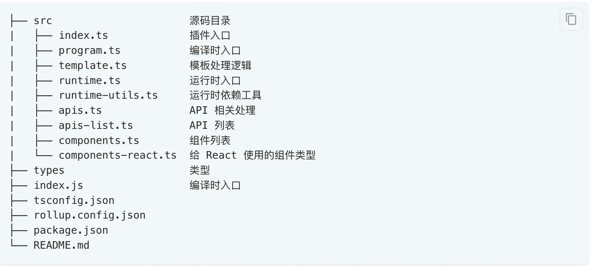
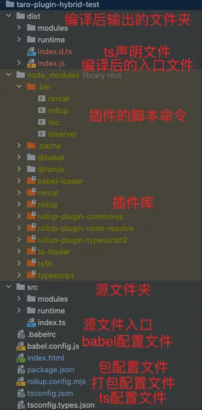

- # 1. 背景
	- 2016年1月微信推出小程序，同年9月份正式上线。从那时起，小程序以其轻量级的优势迅速成为了移动互联网领域的一个重要发展趋势。
	- 随着小程序在微信中的成功，其它社交平台和支付平台也纷纷推出了自己的小程序。
- # 2. 引言
  collapsed:: true
	- 微信、百度、字节等都有各自的小程序平台，为了实现一套代码运行在Web端、Android、ios、小程序平台，端平台框架应运而生。
	- Taro就是开发多端应用的前端开发框架之一，可以支持编译成各种小程序、H5、RN等多个平台。
	- Taro支持React架构或者Vue架构,同时提供了一系列独有的Api和组件。
	  Taro提供了一系列的工具和插件，同时支持扩展编译平台。
	  正所谓“工欲善其事，必先利其器”，一个优秀的工具是实现功能的捷径，借助Taro我们可以搭建一个Wuba编译平台插件，那么首先我们需要了解javaScript打包如何进行配置。
- # 3. 插件
	- ## 3.1 插件目录组织
	  collapsed:: true
		- 
	- 这里主要介绍package.json、rollup.config.json、tsconfig.json这三个配置文件。
	- ## 3.2 配置文件
		- 下面是一个插件的配置demo
		  collapsed:: true
			- 
		- package.json
		  collapsed:: true
			- ```
			  //package.json文件
			  
			  {
			    "name": "taro-plugin-hybrid",
			    "version": "1.0.0",
			    "private": true,      //发布配置:私有的，不发送到公共npm上
			    "main": "./dist/index.js",    //插件入口
			    "dependencies": {
			      "@tarojs/service": "^3.6.2",
			      "rimraf": "^4.4.0",
			      "typescript": "^4.9.5"
			      ...
			    },
			    "devDependencies": {
			      "@babel/core": "^7.8.0",
			      "@babel/preset-env": "^7.20.2",
			      "babel-loader": "^9.1.2",
			      "rollup": "^3.20.0",
			      "rollup-plugin-commonjs": "^10.1.0",
			      "rollup-plugin-node-resolve": "^5.2.0",
			      "rollup-plugin-typescript2": "^0.34.1",
			      "ts-loader": "^9.4.2",
			      "tslib": "^2.5.0",
			      "typescript": "^4.9.5",
			      ...
			    },
			    "scripts": {  //配置执行脚本命令的地方
			      "clean:dist": "rimraf dist",
			      "build:types": "pnpm run clean:dist && tsc -b ./tsconfig.types.json",
			      "build": "rollup -c",
			      "dev": "rollup -w -c",
			      "clear": "pnpm run clean:dist"
			    },
			    "files": [    //插件要执行的文件目录
			      "dist"
			    ]
			  }
			  ```
-