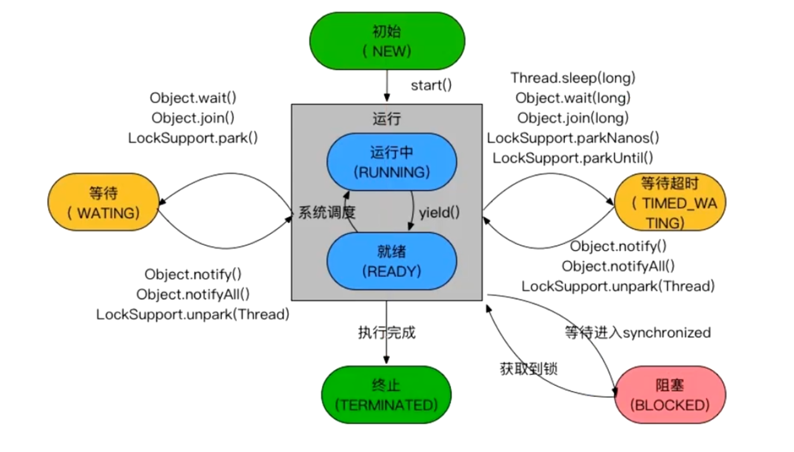

- {:height 436, :width 749}
- 1、新建或者初始态（new thread）
- 2、运行中
	- 系统调度
- 3、就绪态：
	- 进入：调用yield()方法，
	- 新建调用start
	- sleep醒了
	- wait()被notify了
- 4、终止态：执行完成
- 5、等待 和 等待超时
	- wait() sleep()等
- 6、阻塞态
	- 进入阻塞：等待进入synchronized