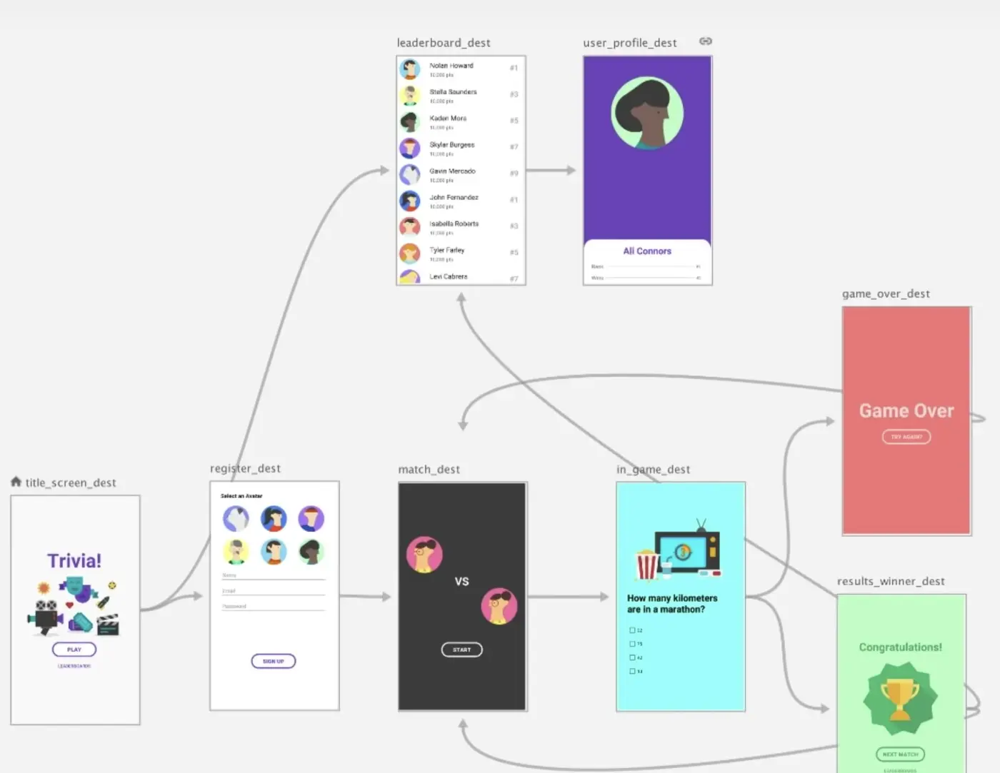
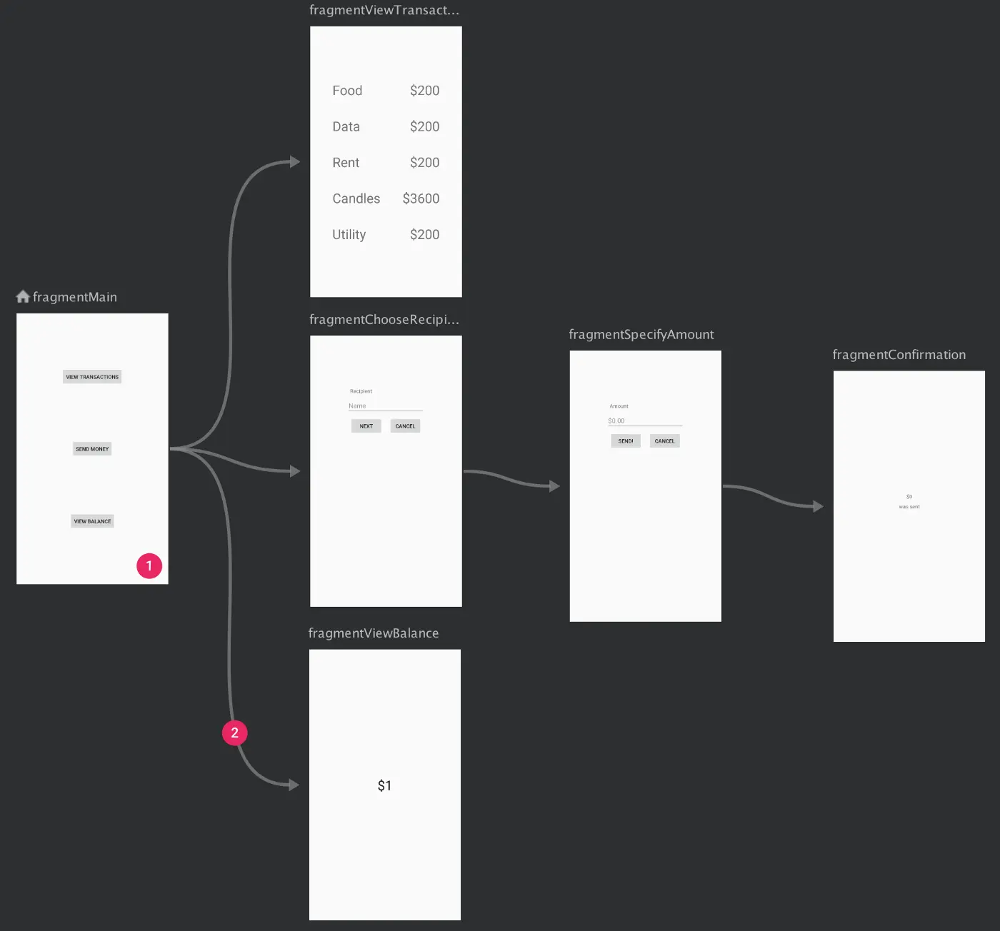
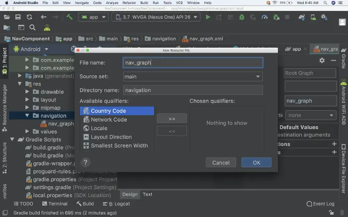
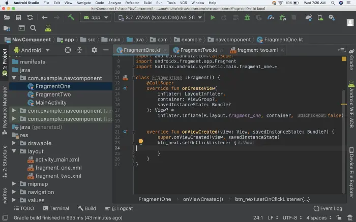
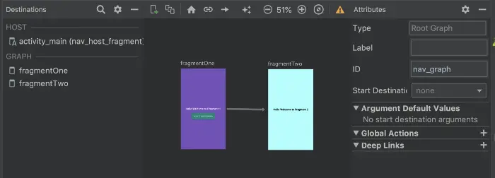
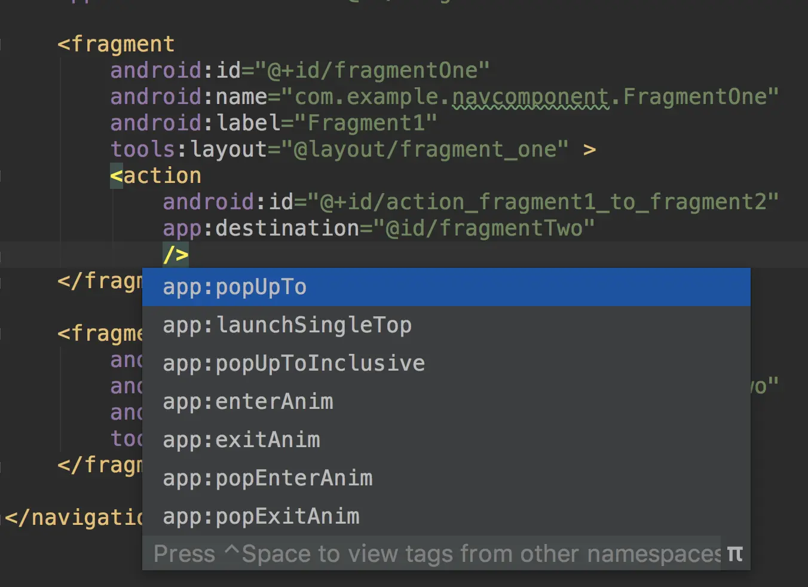
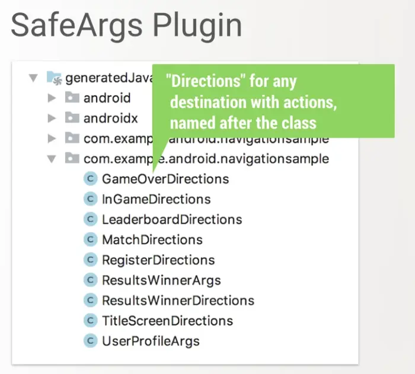
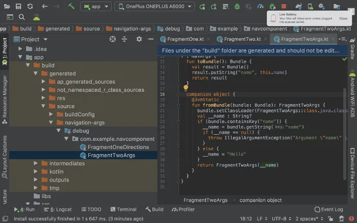
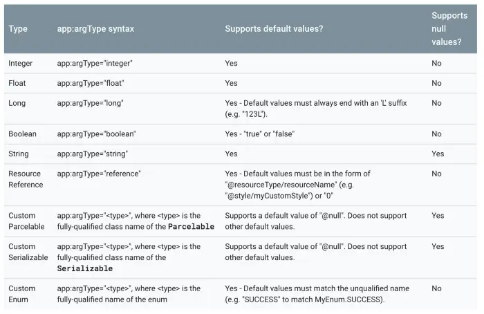

- [Everything You Want to Know About Android Jetpack’s Navigation Component](https://betterprogramming.pub/everything-about-android-jetpacks-navigation-component-b550017c7354)
- 
- 在 Android 中，我们通常使用 Intent 实现 Activity 的导航逻辑，使用 fragment transactions 实现 Fragment 的导航逻辑。 Google 的 Navigation 导航组件简化了 Android 应用程序中的导航逻辑。
- 在这篇文章中，我们将讨论 Navigation 组件的基本使用方法和高级使用方法。
- # 过去有什么问题？
	- 在开发具有多个 Fragment 的应用程序时，我们倾向于执行大量 fragment transactions 以实现相互之间的跳转。编写这些片段事务并处理返回堆栈时，一个问题是处理成本比较高，另一个问题是是如果处理不完善，会导致 IllegalStateException 异常。
- # 解决方案
	- 为了让开发导航的成本更简单，Google 引入了 Navigation 组件。使用这个导航组件，可以轻松编写 Fragment 之间的导航以及处理返回堆栈、异常情况等情况。
	- 让我们开始探索 Navigation 组件。
- # 什么是 Navigation 组件？
	- Navigation 组件是一组用于简化 Android 导航的库、插件和工具。 Android Jetpack 的 Navigation 组件帮助我们实现导航，从简单的按钮点击到更复杂的模式，例如应用栏和导航抽屉。 导航组件还通过遵守一套既定的原则来确保一致且可预测的用户体验。
	- 导航组件由三个关键部分组成。
	- ## Navigation graph (导航图)
		- 这是一种新的资源类型——包含所有与导航相关的信息的 XML 文件。包括应用程序中所有单独的内容区域（称为目的地），以及应用中可以导航的路径。
		  collapsed:: true
			- {:height 675, :width 716}
		- 导航编辑器中的 Navgraph 可以如上所示进行可视化编辑。上面的每一个 Fragment 被称为 目的地，这些 目的地 之间的箭头称之为 操作 —— 定义了用户可以导航的路径。
	- ## NavHost
		- NavHost 是一个空的容器，用于显示导航图中的目的地。 Navigation 组件包含一个默认的 NavHost 实现：NavHostFragment，它显示片段目的地。
		-
		-
		-
		-
	- ## NavController
		- NavController 是通过 NavHost 来管理应用中的导航。当用户在应用中执行页面导航时，NavController 会协调 NavHost 中目标内容的交换。
		- 注意：Android Studio 3.3 提供了导航编辑器中用来展示导航图。这个很棒的功能让我们可以在一个地方看到所有的导航。
- # 好处
	- 导航组件提供了许多其他好处，包括：
		- 处理 Fragment 事务。
		- 默认情况下正确处理 Up 和 Back 操作。
		- 为动画和过渡提供标准化资源。
		- 实现和处理深度链接。
		- 包括导航类型 UI 模式，例如只需最少的额外工作即可处理导航抽屉和底部导航。
		- Safe Args — 一个 Gradle 插件，在目的地之间导航和传递数据时提供类型安全。
		- 支持 ViewModel —— 实现在不同的目的地之间共享 UI 相关的数据
- # 示例
	- 让我们通过创建一个简单的例子来看看 Navigation 组件是如何工作的。 接下来将创建一个带有两个 Fragment 的简单 Activity 来看看如何使用 Navigation 组件实现
	  Fragment 之间的导航。
	- ## 第1步
		- 创建一个基于 AndroidX 的新项目。AndroidX 是 Android 团队用于在 Jetpack 中开发、测试、打包、版本和发布库的开源项目。可以在 AndroidX 概览 中查看更多信息。
	- ## 第2步
		- 在 build.gradle 中添加依赖
			- ```
			  dependencies {
			    def nav_version = "2.3.0-alpha02"
			  
			    // Java language implementation
			    implementation "androidx.navigation:navigation-fragment:$nav_version"
			    implementation "androidx.navigation:navigation-ui:$nav_version"
			  
			    // Kotlin
			    implementation "androidx.navigation:navigation-fragment-ktx:$nav_version"
			    implementation "androidx.navigation:navigation-ui-ktx:$nav_version"
			  
			    // Dynamic Feature Module Support
			    implementation "androidx.navigation:navigation-dynamic-features-fragment:$nav_version"
			  
			    // Testing Navigation
			    androidTestImplementation "androidx.navigation:navigation-testing:$nav_version"
			  }
			  ```
		- 这些是针对不同需求的不同依赖项。根据需求进行选择。
	- ## 第3步 - 1
		- 创建导航图。
		- 要将导航图添加到您的项目：
			- 右键单击 res 目录并选择 New > Android Resource File，出现 New Resource File 对话框
			- 输入文件名，例如：nav_graph
			- 在 Resource type 的下拉列表中选择 Navigation，然后单击确定
				- 
		- 当添加第一个导航图时，Android Studio 会在 res 目录中创建一个导航资源文件夹，该文件夹中包含导航图资源文件。创建的文件看起来像这样：
			- ```
			  <?xml version="1.0" encoding="utf-8"?>
			  <navigation xmlns:android="http://schemas.android.com/apk/res/android"
			      xmlns:app="http://schemas.android.com/apk/res-auto"
			      android:id="@+id/nav_graph">
			  </navigation>
			  ```
		- <navigation> 元素是导航图的根元素。当向图表添加目的地和连接操作时，会添加相应的 <destination> 和 <action> 元素作为子元素。如果有嵌套的图形，将显示为子 <navigation> 元素。
	- ## 第3步 - 2
		- 添加 NavHost 到 Activity 的 XML 文件中。
		- nav_host_fragment 中包含：
			- android:name：NavHost 的类名。
			- app:navGraph：将 NavHostFragment 与导航图相关联。导航图指定了此 NavHostFragment 中用户可以导航到的所有目的地。
			- app:defaultNavHost="true"：确保 NavHostFragment 拦截系统后退按钮。 请注意，只有一个NavHost 可以是默认值。 如果在同一布局中有多个 NavHost（例如双窗格布局），请确保仅指定一个默认 NavHost。
	- ## 第4步
		- 在 nav_graph 中添加目的地和路径。
		  在添加目的地之前创建两个 Fragment 及其 XML：
		- 
		- 接下来为 FragmentOne、FragmentTwo 类创建 XML 文件。
		- 现在让我们将目的地添加到 nav_graph 中
		- 目的地 destination 包含如下属性：
			- Type：指示目标是作为 Fragment、Activity 还是其他自定义类。
			- Label：包含目的地的 XML 布局文件的名称。
			- ID：目的地的 ID，用于在代码中引用。
			- Class：显示与目标关联的类的名称，可以通过下拉列表将关联的类更改为其他目标类型。
			  在导航编辑器中，视图将如下所示：
				- 
		- 现在将 NavHost 添加到 activity_main XML 文件中：
			- ```
			  <androidx.constraintlayout.widget.ConstraintLayout
			      xmlns:android="http://schemas.android.com/apk/res/android"
			      xmlns:app="http://schemas.android.com/apk/res-auto"
			      xmlns:tools="http://schemas.android.com/tools"
			      android:layout_width="match_parent"
			      android:layout_height="match_parent"
			      tools:context=".MainActivity">
			  
			      <fragment
			          android:id="@+id/nav_host_fragment"
			          android:name="androidx.navigation.fragment.NavHostFragment"
			          android:layout_width="match_parent"
			          android:layout_height="match_parent"
			          app:defaultNavHost="true"
			          app:navGraph="@navigation/nav_graph" />
			  
			  </androidx.constraintlayout.widget.ConstraintLayout>
			  ```
		- MainActivity 的代码如下：
			- ```
			  package com.example.navigationsample
			  
			  import android.support.v7.app.AppCompatActivity
			  import android.os.Bundle
			  import androidx.navigation.findNavController
			  
			  class MainActivity : AppCompatActivity() {
			      override fun onCreate(savedInstanceState: Bundle?) {
			          super.onCreate(savedInstanceState)
			          setContentView(R.layout.activity_main)
			      }
			      override fun onSupportNavigateUp() = findNavController(R.id.nav_host_fragment).navigateUp()
			  }
			  ```
		- 就是这样 - 我们完成了。
		- 点击运行按钮并查看 Navigation 组件的神奇之处：
			- 
		- 通过按钮的点击事件实现 Fragment 的跳转，可以看到没有使用 Fragment transaction：
			- ```
			  btn_next.setOnClickListener {
			      view.findNavController()
			          .navigate(R.id.action_fragment1_to_fragment2)
			  }
			  ```
		- 我们需要找到 NavController 并为其提供我们在 XML 中指定的操作 ID。
	-
- # 其他须知
	- 对于每个导航操作，都会将一个目的地添加到返回堆栈中。
	- 在前面的实现中，当我们从 FragmentOne 移动到 FragmentTwo 并单击返回按钮时，返回到了 FragmentOne。
	- 假如从 FragmentTwo 点击返回不希望切换回 FragmentOne，这时需要在 nav_graph 中为 action 添加其他属性，或者我们可以选择使用 NavOptions 以代码的方式添加这些属性。NavOptions 存储了用于导航操作的特殊选项。
	- 在 XML 中可以设置如下属性：
	  collapsed:: true
		- 
	- 对于上面的情况，我们需要使用两个不同的属性：
	  collapsed:: true
		- ```
		  app:popUpTo="@id/fragmentOne"
		  app:popUpToInclusive="true"
		  ```
	- 完整的 nav_graph 如下：
	  collapsed:: true
		- ```
		  <?xml version="1.0" encoding="utf-8"?>
		  <navigation xmlns:android="http://schemas.android.com/apk/res/android"
		      xmlns:app="http://schemas.android.com/apk/res-auto"
		      xmlns:tools="http://schemas.android.com/tools"
		      android:id="@+id/nav_graph"
		      app:startDestination="@id/fragmentOne">
		  
		      <fragment
		          android:id="@+id/fragmentOne"
		          android:name="com.example.navcomponent.FragmentOne"
		          android:label="Fragment1"
		          tools:layout="@layout/fragment_one" >
		          <action
		              android:id="@+id/action_fragment1_to_fragment2"
		              app:destination="@id/fragmentTwo"
		              app:popUpTo="@id/fragmentOne"
		              app:popUpToInclusive="true"
		              />
		      </fragment>
		  
		      <fragment
		          android:id="@+id/fragmentTwo"
		          android:name="com.example.navcomponent.FragmentTwo"
		          android:label="Fragment2"
		          tools:layout="@layout/fragment_two">
		      </fragment>
		  </navigation>
		  
		  ```
	- 最后结果如下：
	  collapsed:: true
		- 
	- ### action
		- action 示例如下：
		  collapsed:: true
			- ```
			  <action android:id="@+id/next_action"
			          app:destination="@+id/flow_step_one"
			          app:enterAnim="@anim/slide_in_right"
			          app:exitAnim="@anim/slide_out_left"
			          app:popEnterAnim="@anim/slide_in_left"
			          app:popExitAnim="@anim/slide_out_right"
			          app:popUpTo="@id/fragmentOne"
			          app:popUpToInclusive="true" />
			  ```
		- 各属性含义如下：
		- id：操作的 ID，NavHost 通过该 ID 进行导航
		- app:enterAnim, app:exitAnim, app:popEnterAnim, app:popExitAnim：四种动画，指定添加和删除 Fragment 时执行的动画
		- app:popUpToInclusive：指定返回堆栈中是否包含当前实例
		- app:launchSingleTop：用于指定此导航操作是否应作为单顶启动（即返回堆栈顶部最多有一个指定的目的地的副本），与 Intent.FLAG_ACTIVITY_SINGLE_TOP 类似
		- 注意：当不使用 app:popUpToInclusive 时频繁在两个 Fragment 之间导航，后台堆栈中将包含 Fragment 的多个实例。
		- 接下来再看下使用代码实现的方法：
		  collapsed:: true
			- ```
			  btn_next.setOnClickListener {
			      val navOptions = NavOptions.Builder()
			              .setPopUpTo(R.id.fragmentOne, true)
			              .build()
			      view.findNavController()
			          .navigate(R.id.action_fragment1_to_fragment2, null, navOptions)
			  }
			  ```
		- 了解有关 [NavOptions](https://developer.android.google.cn/reference/androidx/navigation/NavOptions) 的更多信息。
- # 如何在 Fragment 之间传递参数
	- 在 Fragment 之间共享数据的需求很常见。最简单的方法之一是使用共享的 ViewModel。当我们使用 Navigation 组件时，让我们看看如何使用 safe args 插件在两个 Fragment 之间共享数据。
	- ## Safe Args
		- Safe Args 插件生成的代码允许我们进行类型安全的导航和参数传递。
		- 首先，要将 Safe Args 添加到项目中，在项目顶层的 build.gradle 文件中添加如下依赖：
		  collapsed:: true
			- ```
			  buildscript {
			      repositories {
			          google()
			      }
			      dependencies {
			          def nav_version = "2.3.0-alpha01"
			          classpath "androidx.navigation:navigation-safe-args-gradle-plugin:$nav_version"
			      }
			  }
			  ```
		- 要生成适用于 Java 或 Java 和 Kotlin 混编模块的代码，需要在 module 的 build.gradle 文件中添加：
		  collapsed:: true
			- ```
			  apply plugin: "androidx.navigation.safeargs"
			  ```
		- 如果要添加纯 Kotlin 模块的代码，需要添加：
		  collapsed:: true
			- ```
			  apply plugin: "androidx.navigation.safeargs.kotlin"
			  ```
		- 添加后的完整 build.gradle 文件如下：
		  collapsed:: true
			- ```
			  apply plugin: 'com.android.application'
			  apply plugin: 'kotlin-android'
			  apply plugin: 'kotlin-android-extensions'
			  apply plugin: "androidx.navigation.safeargs.kotlin" // add this
			  ```
		- 启用 Safe Args 后，插件会生成包含我们定义的每个操作的类和方法的代码。对于每个动作，Safe Args 还为每个目的地生成一个类，生成的类名是源目标类名和 Directions 的拼接。例如，如果目标名为 FragmentOne，则生成的类名为 FragmentOneDirections。
		- 生成的类包含用于在起始目的地中定义的每个操作的静态方法。此方法将定义的 action 参数作为参数并返回一个 NavDirections 对象，可以将其传递给 navigate()。 我们可以在生成的文件夹中找到生成的代码。
		  collapsed:: true
			- 
		- 举个例子，假设我们有一个导航图，它有一个单一的动作，将 FragmentOne 导航到 FragmentTwo。
		- Safe Args 自动生成 FragmentOneDirections 类，包含单个方法 actionFragmentOneToFragmentTwo()。 这个方法返回的 NavDirections 对象然后可以直接传递给 navigate()，示例如下：
		- safeargs_nav_graph.xml：
		  collapsed:: true
			- ```
			  <?xml version="1.0" encoding="utf-8"?>
			  <navigation xmlns:android="http://schemas.android.com/apk/res/android"
			      xmlns:app="http://schemas.android.com/apk/res-auto"
			      xmlns:tools="http://schemas.android.com/tools"
			      android:id="@+id/nav_graph"
			      app:startDestination="@id/fragmentOne">
			  
			      <fragment
			          android:id="@+id/fragmentOne"
			          android:name="com.example.navcomponent.FragmentOne"
			          android:label="Fragment1"
			          tools:layout="@layout/fragment_one" >
			          <action
			              android:id="@+id/action_fragment1_to_fragment2"
			              app:destination="@id/fragmentTwo"
			              app:popUpTo="@id/fragmentOne"
			              app:popUpToInclusive="true"
			              />
			      </fragment>
			  
			      <fragment
			          android:id="@+id/fragmentTwo"
			          android:name="com.example.navcomponent.FragmentTwo"
			          android:label="Fragment2"
			          tools:layout="@layout/fragment_two">
			          <argument
			              android:name="name"
			              android:defaultValue="Hello"
			              app:argType="string" />
			      </fragment>
			  </navigation>
			  ```
		- 在 FragmentOne 中调用方法：
		  collapsed:: true
			- ```
			  btn_next.setOnClickListener {
			      val action = FragmentOneDirections.actionFragment1ToFragment2("Android")
			      view.findNavController().navigate(action)
			  }
			  ```
		- 在 FragmentTwo 中可以接收到参数：
		  collapsed:: true
			- ```
			  override fun onActivityCreated(savedInstanceState: Bundle?) {
			      super.onActivityCreated(savedInstanceState)
			      val args: FragmentTwoArgs by navArgs()
			      args.let {
			          Toast.makeText(activity!!, it.name, Toast.LENGTH_SHORT).show()
			      }
			  }
			  ```
		- 我们可以在 build 文件夹中找到生成的代码
		  collapsed:: true
			- 
	- ## 支持的参数类型
		- {:height 462, :width 700}
- # 参考资料
	- [Navigation component](https://developer.android.google.cn/guide/navigation/navigation-getting-started?hl=zh-cn)
	- [Pass data between destinations](https://developer.android.google.cn/guide/navigation/navigation-pass-data?hl=zh-cn)
-