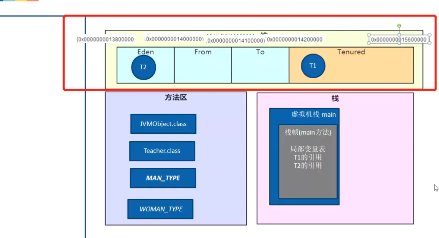

- 1、进入jdk1.8，lib目录下
  collapsed:: true
	- 
- 2、右键，进入命令行，执行
  collapsed:: true
	- ```
	  java -cp ./sa-jdi.jar sun.jvm.hotspot.HSDB
	  ```
- 3、出现可视化工具
  collapsed:: true
	- 
- 4、命令行执行jps，可以查看当前java进程
	- 
	- 找到自己运行程序的进程，前边是进程号
- 5、工具绑定进程号
  collapsed:: true
	- {:height 560, :width 749}
	- 
- 6、绑定后会出现线程
	- 
- 7、查看main方法，的栈
  collapsed:: true
	- 
	- 虚拟机栈：
		- 
- 8、查看类
  collapsed:: true
	- 
	- 
- 9、查看对象
  collapsed:: true
	- 
	- 
- 10、点击查看对象结构
  collapsed:: true
	- 
	- 
	- 
	- 可以看到堆中进行了，分代划分，而且内存是连续的，上边地址
		- 
	- 对象上边有地址值，142证明在堆里存放
		- 