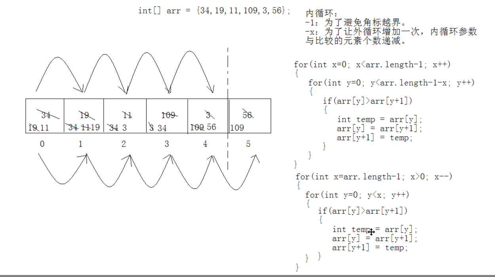

- # 思路
	- 冒泡排序（这里指升序）是一种非常简单直观的排序方式，它是一种交换式的排序方法，基本思想就是相近的两个数字作比较，小的放到前面，大的放后面，按照这个规则从头向后比较，最大的数就被换到了数组尾。
- # 图解
	- 1、相邻2个互相对比，每执行一轮对比，得出最大的放到最后。
	- 2、并且每执行一轮，总对比数减少一个（因为每轮选出的本轮最大的都确定了）所以内层-x
	- 
	- 
- # 代码
	- ```java
	      public void swap(int[] aar, int i, int j) {
	          int temp = aar[i];
	          aar[i] = aar[j];
	          aar[j] = temp;
	      }
	  
	      public int[] maoSort(int[] aar) {
	          // 因为每轮选出最大的一个。如果剩下最后一个就不需要再对比了
	          for (int i = 0; i < aar.length - 1; i++) {
	              for (int j = 0; j < aar.length - 1 - i; j++) {
	                  // 内层-1 是因为这里角标越界
	                  // -x是因为每轮少一个。因为每轮都会选出一个本轮最大的
	                  if (aar[j] > aar[j + 1]) {
	                      swap(aar,j,j+1);
	                  }
	              }
	          }
	          return aar;
	      }
	  ```