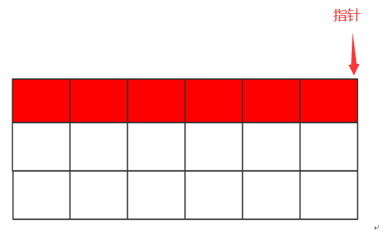
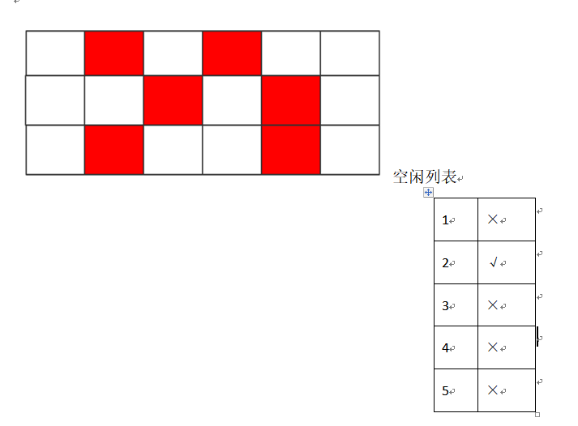

- # 一、划分内存的两种方式
	- 
	- ## 指针碰撞
	  collapsed:: true
		- 如果Java堆中内存是绝对规整的，所有用过的内存都放在一边，空闲的内存放在另一边，中间放着一个指针作为分界点的指示器，那所分配内存就仅仅是把那个指针向空闲空间那边挪动一段与对象大小相等的距离，这种分配方式称为“**指针碰撞**”。
		- 
	- ## 空闲列表
	  collapsed:: true
		- 如果Java堆中的内存并不是规整的，已使用的内存和空闲的内存相互交错，那就没有办法简单地进行指针碰撞了，虚拟机就必须维护一个列表，记录上哪些内存块是可用的，在分配的时候从列表中找到一块足够大的空间划分给对象实例，并更新列表上的记录，这种分配方式称为“**空闲列表**”。
		- 
- # 二、划分方式的选择
	- [[#red]]==**选择哪种分配方式由Java堆是否规整决定**==，而Java堆是否规整又由所采用的垃圾收集器是否带有压缩整理功能决定。
	- 如果是Serial、ParNew等带有压缩的整理的垃圾回收器的话，系统采用的是指针碰撞，既简单又高效。
	- 如果是使用CMS这种不带压缩（整理）的垃圾回收器的话，理论上只能采用较复杂的空闲列表。
- # 三、**并发安全**
	- 除如何划分可用空间之外，还有另外一个需要考虑的问题是[[#red]]==**对象创建在虚拟机中是非常频繁的行为，即使是仅仅修改一个指针所指向的位置，在并发情况下也并不是线程安全**==的，可能出现正在给对象A分配内存，指针还没来得及修改，对象B又同时使用了原来的指针来分配内存的情况。
	- ## CAS机制
		- 解决这个问题有两种方案，一种是对分配内存空间的动作进行同步处理——实际上虚拟机采用CAS配上失败重试的方式保证更新操作的原子性；
	- ##  **分配缓冲**
	  id:: 64b3791e-79a6-46c9-b548-79a0c6d8701a
		- [[#red]]==**另一种是把内存分配的动作按照线程划分在不同的空间之中进行，即每个线程在Java堆中预先分配一小块私有内存，也就是本地线程分配缓冲**==（Thread Local Allocation Buffer,TLAB），JVM在线程初始化时，同时也会申请一块指定大小的内存，只给当前线程使用，这样每个线程都单独拥有一个Buffer，如果需要分配内存，就在自己的Buffer上分配，这样就不存在竞争的情况，可以大大提升分配效率，当Buffer容量不够的时候，再重新从Eden区域申请一块继续使用。
		- TLAB的目的是在为新对象分配内存空间时，让每个Java应用线程能在使用自己专属的分配指针来分配空间，减少同步开销。
		- TLAB只是让每个线程有私有的分配指针，但底下存对象的内存空间还是给所有线程访问的，只是其它线程无法在这个区域分配而已。当一个TLAB用满（分配指针top撞上分配极限end了），就新申请一个TLAB。
		- **参数：**-XX:+UseTLAB [官方地址]([https://docs.oracle.com/javase/8/docs/technotes/tools/unix/java.html](https://docs.oracle.com/javase/8/docs/technotes/tools/unix/java.html))
		- [[#red]]==**允许在年轻代空间中使用线程本地分配块**==（TLAB）。默认情况下启用此选项。要禁用TLAB，请指定-XX:-UseTLAB。