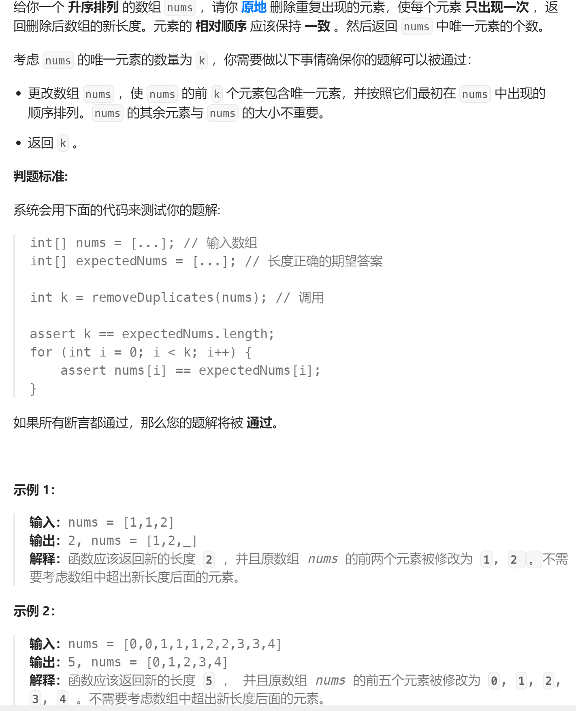
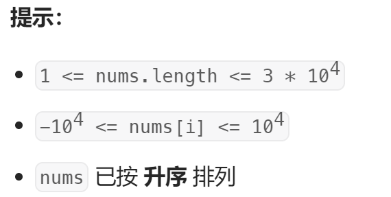

# [题目](https://leetcode.cn/problems/remove-duplicates-from-sorted-array/)-题目要求是返回不重复的个数
	- 
	- 
- # 思路
	- 1、定义2 个快慢指针，一个在前记作 fast，一个在后记作 slow，0作为第一个元素不要修改，都从下标1开始
	  id:: 64f43141-00a7-48f8-b715-140f407a4127
	- 2、遍历一遍数组，跳出条件快指针到最后while (fast < n) {
	- 3、首先[[#red]]==**快指针先寻找与之前数字不同的元素**==nums[fast] != nums[fast - 1]，
	- 4、[[#red]]==**找到一个就赋值给慢指针**== nums[slow] = nums[fast]，然后++slow继续存下一个快指针找到的不同元素
	- 5、==**快指针负责找，慢指针负责存，最终返回slow**==
		- 因为当前slow是下标+1，等待存新值，即slow =2时，已经存了01,2个元素了。此时slow也代表了存个数，
	- ```java
	  public int removeDuplicates(int[] nums) {
	          int n = nums.length;
	          if(n == 0){
	              return 0;
	          }
	          // 1、定义快慢指针从1开始的
	          // 2、循环遍历
	          // 3、快指针负责找不同，慢指针负责存 最后返回慢指针
	          int fastIndex = 1, slowIndex = 1;
	          while(fastIndex < n){
	              // 找不同
	              if(nums[fastIndex] != nums[fastIndex - 1]){
	                  nums[slowIndex] = nums[fastIndex];
	                  slowIndex++;
	              }
	              fastIndex++;
	          }
	          return slowIndex;
	      }
	  ```
- # 复杂度
	- 时间复杂度：O(n)，其中 n 是数组的长度。快指针和慢指针最多各移动 n 次。
	- 空间复杂度：O(1)。只需要使用常数的额外空间。