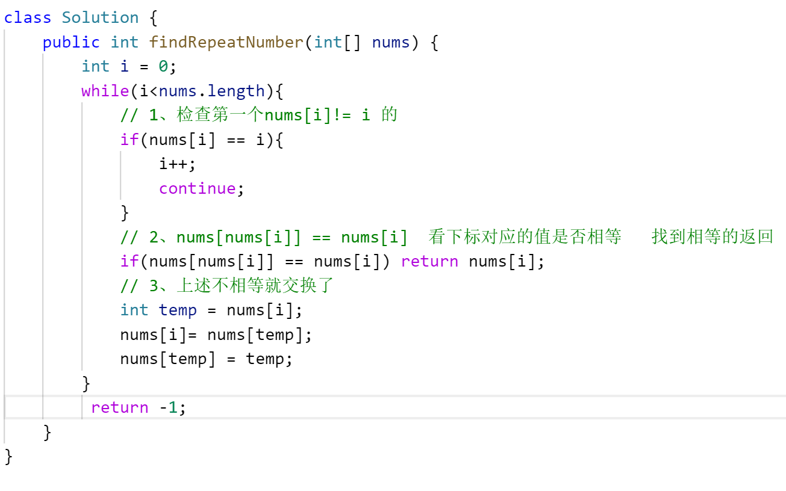

title:: 剑指 Offer 03. 数组中重复的数字-简单

- ## 数据结构-数组
- ## [题目](https://leetcode.cn/problems/shu-zu-zhong-zhong-fu-de-shu-zi-lcof/)
	- 找出数组中重复的数字。
	- 在一个长度为 n 的数组 nums 里的所有数字都在 0～n-1 的范围内。数组中某些数字是重复的，但不知道有几个数字重复了，也不知道每个数字重复了几次。请找出数组中任意一个重复的数字。
	- ## 示例
		- ```java
		  输入：
		  [2, 3, 1, 0, 2, 5, 3]
		  输出：2 或 3 
		  ```
	- **限制：**
	- `2 <= n <= 100000`
	-
- ## 解答
	- ## 方法一：哈希表/set，HastSet找重复
	  collapsed:: true
		- 利用数据结构特点，容易想到使用哈希表（Set）记录数组的各个数字，当查找到重复数字则直接返回。
		- ## 算法流程：
			- 1、初始化： 新建 HashSet ，记为 dic ；
			- 2、遍历数组 nums 中的每个数字 num ：
				- a、当 num 在dic 中，说明重复，直接返回 num ；
				- b、将 num 添加至 dic 中；
			- 3、返回 −1 。本题中一定有重复数字，因此这里返回多少都可以。
		- ## 复杂度分析：
			- 时间复杂度 O(N) ： 遍历数组使用 O(N) ，HashSet 添加与查找元素皆为 O(1) 。
			- 空间复杂度 O(N) ： HashSet 占用 O(N) 大小的额外空间。
		- ```java
		  class Solution {
		      public int findRepeatNumber(int[] nums) {
		          Set<Integer> dic = new HashSet<>();
		          for(int num : nums) {
		              if(dic.contains(num)) return num;
		              dic.add(num);
		          }
		          return -1;
		      }
		  }
		  ```
	- ## 方法二：原地交换
		- ## 思路
		  collapsed:: true
			- 题目说明尚未被充分使用，即 在一个长度为 n 的数组 nums 里的所有数字都在 0 ~ n-1 的范围内 。 此说明含义：数组元素的 索引 和 值 是 一对多 的关系。 因此，可遍历数组并通过交换操作，使元素的 索引 与 值 一一对应（即 nums[i]=i）。因而，就能通过索引映射对应的值，起到与字典等价的作用。
			- 
			- [[#red]]==**遍历中，第一次遇到数字 x 时，将其交换至索引 x 处；而当第二次遇到数字 x 时，一定有 nums[x]=x ，此时即可得到一组重复数字。**==
		- ## ==**算法流程**==
			- 遍历数组 nums ，设索引初始值为 i=0 :
				- 若 nums[i]=i ： 说明此数字已在对应索引位置，无需交换，因此跳过；
				- 若 nums[nums[i]]=nums[i] ： 代表索引nums[i] 处和索引 i 处的元素值都为 nums[i] ，即找到一组重复值，返回此值 nums[i] ；
				- 否则： 交换索引为 i 和 nums[i] 的元素值，将此数字交换至对应索引位置。
			- 若遍历完毕尚未返回，则返回 −1 。
			- 
		- ## 复杂度分析：
			- 时间复杂度 O(N) ： 遍历数组使用 O(N) ，每轮遍历的判断和交换操作使用O(1) 。
			- 空间复杂度 O(1) ： 使用常数复杂度的额外空间。
		- ## 代码
			- ```java
			  // 将值放到与下标相等的位置上
			  class Solution {
			      public int findRepeatNumber(int[] nums) {
			          // 1、定义索引为0 向后遍历
			          int i = 0;
			          while(i < nums.length) {
			              // 2、 比如索引0处的值就为0，索引1处的值就为1 那么不需要交换。执行下个下标
			              // 否则一直循环交换
			              if(nums[i] == i) {
			                  i++;
			                  continue;
			              }
			              // 3、找到相同值的条件，如果 索引4的值为6，而
			              找到的条件：下标作为索引nums[i]  和 该下标对应值nums[nums[i]]作为索引是相同的
			               nums[2] = 2.还没交换就相等  找到的就是重复的
			              if(nums[nums[i]] == nums[i]) return nums[i];
			              
			              // 4、下标i = 0 时  将下标为0位置的值 作为中介，进行nums[nums[i]] == nums[i] 交换
			              // 将下标为0对应的值。和 以该值为索引对应值 进行交换
			              // 比如下标0的位置为2 nums[0] = 2 应该放在 nums[2] 的位置上 即 nums[num[i]]
			              //  与值交换
			              int tmp = nums[i];
			              nums[i] = nums[tmp];
			              nums[tmp] = tmp;
			          }
			          return -1;
			      }
			  }
			  ```
		- ## 图解
			- 
			- 
			- 
			- 
			- 
			- 
			- 
			- 
			- 
- [地址](https://leetcode.cn/problems/shu-zu-zhong-zhong-fu-de-shu-zi-lcof/solutions/96623/mian-shi-ti-03-shu-zu-zhong-zhong-fu-de-shu-zi-yua/)
-