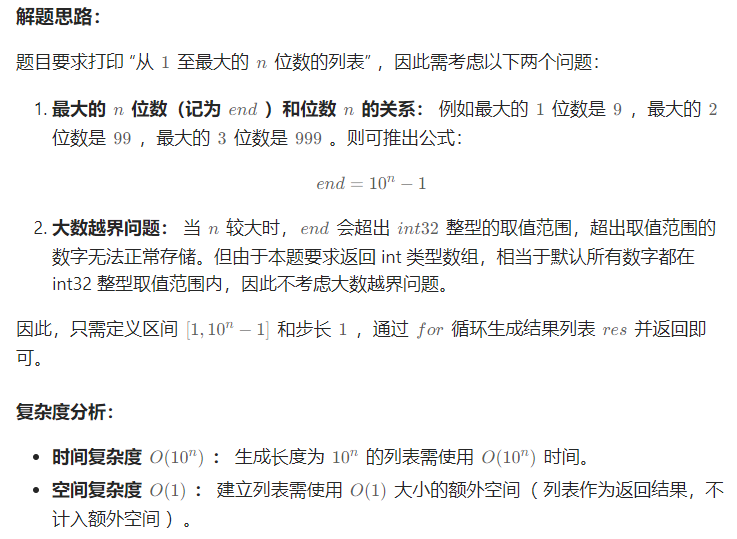

title:: 剑指 Offer 17. 打印从1到最大的n位数-简单

- ## 题目
	- 输入数字 `n`，按顺序打印出从 1 到最大的 n 位十进制数。比如输入 3，则打印出 1、2、3 一直到最大的 3 位数 999。
	- ## 示例
		- ```
		  **输入:** n = 1
		  **输出:** [1,2,3,4,5,6,7,8,9]
		  ```
- ## [题解](https://leetcode.cn/problems/da-yin-cong-1dao-zui-da-de-nwei-shu-lcof/solutions/278565/mian-shi-ti-17-da-yin-cong-1-dao-zui-da-de-n-wei-2/)
	- 
- ## 代码
	- ```java
	  class Solution {
	      public int[] printNumbers(int n) {
	          int end = (int)Math.pow(10, n) - 1;
	          int[] res = new int[end];
	          for(int i = 0; i < end; i++)
	              res[i] = i + 1;
	          return res;
	      }
	  }
	  ```