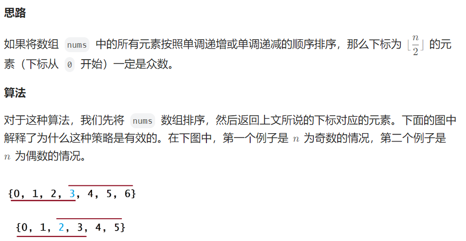
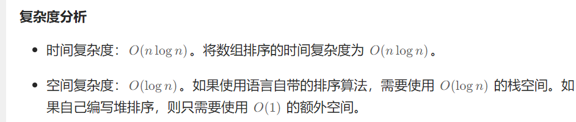

title:: 剑指 Offer 39. 数组中出现次数超过一半的数字-简单

- # 题目
	- 数组中有一个数字出现的次数超过数组长度的一半，请找出这个数字。
	-
	- 你可以假设数组是非空的，并且给定的数组总是存在多数元素。
	- ## 示例
		- ```java
		  输入: [1, 2, 3, 2, 2, 2, 5, 4, 2]
		  输出: 2
		  ```
- # 思路
	- ## 方法一：Hash表
		- 1、hashMap 统计每个出现的次数
		- 2、遍历hashMap 找到大于数组一半的
		- 代码
		  collapsed:: true
			- ```java
			  class Solution {
			      private Map<Integer, Integer> countNums(int[] nums) {
			          Map<Integer, Integer> counts = new HashMap<Integer, Integer>();
			          for (int num : nums) {
			              if (!counts.containsKey(num)) {
			                  counts.put(num, 1);
			              } else {
			                  counts.put(num, counts.get(num) + 1);
			              }
			          }
			          return counts;
			      }
			  
			      public int majorityElement(int[] nums) {
			          Map<Integer, Integer> counts = countNums(nums);
			  
			          Map.Entry<Integer, Integer> majorityEntry = null;
			          for (Map.Entry<Integer, Integer> entry : counts.entrySet()) {
			              if (majorityEntry == null || entry.getValue() > majorityEntry.getValue()) {
			                  majorityEntry = entry;
			              }
			          }
			  
			          return majorityEntry.getKey();
			      }
			  }
			  
			  
			  ```
		- ## 复杂度
			- 都是O(n)
	- ## 方法二：排序
		- 如果将数组 nums 中的所有元素按照单调递增或单调递减的顺序排序，  
		  ​
		- 排序后取中位数
		- ## 代码
		  collapsed:: true
			- ```java
			  class Solution {
			      public int majorityElement(int[] nums) {
			          Arrays.sort(nums);
			          return nums[nums.length / 2];
			      }
			  }
			  ```
		- ## 复杂度
			- 