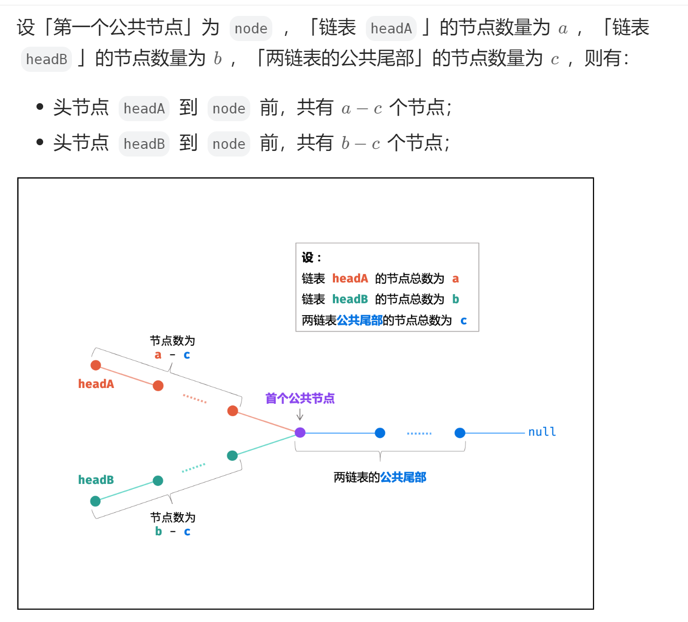

title:: 剑指 Offer 52. 两个链表的第一个公共节点-简单

- # 题目
	- 输入两个链表，找出它们的第一个公共节点。
	- 如下面的两个链表
		- 
		- 在节点 c1 开始相交。
- # 示例1：
  collapsed:: true
	- 
	- ```java
	  输入：intersectVal = 8, listA = [4,1,8,4,5], listB = [5,0,1,8,4,5], skipA = 2, skipB = 3
	  输出：Reference of the node with value = 8
	  输入解释：相交节点的值为 8 （注意，如果两个列表相交则不能为 0）。
	  从各自的表头开始算起，链表 A 为 [4,1,8,4,5]，链表 B 为 [5,0,1,8,4,5]。
	  在 A 中，相交节点前有 2 个节点；在 B 中，相交节点前有 3 个节点。
	  ```
- # 示例2：
  collapsed:: true
	- 
	- ```java
	  输入：intersectVal = 2, listA = [0,9,1,2,4], listB = [3,2,4], skipA = 3, skipB = 1
	  输出：Reference of the node with value = 2
	  输入解释：相交节点的值为 2 （注意，如果两个列表相交则不能为 0）。
	  从各自的表头开始算起，链表 A 为 [0,9,1,2,4]，链表 B 为 [3,2,4]。
	  在 A 中，相交节点前有 3 个节点；在 B 中，相交节点前有 1 个节点。
	  ```
- # 示例3：
  collapsed:: true
	- 
	- ```java
	  输入：intersectVal = 0, listA = [2,6,4], listB = [1,5], skipA = 3, skipB = 2
	  输出：null
	  输入解释：从各自的表头开始算起，链表 A 为 [2,6,4]，链表 B 为 [1,5]。
	  由于这两个链表不相交，所以 intersectVal 必须为 0，而 skipA 和 skipB 可以是任意值。
	  解释：这两个链表不相交，因此返回 null。
	  ```
- # 思路
	- ## 方法一：hash表    hashSet
	  collapsed:: true
		- ```java
		  public class Solution {
		      public ListNode getIntersectionNode(ListNode headA, ListNode headB) {
		          Set<ListNode> visited = new HashSet<ListNode>();
		          // 遍历第一个链表 存在哈希表中
		          ListNode temp = headA;
		          while (temp != null) {
		              visited.add(temp);
		              temp = temp.next;
		          }
		          // 遍历第二个链表  
		          temp = headB;
		          while (temp != null) {
		              if (visited.contains(temp)) {
		                  return temp;
		              }
		              temp = temp.next;
		          }
		          return null;
		      }
		  }
		  ```
	- ## 方法二：双指针遍历
		- 思想是2种情况：
			- 要么有相交:
				- 不想交前个数相同，肯定同时相交
				- [[#red]]==**个数不同，遍历自己+遍历对方，遍历2次。互相用时肯定一致，如果有相交肯定就相交了**==
			- 要么无相交: ，
			-
		- 双指针：指针A，指针B
		- 
		- ```java
		  public class Solution {
		      public ListNode getIntersectionNode(ListNode headA, ListNode headB) {
		          ListNode A = headA, B = headB;
		          // 指针A 遍历完A 后遍历B 
		          // 指针B  遍历完B 后遍历A
		          // 直到2个相遇
		          while (A != B) {
		              A = A != null ? A.next : headB;
		              B = B != null ? B.next : headA;
		          }
		          return A;
		      }
		  }
		  ```