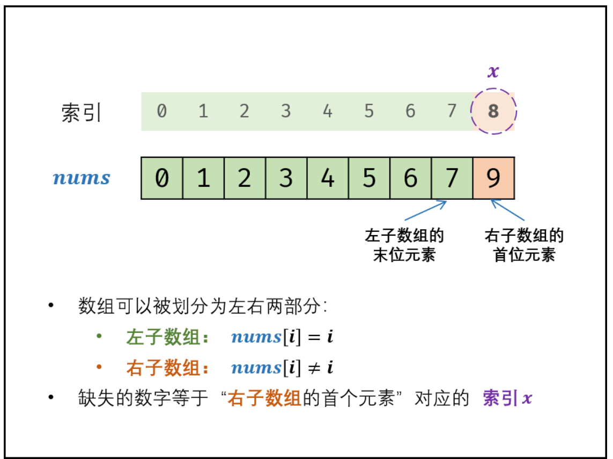
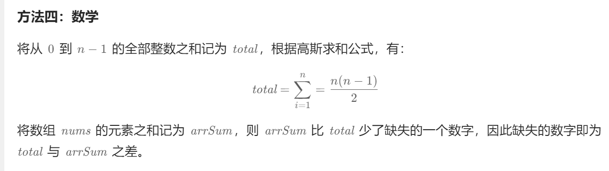

title:: 剑指 Offer 53 - II. 0～n-1中缺失的数字-简单

- # [题目原文](https://leetcode.cn/problems/que-shi-de-shu-zi-lcof/description/)
	- 一个长度为n-1的递增排序数组中的所有数字都是唯一的，并且每个数字都在范围0～n-1之内。在范围0～n-1内的n个数字中有且只有一个数字不在该数组中，请找出这个数字。
	- ## **示例 1:**
		- ```java
		  输入: [0,1,3]
		  输出: 2
		  ```
	- ## 示例2：
		- ```java
		  输入: [0,1,2,3,4,5,6,7,9]
		  输出: 8
		  ```
- ## 方式一： 二分查找
	- ## 思路
		- 排序数组->二分查找
		- 
		- 1、记住有序数组，不缺少肯定nums[i] = i的
		- 2、缺少一个分为左右2块，左侧nums[i] = i 右侧 nums[i] != i
		- 3、找到右侧第一个不等的
		- ```java
		  class Solution {
		      public int missingNumber(int[] nums) {
		          int i = 0, j = nums.length - 1;
		          while(i <= j) { // 跳出循环条件：直到下标相遇
		              int m = (i + j) / 2; //1、取中间下标 
		              if(nums[m] == m) i = m + 1;// 2、根据条件判断  相等说明得右移
		              else j = m - 1; // 3、不相等 往左移找第一个
		          }
		          return i;
		      }
		  }
		  ```
	- ## 二分查找的复杂度
		- 时间复杂度 O(logN)： 二分法为对数级别复杂度。
		- 空间复杂度 O(1)： 几个变量使用常数大小的额外空间。
	-
- ## 方法二：直接遍历
	- 由于数组已经按递增顺序排序，因此可以根据数组中每个下标处的元素是否和下标相等，得到缺失的数字。
	- ```java
	  class Solution {
	      public int missingNumber(int[] nums) {
	          // 不缺少应该是n个
	          int n = nums.length + 1;
	          
	          for (int i = 0; i < n - 1; i++) {
	              if (nums[i] != i) {
	                  return i;
	              }
	          }
	          return n - 1;
	      }
	  }
	  ```
	- 时间复杂度：O(n)，其中 n 是数组 nums 的长度加 1。需要遍历数组 nums 一次寻找缺失的数字。
	- 空间复杂度：O(1)。
- # 其他方案
  collapsed:: true
	- ## 方法一：哈希
	  collapsed:: true
		- ```java
		  class Solution {
		      public int missingNumber(int[] nums) {
		          Set<Integer> set = new HashSet<Integer>();
		          // 不缺少数字的数量
		          int n = nums.length + 1;
		          // 遍历nums 为 n-1个数  存入 
		          for (int i = 0; i < n - 1; i++) {
		              set.add(nums[i]);
		          }
		          int missing = -1;
		          // 遍历 n 验证缺少值
		          for (int i = 0; i <= n - 1; i++) {
		              if (!set.contains(i)) {
		                  missing = i;
		                  break;
		              }
		          }
		          return missing;
		      }
		  }
		  ```
	- ## 方法三：高斯求和
	  collapsed:: true
		- 
		- ```java
		  class Solution {
		      public int missingNumber(int[] nums) {
		          int n = nums.length + 1;
		          int total = n * (n - 1) / 2;
		          int arrSum = 0;
		          for (int i = 0; i < n - 1; i++) {
		              arrSum += nums[i];
		          }
		          return total - arrSum;
		      }
		  }
		  ```
-