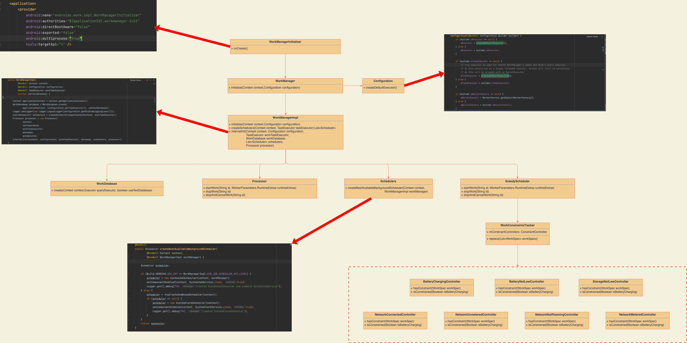
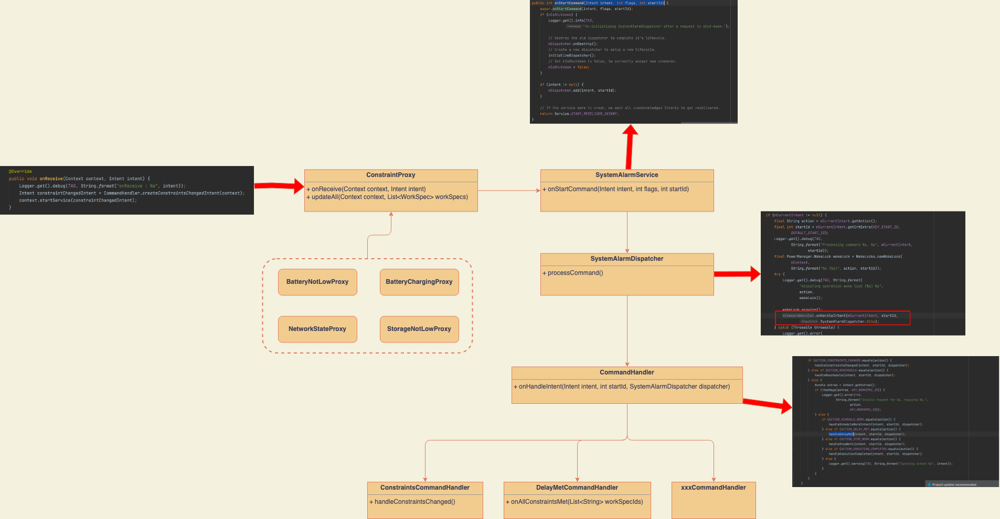

- # WorkManager是干啥的
  collapsed:: true
	- WorkManager是一个可靠异步任务框架。相比其他调度框架WorkManager有以下优势：
	- 强大的任务调度策略，允许给任务设置约束，在耗电量，网络的条件下约束任务执行，达到最优效果。
	  兼容性平台广，支持安卓多个版本的兼容。
	  安全可靠，保证任务一定会被执行，即使在app异常退出后，下次进入依旧会调度任务。
	  策略灵活，支持任务回退策略、支持任务失败重新调度。
	  注意：WorkManager不是一种新的工作线程，它的出现不是为了替代其它类型的工作线程。工作线程通常立即运行，并在执行完成后给到用户反馈。而WorkManager不是即时的，它不能保证任务能立即得到执行。
- # 你将学到
	- WorkManager是如何初始化的？初始化了哪些东西？
	  WorkManager是如何做到即使APP异常退出后，调度任务仍可以在下次启动后重新调度？
	  WorkManager的耗电量，网络这些约束是怎么执行的？
	  WorkManager的周期性任务和一次性任务都是怎么调度的。
- # 源码分析
	- ## 初始化
	  collapsed:: true
		- 我们先来一张结构图从整体角度来看下WorkManager的初始化
		  collapsed:: true
			- 
		- WorkManager由ContentProvider进行初始化，所以无需使用者手动初始化。
		  整个初始化阶段会初始化线程池、数据库、调度器、处理器、约束控制器组件。
		- ### WorkManagerInitializer
		  collapsed:: true
			- 我们可以看到看到WorkManager并不需要开发者手动调用初始化代码，而是巧妙的利用了ContentProvider来自动触发初始化任务的执行。
			- 我们是不是也可以利用ContentProvider来对我们App环境做一些初始化操作呢？比如说BuildConfig里的全局静态变量赋值用ContentProvider进行统一维护加载。
			- WorkManagerInitializer实际会调用WorkManagerImpl类完成具体的初始化任务，待会我们具体会讲到。
		- ### Configuration
		  collapsed:: true
			- WorkManager的初始化配置类，内部会初始化两个线程池任务Executor、TaskExecutor。如果外部没有传入，则是用默认的配置初始化线程池。
			- TaskExecutor 负责立即将你的 WorkRequest信息保存到WorkManager数据库。
			  稍后，当满足WorkRequest的Constraints时（可以立即发生），Internal TaskExecutor 会告诉 WorkerFactory创建一个 Worker。
			- 默认的 Executor 调用你的 Worker的doWork()方法脱离主线程。
		- ### WorkManagerImpl
		  collapsed:: true
			- 真正进行负责初始化任务的类，主要做了以下内容：
			  collapsed:: true
				- 1 初始化WorkDatabase数据库，用于记录调度任务。这也就是为什么WorkManager可以保障调度任务不会丢失，即使在异常情况下，因为他都存在了数据库里。
				- 2 初始化任务调度器列表。调度器列表第一个元素是根据当前系统版本生成可用的后台任务调度器，第二个元素是一个贪心调度器。
					- GreedyScheduler：看网上大部分帖子总结的都是“执行没有任何约束的非周期性的任务”。但实际上也会执行带约束的非周期性的任务。但是前提条件是buildsdkversion< 24,或者没有设置ContentUriTriggers
					- SystemJobScheduler/GcmBasedScheduler/SystemAlarmScheduler：执行周期性或者有约束性的任务。优先返回SystemJobScheduler，在build version小于23的情况下先尝试返回GcmBasedScheduler，若返回为空再返回SystemAlarmScheduler。
				- 3 internalInit内部初始化任务，主要是对异常退出重新启动场景下，对任务重新调度。
		- ### WorkConstraintsTracker
			- 持有相关约束控制类，当满足任务约束条件时，通知任务执行。目前WorkManager内置了如下任务约束控制器
			- BatteryChargingController 电池充电状态
			  BatteryNotLowController 手机低电量状态
			  StorageNotLowController 存储低空间状态
			  NetworkConnectedController 网络连接可用状态
			  NetworkUnmeteredController 网络非计费状态
			  NetworkNotRoamingController 网络非漫游状态
			  NetworkMeteredController 网络计费状态
			  我们后边会专门讲述这些约束实现逻辑，这里只留一个概念。
			-
	- ## 任务调度流程
	  collapsed:: true
		- 我们还是先从整体角度来看下WorkManager的调度。
		  collapsed:: true
			- 
			-
		- 1 整个调度流程是从WorkManager开始，到Processor处理器最终调用具体任务的doWork()方法结束。
		- 2 WorkManager会根据调度任务的不同交给GreedyScheduler和BestAvailableBackgroundScheduler。其中GreedyScheduler会调度不需要延时的任务，BestAvailableBackgroundScheduler会根据系统版本生成真正可用的调度器，负责调度需要延迟或者周期性的任务。
		- ### WorkContinuationImpl
		  collapsed:: true
			- 无论你是调用WorkManager.enqueue的任务，还是WorkContinuation.enqueue的任务，最终都会执行到WorkContinuationImpl的enqueue方法。
			- 在这里，如果这个任务没有在排队，那么就会创建一个EnqueueRunnable对象，由WorkManager之前初始化的TaskExecutor线程池执行任务。
			  collapsed:: true
				- ```
				      public @NonNull Operation enqueue() {
				          if (!mEnqueued) {
				              EnqueueRunnable runnable = new EnqueueRunnable(this);        
				  	 mWorkManagerImpl.getWorkTaskExecutor().executeOnBackgroundThread(runnable);
				             ········
				          } else {
				  ······
				          }
				          return mOperation;
				      }
				  ```
		- ### EnqueueRunnable
		  collapsed:: true
			- EnqueueRunnable任务中，会先调用addToDatabase()方法将调度任务添加到数据库中。这样，在这个任务被真正调度之前，调度任务绝不会丢失，除非连APP的数据库都被清除了。
			  collapsed:: true
				- ```
				  public void run() {
				          try {
				              ·····
				              boolean needsScheduling = addToDatabase();
				              if (needsScheduling) {
				                  final Context context =
				                          mWorkContinuation.getWorkManagerImpl().getApplicationContext();
				                  PackageManagerHelper.setComponentEnabled(context, RescheduleReceiver.class, true);
				                  scheduleWorkInBackground();
				              }
				              mOperation.setState(Operation.SUCCESS);
				          } catch (Throwable exception) {
				              mOperation.setState(new Operation.State.FAILURE(exception));
				          }
				      }
				  ```
			- 当任务添加到数据库之后，如果该任务需要被调度，那么就会调用scheduleWorkInBackground()方法最终调用Schedulers.schedule(）来调度任务。
			- 在这个方法中会先从数据库中取出刚才的任务，然后交给schedulers去遍历调度执行。这里的schedulers就是初始化时创建的两个调度器GreedyScheduler和BestAvailableBackgroundScheduler。
			  collapsed:: true
				- ```
				    public static void schedule(
				              @NonNull Configuration configuration,
				              @NonNull WorkDatabase workDatabase,
				              List<Scheduler> schedulers) {
				          if (schedulers == null || schedulers.size() == 0) {
				              return;
				          }
				  
				          WorkSpecDao workSpecDao = workDatabase.workSpecDao();
				          List<WorkSpec> eligibleWorkSpecs;
				  
				          workDatabase.beginTransaction();
				          try {
				              eligibleWorkSpecs = workSpecDao.getEligibleWorkForScheduling(
				                      configuration.getMaxSchedulerLimit());
				              if (eligibleWorkSpecs != null && eligibleWorkSpecs.size() > 0) {
				                  long now = System.currentTimeMillis();
				                  for (WorkSpec workSpec : eligibleWorkSpecs) {
				                      workSpecDao.markWorkSpecScheduled(workSpec.id, now);
				                  }
				              }
				              workDatabase.setTransactionSuccessful();
				          } finally {
				              workDatabase.endTransaction();
				          }
				  
				          if (eligibleWorkSpecs != null && eligibleWorkSpecs.size() > 0) {
				              WorkSpec[] eligibleWorkSpecsArray = eligibleWorkSpecs.toArray(new WorkSpec[0]);
				              // Delegate to the underlying scheduler.
				              for (Scheduler scheduler : schedulers) {
				                  scheduler.schedule(eligibleWorkSpecsArray);
				              }
				          }
				      }
				  ```
			- 这时候你就有疑问了，为啥一个任务要两个调度器执行？而不是指定对应的调度器去执行？这样做会不会出现重复执行任务的问题？
			- 实际上虽然这里调度器列表遍历去调度，但是实际上不会出现一个任务被两次执行的问题。具体原因我们后边给出答案。我们先继续我们的分析。
			- 我们假设系统是大于23，BestAvailableBackgroundScheduler选用了SystemJobScheduler调度器，我们以SystemJobScheduler进行分析。
			-
		- ### SystemJobScheduler
		  collapsed:: true
			- SystemJobScheduler会从数据库中取出对应任务id，然后在scheduleInternal方法里调用mSystemJobInfoConverter.convert()转换成JobInfo最终交给JobScheduler去调度任务。
			  collapsed:: true
				- ```
				  public void schedule(@NonNull WorkSpec... workSpecs) {
				          WorkDatabase workDatabase = mWorkManager.getWorkDatabase();
				  
				          for (WorkSpec workSpec : workSpecs) {
				              workDatabase.beginTransaction();
				              try {
				                  WorkSpec currentDbWorkSpec = workDatabase.workSpecDao().getWorkSpec(workSpec.id);
				                  ·······
				                  scheduleInternal(workSpec, jobId);
				  
				                  if (Build.VERSION.SDK_INT == 23) {
				                     
				                      if (jobIds != null) {
				                          ············
				                          scheduleInternal(workSpec, nextJobId);
				                      }
				                  }
				                  workDatabase.setTransactionSuccessful();
				              } finally {
				                  workDatabase.endTransaction();
				              }
				          }
				      }
				  ```
				- ```
				  public void scheduleInternal(WorkSpec workSpec, int jobId) {
				          JobInfo jobInfo = mSystemJobInfoConverter.convert(workSpec, jobId);
				          
				          try {
				              mJobScheduler.schedule(jobInfo);
				          } catch (IllegalStateException e) {
				              ·······
				          } catch (Throwable throwable) {
				              ·······
				          }
				      }
				  ```
			- JobScheduler是android在5.0上针对于降低功耗而提出来的一种策略方案，所有的降耗策略与WorkManager完全一致。所以也可以这么理解WorkManager是对JobScheduler的兼容包装。
			- JobScheduler特性不在我们这次研究范围大家可以自行了解。但是有个特性必须要在这里说明下：
			- JobScheduler面对的是定时任务，系统内置了最小的周期事件，为15分钟。如果我们设置的周期小于15分钟，则会被强制设置为15分钟。
		- ### SystemJobService
		  collapsed:: true
			- 最终JobScheduler会在SystemJobService的onStartJob()唤起我们的任务。然后调用mWorkManagerImpl.startWork()去开始任务的执行
				- ```
				  public boolean onStartJob(@NonNull JobParameters params) {
				          if (mWorkManagerImpl == null) {
				              jobFinished(params, true);
				              return false;
				          }
				  
				          String workSpecId = getWorkSpecIdFromJobParameters(params);
				        ·······
				          mWorkManagerImpl.startWork(workSpecId, runtimeExtras);
				          return true;
				      }
				  
				  ```
		- ### GreedyScheduler
		  collapsed:: true
			- 刚我们提到schedulers调度器列表第二个调度器就是GreedyScheduler，一个贪心调度器。这个调度器的任务主要调度一些非周期性的任务。
			- GreedyScheduler的schedule方法可以看到，对于非周期性任务没约束条件的任务会直接调用mWorkManagerImpl.startWork()执行任务。如果是有约束条件，24以下或者没有设置contentUriTriggers会加到constrainedWorkSpecs列表里。后续判断constrainedWorkSpecs列表不为空的时候就会调用mWorkConstraintsTracker.replace()方法。
				- ```
				  public void schedule(@NonNull WorkSpec... workSpecs) {
				          ········
				          for (WorkSpec workSpec: workSpecs) {
				              if (workSpec.state == WorkInfo.State.ENQUEUED
				                      && !workSpec.isPeriodic()
				                      && workSpec.initialDelay == 0L
				                      && !workSpec.isBackedOff()) {
				                  if (workSpec.hasConstraints()) {
				                      if (Build.VERSION.SDK_INT < 24
				                              || !workSpec.constraints.hasContentUriTriggers()) {
				                          constrainedWorkSpecs.add(workSpec);
				                          constrainedWorkSpecIds.add(workSpec.id);
				                      }
				                  } else {
				                mWorkManagerImpl.startWork(workSpec.id);
				                  }
				              }
				          }
				          synchronized (mLock) {
				              if (!constrainedWorkSpecs.isEmpty()) {           mConstrainedWorkSpecs.addAll(constrainedWorkSpecs);
				                  mWorkConstraintsTracker.replace(mConstrainedWorkSpecs);
				              }
				          }
				      }
				  ```
		- ### WorkConstraintsTracker
		  collapsed:: true
			- 上一步提到GreedyScheduler的schedule方法最终会调用WorkConstraintsTracker的replace方法。
			- 这里会循环遍历ConstraintController重新设置callback
			  collapsed:: true
				- ```
				  public void replace(@NonNull List<WorkSpec> workSpecs) {
				          synchronized (mLock) {
				              for (ConstraintController controller : mConstraintControllers) {
				                  controller.setCallback(null);
				              }
				  
				              for (ConstraintController controller : mConstraintControllers) {
				                  controller.replace(workSpecs);
				              }
				  
				              for (ConstraintController controller : mConstraintControllers) {
				                  controller.setCallback(this);
				              }
				          }
				      }
				  ```
			- 而ConstraintController的Callback回调最终又会回调到GreedyScheduler的onAllConstraintsMet的回调函数里。在这里会对所有满足约束条件的任务调用mWorkManagerImpl.startWork()来执行任务。
				- ```
				   @Override
				      public void onAllConstraintsMet(@NonNull List<String> workSpecIds) {
				          for (String workSpecId : workSpecIds) {
				              Logger.get().debug(
				                      TAG,
				                      String.format("Constraints met: Scheduling work ID %s", workSpecId));
				              mWorkManagerImpl.startWork(workSpecId);
				          }
				      }
				  ```
			- 通过刚才代码分析，我们知道GreedyScheduler也会调度非周期带约束的任务，并非如网上一些资料说的只会调度非周期无约束任务。
			- 在这里我们就可以解答下为什么有两个调度器在遍历调度一个任务，而最终不会出现一个任务被执行两遍的情况。
			- 因为在两个调度器的内部，BestAvailableBackgroundScheduler只负责周期性调度任务，而GreedyScheduler只负责非周期任务。
			- 当然GreedyScheduler也不是会执行所有的非周期任务，当你的任务设置了约束条件，并且设置了ContentUriTriggers并且你的版本大于24的时候，GreedyScheduler不在调度这个任务，而是交给了BestAvailableBackgroundScheduler。
		- ### Processor
		  collapsed:: true
			- 上边我们提到两个scheduler最终都会调用WorkManagerImpl的startWork()方法最终去真正调度任务，我们顺着代码可以看到最终任务是交给了WorkTaskExecutor线程池执行StartWorkRunnable任务。而StartWorkRunnable的run方法又将任务交给了Processor去处理,Processor又将任务包装成WorkerWrapper在交个WorkTaskExecutor线程池执行Runnable。
			- ```
			  public void startWork(String workSpecId, WorkerParameters.RuntimeExtras runtimeExtras) {
			          mWorkTaskExecutor
			                  .executeOnBackgroundThread(
			                          new StartWorkRunnable(this, workSpecId, runtimeExtras));
			      }
			  ```
			- ```
			  public void run() {
			          mWorkManagerImpl.getProcessor().startWork(mWorkSpecId, mRuntimeExtras);
			      }
			  ```
			- ```
			  public boolean startWork(String id, WorkerParameters.RuntimeExtras runtimeExtras) {
			          WorkerWrapper workWrapper;
			          synchronized (mLock) {
			              if (mEnqueuedWorkMap.containsKey(id)) {
			                  Logger.get().debug(
			                          TAG,
			                          String.format("Work %s is already enqueued for processing", id));
			                  return false;
			              }
			  
			              workWrapper =
			                      new WorkerWrapper.Builder(
			                              mAppContext,
			                              mConfiguration,
			                              mWorkTaskExecutor,
			                              mWorkDatabase,
			                              id)
			                              .withSchedulers(mSchedulers)
			                              .withRuntimeExtras(runtimeExtras)
			                              .build();
			              ListenableFuture<Boolean> future = workWrapper.getFuture();
			          }
			        
			  //最终又扔到线程池里一个任务
			   mWorkTaskExecutor.getBackgroundExecutor().execute(workWrapper);
			          return true;
			      }
			  ```
			- 这里你肯定有疑问，为啥WorkManager不一步到位，而是先搞个StartWorkRunnable，然后又搞个WorkerWrapper调来调去的？这块也是我的疑问，大家可以探讨下。
		- ### WorkerWrapper
		  collapsed:: true
			- 最终任务调度到这个WorkerWrapper类里执行runWorker()方法真正调度任务。因为这个runWorker()方法太长了这里就不贴里边的具体代码了。我们主要看两个东西。
			- 首先是Worker任务的具体执行时机，WorkTaskExecutor开启了一个主线程去调用mWorker.startWork()方法，这个最终就会调用到我们实际的任务上。
			- ```
			  mWorkTaskExecutor.getMainThreadExecutor()
			                      .execute(new Runnable() {
			                          @Override
			                          public void run() {
			                              try {
			                                 
			                                  mInnerFuture = mWorker.startWork();
			                                  future.setFuture(mInnerFuture);
			                              } catch (Throwable e) {
			                                  future.setException(e);
			                              }
			  
			                          }
			                      });
			  ```
			- 另外一个点是这个方法里的一个注释
				- ```
				  // Case 2:
				              // On API 23, we double scheduler Workers because JobScheduler prefers batching.
				              // So is the Work is periodic, we only need to execute it once per interval.
				              // Also potential bugs in the platform may cause a Job to run more than once.
				  ```
			- 这时候又回到我们之前的那个问题，两个调度器遍历调度任务会不会出现一个任务被执行两次的问题？
			- 刚才我的回答是不会，因为每个schedule会执行执行特定的任务，但这里官方很诚实的加上注释说明了。23平台上会有潜在bug会调度多次！！（尼玛！）
			- 那我们分析下潜在的风险究竟是什么。
			- 数据库没来得及更改状态？但是Workmanager读取操作数据库都是用的事务，不太可能出现状态不一致情况。
			  异步组装任务造成任务状态不及时更新？我觉得也不太可能，因为组装任务是在数据库读取任务之后，此时及时异步线程组装任务也是在状态修改之后才执行的，不太可能出现问题。
			  目前这块暂时还没想明白具体会是什么潜在的Bug，（也许谷歌自己也不知道要不也不会用潜在这个词），总之这里是个坑。
			- 也就是说WorkManager保证任务一定会执行，但是不保证任务会被立即执行，也不保证任务不会被调用多次。
			- 我们在从一个全局角度看下这个任务调度逻辑。
			- 约束条件逻辑
				- 我们在上边分析GreedyScheduler调度逻辑的时候讲到了WorkConstraintsTracker约束追踪器这个东西，它持有了BatteryChargingController等多种条件控制器。当约束条件满足后会回调onConstraintMet，并回调GreedyScheduler一个onAllConstraintsMet的函数。在这里GreedyScheduler会执行那些已经满足约束的调度任务。
				- ```
				      public void onConstraintMet(@NonNull List<String> workSpecIds) {
				          synchronized (mLock) {
				              List<String> unconstrainedWorkSpecIds = new ArrayList<>();
				              for (String workSpecId : workSpecIds) {
				                  if (areAllConstraintsMet(workSpecId)) {
				                      Logger.get().debug(TAG, String.format("Constraints met for %s", workSpecId));
				                      unconstrainedWorkSpecIds.add(workSpecId);
				                  }
				              }
				              if (mCallback != null) {
				               //回调外部所有约束都已经满足了   mCallback.onAllConstraintsMet(unconstrainedWorkSpecIds);
				              }
				          }
				      }
				  ```
				- 这是对于GreedyScheduler执行非周期性任务的逻辑。那对于约束条件暂时不满足，后期又满足的情况WorkManager是怎么处理的呢？我们还是从最开始的源头来分析下。
				- 我们知道，耗电量、存储、网络这些状态的监听只能通过系统广播来实现，所以源头一定是广播。
		- ### ConstraintProxy
		  collapsed:: true
			- WorkManager的约束广播都是继承ConstraintProxy这个抽象类。这个类的父类就是广播。
			- ```
			  abstract class ConstraintProxy extends BroadcastReceiver {
			      private static final String TAG = Logger.tagWithPrefix("ConstraintProxy");
			  
			      @Override
			      public void onReceive(Context context, Intent intent) {
			          Logger.get().debug(TAG, String.format("onReceive : %s", intent));
			          Intent constraintChangedIntent = CommandHandler.createConstraintsChangedIntent(context);
			          context.startService(constraintChangedIntent);
			      }
			  
			      ·····
			  }
			  ```
			- 我们重点看下onReceive()这个方法，当约束条件变化的时候会调用CommandHandler向SystemAlarmService发送消息。
				- ```
				   static Intent createConstraintsChangedIntent(@NonNull Context context) {
				          Intent intent = new Intent(context, SystemAlarmService.class);
				          intent.setAction(ACTION_CONSTRAINTS_CHANGED);
				          return intent;
				      }
				  ```
			- SystemAlarmService没啥内容，主要是将消息有交给了SystemAlarmDispatcher来分发。
		- ### SystemAlarmDispatcher
			- 这里重点看下processCommand()这个方法。这里创建一个异步线程有将任务扔回给了CommandHandler的onHandleIntent()方法处理。
				- ```
				  private void processCommand() {
				  ····
				  try {
				  processCommandLock.acquire();
				  // Process commands on the background thread.
				  mWorkManager.getWorkTaskExecutor().executeOnBackgroundThread(new Runnable() {
				  @Override
				  public void run() {
				  ·····
				  try {
				   wakeLock.acquire();
				                          mCommandHandler.onHandleIntent(mCurrentIntent, startId,
				                                  SystemAlarmDispatcher.this);
				                      } catch (Throwable throwable) {
				                         
				                      }  finally {
				                          
				                      }
				                  }
				              }
				          });
				      } finally {
				          processCommandLock.release();
				      }
				  }
				  ```
			- 我这里整理下链路，首先是ConstraintProxy约束广播，然后用CommandHandler创建消息发送给SystemAlarmService服务。这个服务又把消息给SystemAlarmDispatcher，SystemAlarmDispatcher创建一个异步线程任务又把消息扔给CommandHandler去处理任务。我们用一个图来总体看下。
				- 
			- 具体到这里后边的逻辑大家心里就有谱了，CommandHandler会接受多种指令，有重新调度的，有约束条件变换的有约束延迟满足的。这些指令在进一步给到对应的调度器和分发器，最终由WorkManagerImpl执行相应的策略。
			- 这里就不在具体往后跟踪代码分析了，大家有兴趣可以自行分析一波。
			- 异常退出重新调度
			  最后我们来讲讲大家感兴趣的一个问题，WorkManager如何做到异常退出重新启动后，仍然调度未完成的任务的。
			- 首先还是要从最开始的初始化WorkManagerImpl类开始说起