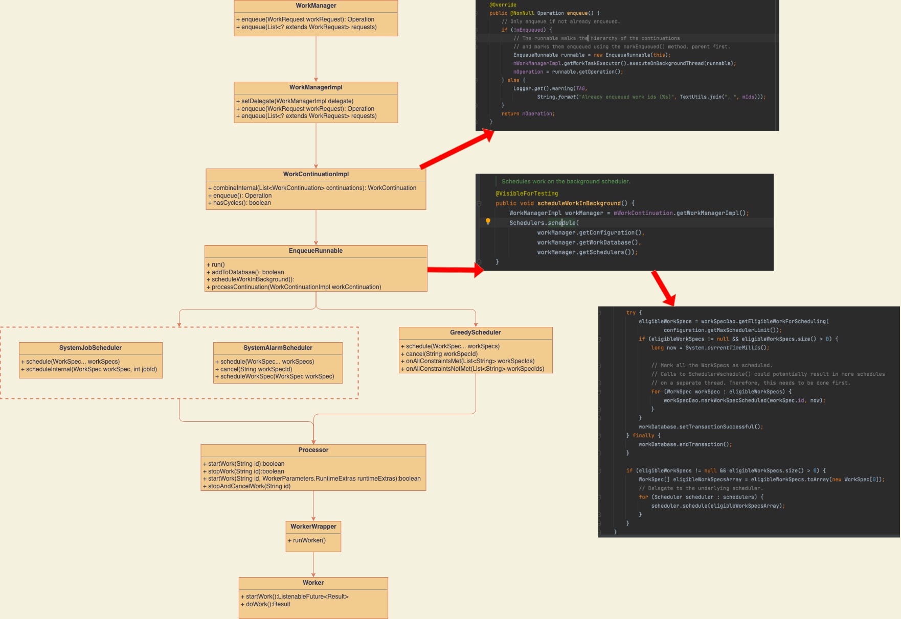

- # WorkManager是干啥的
  collapsed:: true
	- WorkManager是一个可靠异步任务框架。相比其他调度框架WorkManager有以下优势：
	- 强大的任务调度策略，允许给任务设置约束，在耗电量，网络的条件下约束任务执行，达到最优效果。
	  兼容性平台广，支持安卓多个版本的兼容。
	  安全可靠，保证任务一定会被执行，即使在app异常退出后，下次进入依旧会调度任务。
	  策略灵活，支持任务回退策略、支持任务失败重新调度。
	  注意：WorkManager不是一种新的工作线程，它的出现不是为了替代其它类型的工作线程。工作线程通常立即运行，并在执行完成后给到用户反馈。而WorkManager不是即时的，它不能保证任务能立即得到执行。
- # 你将学到
	- WorkManager是如何初始化的？初始化了哪些东西？
	  WorkManager是如何做到即使APP异常退出后，调度任务仍可以在下次启动后重新调度？
	  WorkManager的耗电量，网络这些约束是怎么执行的？
	  WorkManager的周期性任务和一次性任务都是怎么调度的。
- # 源码分析
	- ## 初始化
	  collapsed:: true
		- 我们先来一张结构图从整体角度来看下WorkManager的初始化
		  collapsed:: true
			- 
		- WorkManager由ContentProvider进行初始化，所以无需使用者手动初始化。
		  整个初始化阶段会初始化线程池、数据库、调度器、处理器、约束控制器组件。
		- ### WorkManagerInitializer
		  collapsed:: true
			- 我们可以看到看到WorkManager并不需要开发者手动调用初始化代码，而是巧妙的利用了ContentProvider来自动触发初始化任务的执行。
			- 我们是不是也可以利用ContentProvider来对我们App环境做一些初始化操作呢？比如说BuildConfig里的全局静态变量赋值用ContentProvider进行统一维护加载。
			- WorkManagerInitializer实际会调用WorkManagerImpl类完成具体的初始化任务，待会我们具体会讲到。
		- ### Configuration
		  collapsed:: true
			- WorkManager的初始化配置类，内部会初始化两个线程池任务Executor、TaskExecutor。如果外部没有传入，则是用默认的配置初始化线程池。
			- TaskExecutor 负责立即将你的 WorkRequest信息保存到WorkManager数据库。
			  稍后，当满足WorkRequest的Constraints时（可以立即发生），Internal TaskExecutor 会告诉 WorkerFactory创建一个 Worker。
			- 默认的 Executor 调用你的 Worker的doWork()方法脱离主线程。
		- ### WorkManagerImpl
		  collapsed:: true
			- 真正进行负责初始化任务的类，主要做了以下内容：
			  collapsed:: true
				- 1 初始化WorkDatabase数据库，用于记录调度任务。这也就是为什么WorkManager可以保障调度任务不会丢失，即使在异常情况下，因为他都存在了数据库里。
				- 2 初始化任务调度器列表。调度器列表第一个元素是根据当前系统版本生成可用的后台任务调度器，第二个元素是一个贪心调度器。
					- GreedyScheduler：看网上大部分帖子总结的都是“执行没有任何约束的非周期性的任务”。但实际上也会执行带约束的非周期性的任务。但是前提条件是buildsdkversion< 24,或者没有设置ContentUriTriggers
					- SystemJobScheduler/GcmBasedScheduler/SystemAlarmScheduler：执行周期性或者有约束性的任务。优先返回SystemJobScheduler，在build version小于23的情况下先尝试返回GcmBasedScheduler，若返回为空再返回SystemAlarmScheduler。
				- 3 internalInit内部初始化任务，主要是对异常退出重新启动场景下，对任务重新调度。
		- ### WorkConstraintsTracker
			- 持有相关约束控制类，当满足任务约束条件时，通知任务执行。目前WorkManager内置了如下任务约束控制器
			- BatteryChargingController 电池充电状态
			  BatteryNotLowController 手机低电量状态
			  StorageNotLowController 存储低空间状态
			  NetworkConnectedController 网络连接可用状态
			  NetworkUnmeteredController 网络非计费状态
			  NetworkNotRoamingController 网络非漫游状态
			  NetworkMeteredController 网络计费状态
			  我们后边会专门讲述这些约束实现逻辑，这里只留一个概念。
			-
	- ## 任务调度流程
	  collapsed:: true
		- 我们还是先从整体角度来看下WorkManager的调度。
		  collapsed:: true
			- 
			-
		- 1 整个调度流程是从WorkManager开始，到Processor处理器最终调用具体任务的doWork()方法结束。
		- 2 WorkManager会根据调度任务的不同交给GreedyScheduler和BestAvailableBackgroundScheduler。其中GreedyScheduler会调度不需要延时的任务，BestAvailableBackgroundScheduler会根据系统版本生成真正可用的调度器，负责调度需要延迟或者周期性的任务。