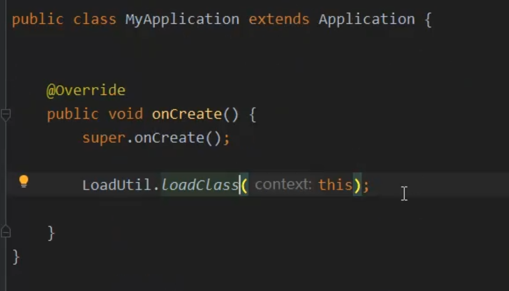

## 1、dexFile
	- 
- ## 2、思路：可以将插件的dex和宿主的dex合并成一个新的Elements
	- 
	- 
- ## 3、实现
	- LoadUtil
	  collapsed:: true
		- ```java
		  package com.enjoy.leo_plugin;
		  
		  import android.content.Context;
		  
		  import java.io.ObjectStreamException;
		  import java.lang.reflect.Array;
		  import java.lang.reflect.Field;
		  
		  import dalvik.system.DexClassLoader;
		  
		  public class LoadUtil {
		  
		      private final static String apkPath = "/sdcard/plugin-debug.apk";
		  
		      public static void loadClass(Context context) {
		  
		          /**
		           * 宿主dexElements = 宿主dexElements + 插件dexElements
		           *
		           * 1.获取宿主dexElements
		           * 2.获取插件dexElements
		           * 3.合并两个dexElements
		           * 4.将新的dexElements 赋值到 宿主dexElements
		           *
		           * 目标：dexElements  -- DexPathList类的对象 -- BaseDexClassLoader的对象，类加载器
		           *
		           * 获取的是宿主的类加载器  --- 反射 dexElements  宿主
		           *
		           * 获取的是插件的类加载器  --- 反射 dexElements  插件
		           */
		          try {
		              Class<?> clazz = Class.forName("dalvik.system.BaseDexClassLoader");
		              Field pathListField = clazz.getDeclaredField("pathList");
		              pathListField.setAccessible(true);
		  
		              Class<?> dexPathListClass = Class.forName("dalvik.system.DexPathList");
		              Field dexElementsField = dexPathListClass.getDeclaredField("dexElements");
		              dexElementsField.setAccessible(true);
		  
		              // 宿主的 类加载器
		              ClassLoader pathClassLoader = context.getClassLoader();
		              // DexPathList类的对象
		              Object hostPathList = pathListField.get(pathClassLoader);
		              // 宿主的 dexElements
		              Object[] hostDexElements = (Object[]) dexElementsField.get(hostPathList);
		  
		              // 插件的 类加载器
		              ClassLoader dexClassLoader = new DexClassLoader(apkPath, context.getCacheDir().getAbsolutePath(),
		                      null, pathClassLoader);
		              // DexPathList类的对象
		              Object pluginPathList = pathListField.get(dexClassLoader);
		              // 插件的 dexElements
		              Object[] pluginDexElements = (Object[]) dexElementsField.get(pluginPathList);
		  
		              // 宿主dexElements = 宿主dexElements + 插件dexElements
		  //            Object[] obj = new Object[]; // 不行
		  
		              // 创建一个新数组
		              Object[] newDexElements = (Object[]) Array.newInstance(hostDexElements.getClass().getComponentType(),
		                      hostDexElements.length + pluginDexElements.length);
		  
		              System.arraycopy(hostDexElements, 0, newDexElements,
		                      0, hostDexElements.length);
		              System.arraycopy(pluginDexElements, 0, newDexElements,
		                      hostDexElements.length, pluginDexElements.length);
		  
		              // 赋值
		              // hostDexElements = newDexElements
		              dexElementsField.set(hostPathList, newDexElements);
		  
		          } catch (Exception e) {
		              e.printStackTrace();
		          }
		      }
		  
		  }
		  
		  ```
	- 使用
		- 1、初始化合并加载DexElements
		  collapsed:: true
			- 
		- 2、其他地方可以直接使用反射调用 插件APK中的类了
		  collapsed:: true
			- 