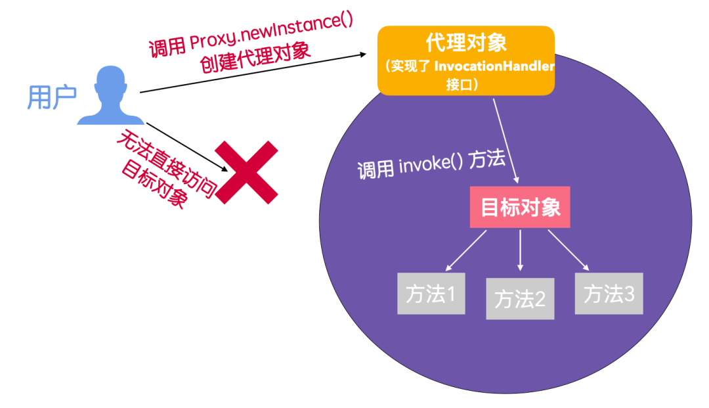

- ## 一、什么是动态代理
	- 首先，动态代理是代理模式的一种实现方式，代理模式除了动态代理还有 静态代理，只不过静态代理能够在编译时期确定类的执行对象，而动态代理只有在运行时才能够确定执行对象是谁。代理可以看作是对最终调用目标的一个封装，我们能够通过操作代理对象来调用目标类，这样就可以实现调用者和目标对象的解耦合。
	- 动态代理的应用场景有很多，最常见的就是 AOP 的实现、RPC 远程调用、Java 注解对象获取、日志框架、全局性异常处理、事务处理等。
	- 动态代理的实现有很多，但是 JDK 动态代理是很重要的一种
- ## 二、实现动态代理需要具备的因素
	- 被代理的接口
	- 接口实现类
	- 通过方法匹配代理方法(InvocationHandler中的invoke)
- ## 三、动态代理的作用
	- 1、方法插入代码：通过 接口中的 invoke 方法进行业务的调用和增强等处理，InvocationHandler是一个拦截器类
	- 2、api实现类的差异化，用代理类新实现替换旧实现
- ## 四、动态代理执行过程
	- 
	- RD无法直接访问 “目标接口实现类对象”，通过创建 “代理类对象”，调用invoke来访问目标对象的方法
	- 在 JDK 动态代理中，实现了 InvocationHandler 的类可以看作是 代理类
- ## 五、相关类
	- ### 5-1、InvocationHandler接口 (实现该接口作为代理类)
		- ```java
		  public interface InvocationHandler {
		     /**
		      * Object proxy: 
		      */
		      public Object invoke(Object proxy, Method method, Object[] args)
		          throws Throwable;
		  }
		  ```
	- ### 5-2、
-