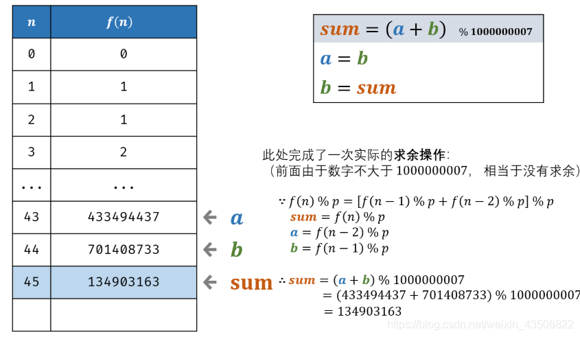

- # 一、动态规划定义
	- 动态规划（Dynamic Programming，DP）是运筹学的一个分支，是求解决策过程最优化的过程。20世纪50年代初，美国数学家贝尔曼（R.Bellman）等人在研究多阶段决策过程的优化问题时，提出了著名的最优化原理，从而创立了动态规划。动态规划的应用极其广泛，包括工程技术、经济、工业生产、军事以及自动化控制等领域，并在背包问题、生产经营问题、资金管理问题、资源分配问题、最短路径问题和复杂系统可靠性问题等中取得了显著的效果。
- # 二、动态规划的基本思想
	- 1.思想一：穷举法
	  动态规划没有为具体的问题设计特殊的解法，动态规划的方法在 每一阶段考虑了所有可能的情况，并且记录每一步的结果。但是我们通常不建议运用这个方法思想去解决大多数问题，但是他又是每个优化解法的基础，所以大家不要对穷举法产生排斥心理。
	- 2.思想二：空间换时间
	  表格法（programming）的语义是非常准确的，可以用动态规划解决的问题，很多时候就是让我们在求解问题的过程中，记录每一步求解的结果。其实还是 空间换时间 思想的体现。
- **状态定义：** 设 dp 为一维数组，其中 dp[i]的值代表 斐波那契数列第 i 个数字 。
- **转移方程：** dp[i + 1] = dp[i] + dp[i - 1]，即对应数列定义 f(n + 1) = f(n) + f(n - 1)；
- **初始状态：** dp[0] = 0, dp[1] = 1 ，即初始化前两个数字；
- **返回值：** dp[n] ，即斐波那契数列的第 n 个数字。
- ### **空间复杂度优化：**
	- >若新建长度为 n 的 dp 列表，则空间复杂度为 O(N)。
		- ```JAVA
		  public class recursion{
		   
		      public int fib(int N) {
		          if (N < 2) {
		              return N;
		          }
		          //状态数组 自底向上 dp递推方式
		          int[] dp = new int[N + 1];
		          // 初始化
		          dp[0] = 0;
		          dp[1] = 1;
		          // 递推开始
		          for (int i = 2; i < N + 1; i++) {
		              dp[i] = dp[i - 1] + dp[i - 2];
		          }
		          return dp[N];
		      }
		  }
		  ```
	- > 由于 dp 列表第 i 项只与第 i-1 和第 i-2 项有关，因此只需要初始化三个整形变量 sum, a, b ，利用辅助变量 sum 使 a, b 两数字交替前进即可 。
	- > 节省了 dp列表空间，因此空间复杂度降至 O(1) 。
		- ```java
		  class Solution {
		      public int numWays(int n) {
		          // 小青蛙问题 和 标准斐波那契数列 初始值不同而已
		          int a = 1, b = 1, sum;
		          for(int i = 0; i < n; i++){
		              sum = (a + b) % 1000000007;
		              a = b;
		              b = sum;
		          }
		          return a;
		      }
		  }
		  ```
- # **循环求余法：**
	- ## 大数越界问题：
		- 随着 n增大, f(n)会超过 Int32 甚至 Int64 的取值范围，导致最终的返回值错误。
		- 解决方案：取模1000000007，求余，如果结果1000000008 则返回1
	- ## 求余运算规则：
		- 设正整数 x, y, p，求余符号为⊙ ，则有 (x+y)⊙p=(x⊙p+y⊙p)⊙p 。
	- ## 解析
	  collapsed:: true
		- 根据以上规则，可推出
		- f(n) = f(n-1)+f(n-2) ,大数越界取余数  p = 100000007(取余用)
		- f(n)⊙p = （ f(n-1)+f(n-2) ）⊙p   根据求余数运算规则
		- f(n)⊙p=[f(n−1)⊙p+f(n−2)⊙p]⊙p ，
		- 从而可以在循环过程中每次计算 sum=(a+b)⊙1000000007 ，此操作与最终返回前取余等价。
		- [[#red]]==**sum 为f(n)  a 为 f(n-2)  b 为f(n-1)**==
		- 
	- ## 代码：
		- ```java
		  class Solution {
		      public int numWays(int n) {
		          int a = 1, b = 1, sum;
		          for(int i = 0; i < n; i++){
		              sum = (a + b) % 1000000007;
		              a = b;
		              b = sum;
		          }
		          return a;
		      }
		  }
		  ```