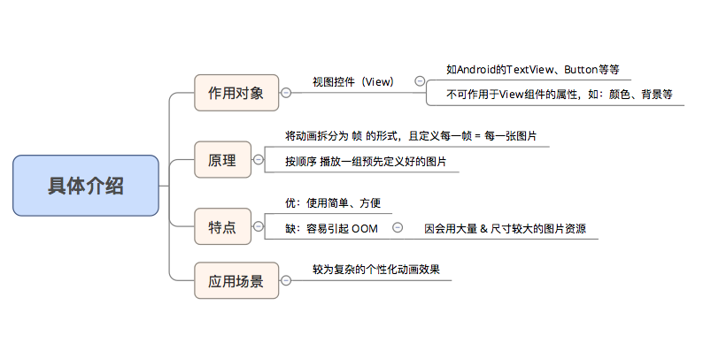
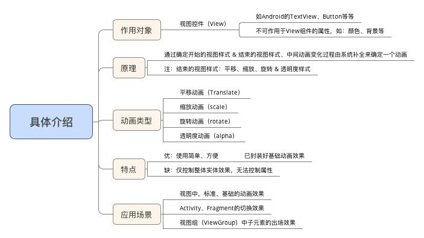
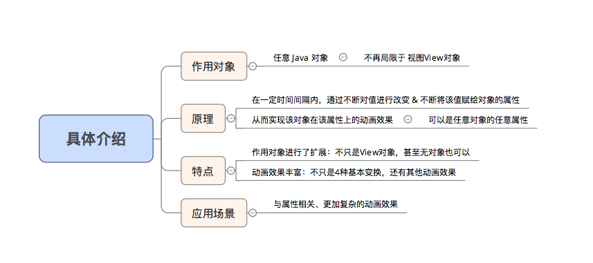
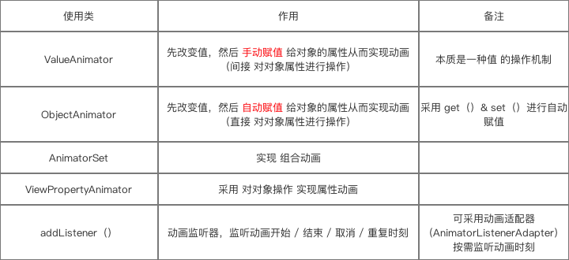

## 帧动画（Drawable Animation）
collapsed:: true
	- 1 作用对象：是视图控件，不能作用于view的属性，比如颜色背景
	- 2 原理： 按顺序播放一组图片
	- 3 应用场景：复杂的个性动画，或者复杂loading图，，【使用lottieVIew  播放json动画比较好】
	- 4 优点： 使用简单 方便  缺点： 使用大量的图片占用资源，严重会导致oom
	- 
- ## 补间动画（View Animation）
  collapsed:: true
	- 1  作用对象：是视图控件，不能作用于view的属性，比如颜色背景
	- 2 平移 旋转  缩放 透明度      对应的动画类 是带animation的类
	- 3 应用场景：a基础的动画效果  b  Activity【overridePendingTransition】  fragment的进出场动画
	- 4 原理 ： 如果使用的是xml:  定义开始样式，结束样式，中间动画变化由系统完成的动画
	- 5 优缺点： 优点： 使用简单，方便，缺点 无法控制view属性
	- 
- ## [[属性动画（Property Animation）]]
	- 
	- 1 作用对象：任意的java对象里的属性【就是成员变量】
	- 2 原理： 在一定时间间隔内，，通过不断对属性值 做修改，  并且不断把改变后的值 赋值给作用对象，调用invalidate重绘       达到动画效果
	- 3 优点：可以操作属性，动画效果丰富，可扩展性强
	- 4场景： 任何与属性相关的动画
	- 5 使用上对应 ：Animator相关类
	  collapsed:: true
		- 