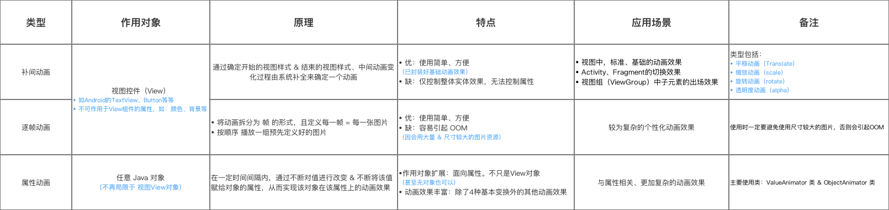
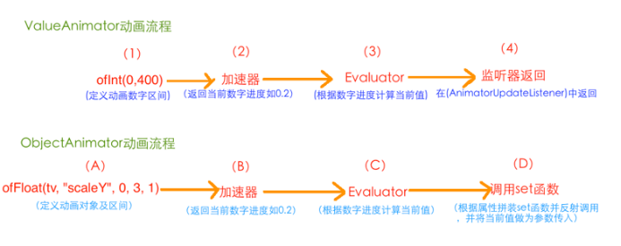

# 1、[[动画分类]]和区别#card
	- # 动画分类
		- 帧动画、补间动画、属性动画、lottie动画
	- ## 1、作用对象不同
		- ### 1、帧动画和补间动画（View animation）：具体控件（ImageView等）
		- ### 2、属性动画：具体属性
	- ## 2、原理不同
		- ### 1、帧动画：按顺序播放一组图片
		- ### 2、补间动画：确定控件开始和结束样式，中间动画系统补全，[[#red]]==**没有真正改变属性值。**==
		- ### 3、属性动画：一定时间内，不断对控件属性值修改，绘制，达到动画效果，==**真正改变属性**==
	- ## 3、优缺点不同
		- ### 1、帧动画：
			- 优点：使用简单
			- 缺点：图片过大容易引发OOM
		- ### 2、补间动画
			- 优点：使用简单
			- 缺点：只能针对控件整体做动画，无法对属性做动画
		- ### 3、属性动画
			- 优点：动画效果丰富
	- ## 4、使用场景不同
		- ### 1、帧动画：复杂的loading等，现在一般用lottie
		- ### 2、补间动画：activity、fragment进出场动画等
		- ### 3、属性动画：适合与具体属性有关的动画
	- #### 参考图
	  collapsed:: true
		- {:height 185, :width 749}
- # 2、插值器、估值器作用和区别#card
	- ## 插值器：==**辅助动画**==实现的接口
		- 作用：决定属性值从起始到结束的[[#red]]==**变化规律，或者说趋势**==，返回进度百分比，0.2
	- ## 估值器：[[#red]]==**辅助动画插值器**==的接口
		- 作用：决定属性值     起始到结束    [[#red]]==**变化的具体值**==，根据插值器百分比计算具体值
		- 计算公式原理：[[#red]]==**起始值+ 进度*（终止-起始值）**==
- # 3、属性动画原理#card
	- 
	- # 1、ValueAnimator的实现原理：
		- ## 1、ofInt(0,400)函数定义动画的数字区间
		- ## 2、插值器/加速器
			- 动画开始后，通过插值器返回当前动画进度---->以小数表示的百分制进度比如  0.2
		- ## 3、估值器：
			- >估值器相当于转换器：他能把小数进度转换成对应的数值位置
			- 它将插值器中的小数百分比 比如0.2，转换成[[#red]]==**动画区间对应进度**==的具体数字（上述第一步定义的）
			- 原理公式：当前的值 = 起始值 + （终止值 - 起始值）* 显示进度fraction
		- ## 4、鉴定器：AnimatorUpdataListener
			- 使用animation.getAnimatedValue()函数拿到Evaluator中返回的数字值。
	- # 2、ObjectAnimator的实现原理
		- ## 1、ofFloat(tv,"scaleY",0,3,1)
			- 定义动画对象及数字区间
		- ## 2、插值器
			- 获取当前动画百分比进度：0.2
		- ## 3、估值器
			- 根据插值器的百分比进度，和定义的数字区间，计算当前进度对应具体值
		- ## 4、反射调用属性set函数，传入当前进度对应具体值
- # 5、面试题 插值器的应用场景？：动画的速度曲线#card
	- interpolator  插值器作用： 设置 从时间完成度 到动画完成度  映射的公式   ，动画的速速曲线   如  先快后慢   先慢后快等
	- 1 默认的插值器：AccelerateDecelerateInterpolator   ： 先加速 再减速  先快后慢
		- 使用场景： 适用于 大多数变换的场景，，不涉及  界面元素的入场 出场 的时候
	- 2 AccelerateInterpolator  :  ==**加速插值器   越来越快**==
		- 场景：  ==**元素出场动画**==
	- 3 DecelerateInterpolator  ： [[#red]]==**减速插值器   越来越慢**==
		- 场景：  [[#red]]==**元素 入场动画**==
	- 4 LinearInterpolator  :  匀速插值
- # 6、属性动画中ObjectAnimator和ValueAnimator区别#card
	- 1、ObjectAnimator是ValueAnimator子类
	- 2、ObjectAnimator ==**会自动调用属性setter方法更新值**==，ValueAnimator需要添加监听，**[[#red]]==手动更新==**
	- 3、一般来说ObjectAnimator使用方便
- #### 4、属性动画几种实现方式总结
  collapsed:: true
	- ## ViewPropertyAnimator：
		- 作用：使用简单  只对view自带属性做动画  ：平移  缩放 旋转 透明度 等
		- 缺点：不能对view的 自定义属性  做动画
	- ## ObjectAnimator     {想对谁做动画   就需要把那个需要改变的值 做成 成员变量属性，，重写该属性set方法  并加invalidate  改变值 重绘}
		- 作用：能针对目标class  任一成员变量属性  做动画
		- 缺点：同时只能针对一个属性
	- ## AnimatorSet 由于ObjectAnimator     的缺点  而产生
		- 作用1： 能同时对多个 自定义属性做动画 
		  作用2： 能对不同view对象  做动画       
		  作用域 比较广    可  多个属性动画    不同view  做合成，，选择先后顺序  同时执行 等等
		  PropertyValuesHolder  与   AnimatorSet区别
		- AnimatorSet是对多个动画做合成
	- ## PropertyValuesHolder  是对一个view的 多个属性做合成
	- 重合功能： 想在同一时间 对一个view的多个属性 做动画
	- PropertyValuesHolder   单独功能 定义关键帧：Keyframe
		-