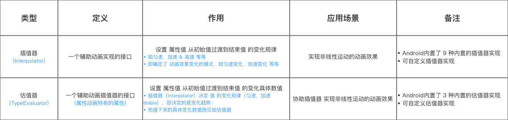

# 1、[[动画分类]]
	- {:height 185, :width 749}
- # 2、属性动画几种实现方式总结
  collapsed:: true
	- ## ViewPropertyAnimator：
		- 作用：使用简单  只对view自带属性做动画  ：平移  缩放 旋转 透明度 等
		- 缺点：不能对view的 自定义属性  做动画
	- ## ObjectAnimator     {想对谁做动画   就需要把那个需要改变的值 做成 成员变量属性，，重写该属性set方法  并加invalidate  改变值 重绘}
		- 作用：能针对目标class  任一成员变量属性  做动画
		- 缺点：同时只能针对一个属性
	- ## AnimatorSet 由于ObjectAnimator     的缺点  而产生
		- 作用1： 能同时对多个 自定义属性做动画 
		  作用2： 能对不同view对象  做动画       
		  作用域 比较广    可  多个属性动画    不同view  做合成，，选择先后顺序  同时执行 等等
		  PropertyValuesHolder  与   AnimatorSet区别
		- AnimatorSet是对多个动画做合成
	- ## PropertyValuesHolder  是对一个view的 多个属性做合成
	- 重合功能： 想在同一时间 对一个view的多个属性 做动画
	- PropertyValuesHolder   单独功能 定义关键帧：Keyframe
		-
- # 3、插值器Interpolator，估值器
	- 
- # 4、面试题 插值器的应用场景？：
	- interpolator  插值器作用： 设置 从时间完成度 到动画完成度  映射的公式   ，动画的速速曲线   如  先快后慢   先慢后快等
	- 1 默认的插值器：AccelerateDecelerateInterpolator   ： 先加速 再减速  先快后慢
		- 使用场景： 适用于 大多数变换的场景，，不涉及  界面元素的入场 出场 的时候
	- 2 AccelerateInterpolator  :  加速插值器   越来越快
		- 场景：  元素出场动画
	- 3 DecelerateInterpolator  ： 减速插值器   越来越慢
		- 场景：  元素 入场动画
	- 4 LinearInterpolator  :  匀速插值
- # 5、TypeEvaluator  计算估值器
	- 作用：对指定类型的属性（可以是自带属性 int float   也可以自定义）   精确计算出  动画过程中      每一个动画完成度        对应的属性值
	- 自定义估值器：    最终目的：计算每个进度fraction时刻的    动画属性应该所处的值
	- 在evaluate   计算方法中  核心原理：      起始值+ 进度*（终止-起始值） 来算出每进度 所应该返回的值