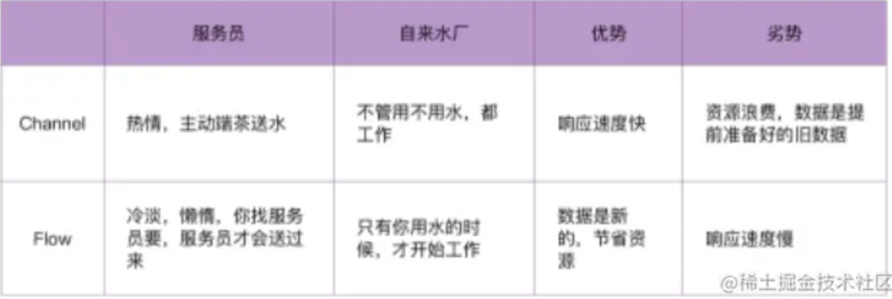

## rxjava操作符复杂
- ## 协程channel只能处理简单的场景
	- 1、热的，不管用不用数据，都发送
	- 2、优势：响应速度快
	- 3、劣势：资源浪费，数据是提前准备好的旧数据
	- 协程
		- 我们可以使用`launch`、`async`、挂起函数、`Channel`等来实现，
		- 但是对于复杂的逻辑操作，比如一个数据源需要从IO线程中获取，然后进行过滤和处理，再在UI线程展示，再在IO线程中进行保存，这种就需要使用更强大的组件，即`Flow`
- ## 协程Flow（数据转换，线程切换）
	- 1、比协程Channel功能强大灵活，比rxjava使用简单
	- 2、冷的，只有使用终止操作符 才开始工作
	- 3、优势：数据是新的，节省资源
	- 4、劣势：响应速度慢
- 