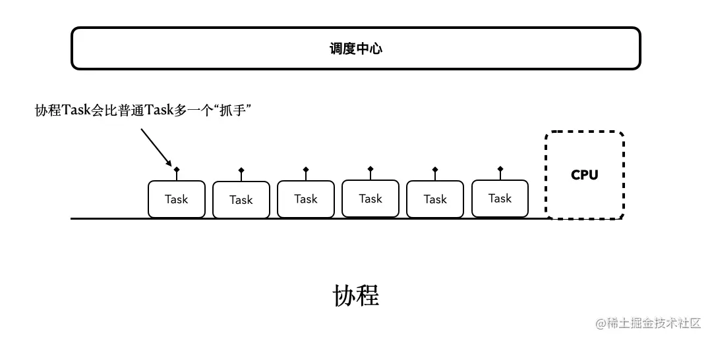

# 一、依赖
collapsed:: true
	- ```
	      // 协程 支持包   ------   AndroidX 扩展包
	      implementation "org.jetbrains.kotlinx:kotlinx-coroutines-core:1.7.3"
	      implementation 'org.jetbrains.kotlinx:kotlinx-coroutines-android:1.7.3'
	  
	      // implementation 'org.jetbrains.kotlinx:kotlinx-coroutines-java:1.7.3'
	  ```
- # 二、协程的创建
	- ## 1、GlobalScope全局作用域的:非阻塞支持挂起
	  collapsed:: true
		- GlobalScope是[[#red]]==**应用程序级别的协程作用域**==，它生命周期跟随整个应用程序。当应用程序中的所有协程都完成或被取消后，GlobalScope也会被取消。
		- ### 使用场景
			- GlobalScope适用于执行长期运行的异步任务，比如网络请求或者定时任务等。但是，由于GlobalScope是应用程序级别的，因此应该谨慎使用，以免出现资源泄漏或内存泄漏等问题。
		- ### [[GlobalScope使用示例]]
	- ## 2、MainScope
	  collapsed:: true
		- MainScope是指定了Dispatchers.Main作为其默认协程调度器的CoroutineScope实例。它通常用于与UI相关的协程操作，例如更新UI或响应用户输入等。[[#red]]==**MainScope的生命周期通常是Activity或Fragment的生命周期**==，当它们被销毁时，MainScope也会被取消。
	- >因此，如果您需要在应用程序范围内执行异步任务，应使用GlobalScope。
	  如果您需要在与UI相关的协程操作中使用协程，则应使用MainScope。
	  同时，无论使用哪个协程作用域，都应注意避免泄漏和取消协程以释放资源。
	- ## 3、viewModelScope
		- viewModelScope是一个CoroutineScope的实例，[[#red]]==**它的生命周期与ViewModel的生命周期相同**==。viewModelScope通常用于执行与ViewModel相关的异步操作，例如从数据库或网络获取数据等。
	- ## 4、lifecycleScope
	  collapsed:: true
		- lifecycleScope是一个CoroutineScope的实例，[[#red]]==**它的生命周期与LifecycleOwner（通常是Activity或Fragment）的生命周期相同。**==
		- ### 使用场景
			- lifecycleScope通常用于执行与Activity或Fragment相关的异步操作，例如启动Activity或Fragment时执行的异步任务。
	- ## 5、[[runBlocking]]:阻塞式的
	- ## 6、withContext
	  collapsed:: true
		- withContext是一个函数，它允许您在指定的调度器上运行协程。执行完后，自动切回来
			- {:height 312, :width 688}
		- ### 使用场景
			- withContext通常用于在不同的线程或调度器上执行异步操作，例如在后台线程中执行数据库操作。
		- ## 使用示例
			- 如果将业务代码封装成函数，使用withContext设置指定线程执行。需要加suspend声明成挂起函数
	- >除了这些常见的CoroutineScope，您还可以根据需要创建自己的CoroutineScope实例。无论使用哪种CoroutineScope，都应注意避免泄漏和取消协程以释放资源。
	- ## 7、[[自定义协程作用域]]
- # 三、协程的启动
  collapsed:: true
	- ## 1、[[launch函数（使用了高阶函数）启动协程]]。无返回值
		- 不阻塞线程，不能拿到协程结果
	- ## 2、[[runBlocking]]
		- 阻塞线程，可以拿到协程结果
	- ## 3、[[async函数]]，可以有返回值，await获取
		- 不阻塞线程，可以拿到协程结果
- # 四、其他挂起函数
	- ## delay：
	  collapsed:: true
		- 可挂起的，延时操作
		- 本质：在 JVM 上 `delay` 实际上是在一个 `ScheduledExcecutor` 里面添加了一个延时任务，因此会发生线程切换
	- ## job的join
	  collapsed:: true
		- `public suspend fun join()`，它的含义是：**挂起当前协程，直到`job`执行完成**。
		- 就比如上面的代码中，我们使用`job.join()`，它就会挂起当前协程执行流程，等待`job`执行完，才继续执行后续代码。
	- ## await()
	  collapsed:: true
		- 挂起协程，等待协程执行完，拿到结果
		- 
- # 五、[[协程的取消]]
- # 六、概念
	- ## 阻塞  [[阻塞式的流程]]
		- 先执行协程的东西，再执行你的代码
	- ## 非阻塞支持挂起  [[挂起后的流程]]
	  collapsed:: true
		- 按顺序执行
	- ## [[CPS(Continuation-Passing-Style Transfrom)转换]]
- # 七、相关类
	- ## [[协程-job]]
	- ## [[协程调度器-CoroutineDispatcher]]
	- ## [[Continuation]]
	- ## [[CoroutineStart协程启动模式]]
	- ## [[CoroutineContext上下文]]：[详细](https://juejin.cn/post/7091850594474229796)
	- ## [[协程作用域CoroutineScope]]
- # 九、[[suspend关键字与挂起函数]]
  collapsed:: true
	- ## 总结
		- 挂起：就是 可以稍后被切回来的线程切换。
		- 切回来的动作：resume 恢复
	- ## [[被suspend关键字修饰的函数，就能被挂起吗？]]
	- ## [[怎么自定义suspend函数]]，可以真正挂起 切线程的那种
	- ## 协程自带的挂起函数
		- 1、withContext 比较常用，指定线程
		- 2、delay(10)等待一段时间后再向下执行
- # 十、[[非阻塞式挂起]]
- # 十一、协程的异常处理 [详细](https://www.jianshu.com/p/f969a5769ec8) [详细2](https://juejin.cn/post/7093453154297544741)
	- **协程内部异常处理流程**：launch 会在内部出现未捕获的异常时尝试触发对父协程的取消，能否取消要看作用域的定义，如果取消成功，那么异常传递给父协程，否则传递给启动时上下文中配置的 CoroutineExceptionHandler 中，如果没有配置，会查找全局（JVM上）的 CoroutineExceptionHandler 进行处理，如果仍然没有，那么就将异常交给当前线程的 UncaughtExceptionHandler 处理；而 async 则在未捕获的异常出现时同样会尝试取消父协程，但不管是否能够取消成功都不会后其他后续的异常处理，直到用户主动调用 await 时将异常抛出。
	- **异常在作用域内的传播**：当协程出现异常时，会根据当前作用域触发异常传递，GlobalScope 会创建一个独立的作用域，所谓“自成一派”，而 在 coroutineScope 当中协程异常会触发父协程的取消，进而将整个协程作用域取消掉，如果对 coroutineScope 整体进行捕获，也可以捕获到该异常，所谓“一损俱损”；如果是 supervisorScope，那么子协程的异常不会向上传递，所谓“自作自受”。
	- **join 和 await 的不同**：join 只关心协程是否执行完，await 则关心运行的结果，因此 join 在协程出现异常时也不会抛出该异常，而 await 则会；考虑到作用域的问题，如果协程抛异常，可能会导致父协程的取消，因此调用 join 时尽管不会对协程本身的异常进行抛出，但如果 join 调用所在的协程被取消，那么它会抛出取消异常，这一点需要留意。
	- ## 注意
		- **千万不要用`try-catch`直接包裹`launch`、`async`**。而这里正确的用法是把`try-catch`移到`launch`的代码块内部使用即可。
	- ## [[协程异常处理-面试]]
- # 十二、[[协程的并发]]