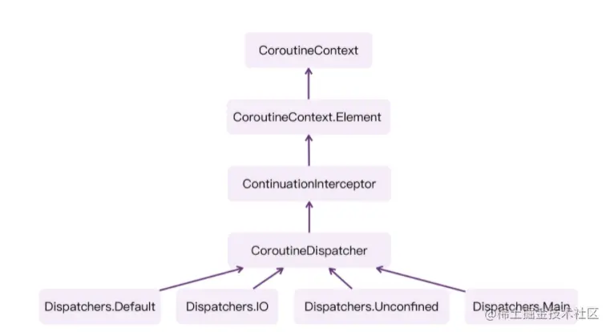

- # 前言
  collapsed:: true
	- 在前面2篇文章中，我们以启动协程基础API：`startCoroutine{}`入手，它是一个挂起函数类型的扩展函数，最终会让我们状态机`Continuation`对象多一个`create()`方法，从而创建状态机对象。
	- 然后我们以`launch{}`入手，会发现其最终还是会调用`createCoroutineUnintercepted`来创建状态机`Continuation`对象，但是在这其中我们加入了很多关于协程的概念，比如`Job`、`CoroutineScope`等，这里能实现的原因非常简单，在协程构建器中，我们传入给挂起函数的`Continuation`对象，实现了`Job`等多个接口。
	- 那本篇文章还是以`launch{}`入手，分析协程是如何进行线程调度的
- #
  collapsed:: true
	- 协程中关于线程调度的类就是`Dispatchers`了，我们可以使用`withContext(Dispatchers.IO)`或者其他方法来指定协程`block`所执行的线程，所以我们先来看看`Dispatchers`相关的内容。
- #  `Dispatchers` 调度器相关
  collapsed:: true
	- 首先就是`Dispatchers`，它是一个单例类：
		- ```kotlin
		  public actual object Dispatchers {
		  
		      public actual val Default: CoroutineDispatcher = DefaultScheduler
		  
		      public actual val Main: MainCoroutineDispatcher get() = MainDispatcherLoader.dispatcher
		      
		      public actual val Unconfined: CoroutineDispatcher = kotlinx.coroutines.Unconfined
		      
		      public val IO: CoroutineDispatcher = DefaultIoScheduler
		  }
		  ```
	- 这里可以发现我们平时用的几种调度器线程池：`Default`、`Main`、`Unconfined`和`IO`都是该单例的属性成员，同时他们的类型都是`CoroutineDispatcher`，即协程调度器。
	- 这个协程调度器`CoroutineDispatcher`的继承关系如下
	- ```kotlin
	  public abstract class CoroutineDispatcher :
	      AbstractCoroutineContextElement(ContinuationInterceptor), ContinuationInterceptor {}
	  
	  ```
	- ```kotlin
	  public interface ContinuationInterceptor : CoroutineContext.Element {}
	  ```
	- ```kotlin
	  public abstract class AbstractCoroutineContextElement(public override val key: Key<*>) : Element
	  ```
	- 这里的继承关系乍一看挺复杂的，我们来一一分析：
		- 首先就是协程调度器`CoroutineDispatcher`类，它是继承至抽象协程上下文Element类`AbstractCoroutineContextElement`，从命名来看，它就是`Element`的抽象类，提供了一些实现的公共方法。
		- 其次就是它实现了`ContinuationInterceptor`接口，这个接口也是`Element`的子接口，所以在代码第一行传递给`AbstractCoroutineContextElement`中的`Key`就是`ContinuationInterceptor`中的`Key`。
		- 这里我们一直无法找到`Continuation`合适的翻译，但是根据我们之前学习挂起函数原理的时候知道，`Continuation`是底层元素，在挂起函数经过`CPS`转换后，会得到一个状态机模型，那个模型就是`Continuation`子类`SuspendLambda`的对象。
		- 所以这里的`ContinuationInterceptor`其实就是状态机的拦截器，我们可以对状态机对象进行拦截和处理。
	- 简单分析了上面几种关系，所以类的继承关系如下：
		- 
	- 这个关系图在后面分析时有很大的作用。
- # 默认的 `Dispatchers.Default`
  collapsed:: true
	- 我们还是以简单的代码为例，比如下面代码：
	  collapsed:: true
		- ```kotlin
		  fun main(){
		      testLaunch()
		      Thread.sleep(10000)
		  }
		  
		  private fun testLaunch(){
		      val scope = CoroutineScope(Job())
		      scope.launch {
		          logX("Hello")
		          delay(1000)
		          logX("Kotlin")
		      }
		  }
		  
		  /**
		   * 输出结果：
		  ================================
		  Hello
		  Thread:DefaultDispatcher-worker-1 @coroutine#1
		  ================================
		  ================================
		  Kotlin
		  Thread:DefaultDispatcher-worker-1 @coroutine#1
		  ================================
		   * */。
		  ```
	- 在这里创建了一个`CoroutineScope`，但是并没有指定`Dispatcher`，我们从日志可以发现其执行的线程池为`DefaultDispatcher`，并且还可以打印出协程名字:`@coroutine#1`，这些是哪里帮我们完成的呢？
	- 我们来看一下`launch{}`的源码：
		- ```kotlin
		  public fun CoroutineScope.launch(
		      context: CoroutineContext = EmptyCoroutineContext,
		      start: CoroutineStart = CoroutineStart.DEFAULT,
		      block: suspend CoroutineScope.() -> Unit
		  ): Job {
		      //注释1，获取新的上下文
		      val newContext = newCoroutineContext(context)
		      val coroutine = if (start.isLazy)
		          LazyStandaloneCoroutine(newContext, block) else
		          StandaloneCoroutine(newContext, active = true)
		      coroutine.start(start, coroutine, block)
		      return coroutine
		  }
		  ```
	- 这里的几行代码，我们又一次来分析了，这一次我们重点关注协程上下文。
		- 首先就是第一个参数的默认值是`EmptyCoroutineContext`，在前面介绍`CoroutineContext`文章我们说过，`CoroutineContext`我们可以当成一个`Map`来使用，而这里的`EmptyCoroutineContext`就是一个空`Map`，也就等于没有传递；只不过Kotlin使用这个来代替`null`。
		- 然后就是注释1部分，这里会对传入的`context`进行处理，`newCoroutineContext()`方法源码如下
	- ```kotlin
	  public actual fun CoroutineScope.newCoroutineContext(context: CoroutineContext): CoroutineContext {
	      //注释1 继承父协程上下文
	      val combined = coroutineContext.foldCopiesForChildCoroutine() + context
	      //注释2 当是调试模式时，添加日志
	      val debug = if (DEBUG) combined + CoroutineId(COROUTINE_ID.incrementAndGet()) else combined
	      //注释3 添加Default
	      return if (combined !== Dispatchers.Default && combined[ContinuationInterceptor] == null)
	          debug + Dispatchers.Default else debug
	  }
	  
	  ```
	- 上面代码我们来一一分析：
		- 首先是`newCoroutineContext()`方法是`CoroutineScope`的扩展函数，所以注释1的`coroutineContext`就是该`CoroutineScope`的`coroutineContext`成员属性对象，这个关系我们之前说过，`CoroutineScope`是对`CoroutineContext`的一层封装。
		- 然后就是注释1的`foldCopiesChildCoroutine()`函数作用就是将`CoroutineScope`当中的所有上下文元素都拷贝出来，然后跟传入的`context`进行合并。这行代码，可以让子协程继承父协程的上下文元素。
		- 注释2的作用是在调试模式下，给协程对象增加唯一的ID，比如之前的`@coroutine#1`信息。
		- 注释3的判断条件要看清楚，当`combined`不等于`Dispatchers.Default`时，或者`combined[ContinuationInterceptor]`为`null`时，给上下文添加`Deispatchers.Default`。
		- 这里也印证了前面的继承观点，即：[[#red]]==**协程调度器在上下文中存储的Key是ContinuationInterceptor，且默认会设置为Dispatchers.Default。**==
		- 所以默认是`Default`线程池，因为Kotlin是支持多平台的，只有UI编程的平台比如Android才有`Main`主线程的概念，所以这里默认是`Default`一定不会错。
		- ## [[#red]]==结论：==
			- [[CoroutineContext协程上下文map存储协程调度器]]
- # `intercepted` 拦截分析->创建DispatchedContinuation
  collapsed:: true
	- 既然我们知道了在哪里设置了协程的调度器，那在哪里切换线程以及在特定线程上执行协程呢？
	- 还是回到我们熟悉的函数：
	- ```kotlin
	  public fun <T> (suspend () -> T).startCoroutineCancellable(completion: Continuation<T>): Unit = runSafely(completion) {
	      createCoroutineUnintercepted(completion).intercepted().resumeCancellableWith(Result.success(Unit))
	  }
	  ```
	- 上面这个函数在之前文章已经分析很多遍了，至少我们知道`createCoroutineUnintercepted(completion)`就完成了协程的创建，或者说已经完成了协程`Continuation`状态机的创建。
	- 那么核心的再处理就是这里的`intercepted()`方法了：
	- ```kotlin
	  public actual fun <T> Continuation<T>.intercepted(): Continuation<T> =
	      (this as? ContinuationImpl)?.intercepted() ?: this
	  ```
	- 对`Continuation`进行拦截处理，这里代码很简单，把`Continuation`强转为`ContinuationImpl`，然后调用其`intercepted()`方法。
	- 根据前面文章分析，我们知道这里的真正类型是`SuspendLambda`，它是`ContinuationImapl`的子类，所以这个转换一定能成功，我们接着来看`intercepted()`方法：
	- ```kotlin
	  public fun intercepted(): Continuation<Any?> =
	      intercepted
	          ?: (context[ContinuationInterceptor]?.interceptContinuation(this) ?: this)
	              .also { intercepted = it }
	  
	  ```
		- 这里首先会调用`context`中保存的`ContinuationInterceptor`，在前面分析中，我们可知这个`context`其实就是我们前面创建出来的协程上下文`context`。
		- 根据前面默认值分析，这里`intercepted`的值就会是我们前面所赋值的`Dispatchers.Default`。
	- 所以这里会调用`Dispatchers.Default`的`interceptContinuation()`方法，注意这里会将`this`即状态机自己传入到该函数中。
	-
- # `Dispatchers.Default` 分析-线程池
  collapsed:: true
	- 这里我们视角又绕回了`Dispatchers.Default`，我们通过查看可以发现`interceptContinuation`方法是定义在`ContinuationInterceptor`接口中的抽象方法，其实现地方是`CoroutineDispatcher`抽象类，如下：
	- ```kotlin
	  public final override fun <T> interceptContinuation(continuation: Continuation<T>): Continuation<T> =
	      DispatchedContinuation(this, continuation)
	  
	  ```
	- 会发现这里会返回一个`DispatchedContinuation`实例对象，参数`this`就是`Default`，`continuation`就是状态机。
	- 到这里我们为了逻辑更清晰、分层，可以把前面的`startCoroutineCancellable()`方法改写一下
	- ```kotlin
	  public fun <T> (suspend () -> T).startCoroutineCancellable(completion: Continuation<T>): Unit = runSafely(completion) {
	      createCoroutineUnintercepted(completion).intercepted().resumeCancellableWith(Result.success(Unit))
	  }
	  
	  //改写如下
	  public fun <T> (suspend () -> T).startCoroutineCancellable(completion: Continuation<T>): Unit = runSafely(completion) {
	      // 1 创建出状态机Continuation对象 包裹了 StandaloneCoroutine，
	      val continuation = createCoroutineUnintercepted(completion)
	      // 2 调用续体的intercepted，，，得到DispatchedContinuation对象
	      val dispatchedContinuation = continuation.intercepted()
	      // 3 进行后续处理
	      dispatchedContinuation.resumeCancellableWith(Result.success(Unit))
	  
	  ```
	- 所以我们分析的重点就来到了这个`DispatchedContinuation`类。
	- 在分析该类之前，我们来看一下`Dispatchers.Default`的具体继承关系：
	- ```kotlin
	  //类型是CoroutineDispatcher，实现是DefaultScheduler
	  public actual val Default: CoroutineDispatcher = DefaultScheduler
	  ```
	- ```kotlin
	  //单例，继承至SchedulerCoroutineDispatcher
	  internal object DefaultScheduler : SchedulerCoroutineDispatcher
	  ```
	- ```kotlin
	  //继承至ExecutorCoroutineDispatcher
	  internal open class SchedulerCoroutineDispatcher(
	      private val corePoolSize: Int = CORE_POOL_SIZE,
	      private val maxPoolSize: Int = MAX_POOL_SIZE,
	      private val idleWorkerKeepAliveNs: Long = IDLE_WORKER_KEEP_ALIVE_NS,
	      private val schedulerName: String = "CoroutineScheduler",
	  ) : ExecutorCoroutineDispatcher()
	  ```
	- ```kotlin
	  //继承至CoroutineDispatcher
	  public abstract class ExecutorCoroutineDispatcher: CoroutineDispatcher()
	  ```
	- 可以发现最终继承至`CoroutineDispatcher`抽象类，关于该类的关系，在前面我们分析过了。
- # `DispatchedContinuation` 类分析-》Runnable
  collapsed:: true
	- 先来看一下这个`DispatchedContinuation`类的定义：
	- ```kotlin
	  internal class DispatchedContinuation<in T>(
	      @JvmField val dispatcher: CoroutineDispatcher,
	      @JvmField val continuation: Continuation<T>
	  ) : DispatchedTask<T>(MODE_UNINITIALIZED), CoroutineStackFrame, Continuation<T> by continuation {}
	  
	  ```
	- 会发现这个类的定义还是非常复杂的，首先它实现了`Continuation`接口，但是使用了类委托，把接口实现都委托给了传递进来的`continuation`参数。其次参数`dispatcher`就是前面分析的默认参数`Dispatchers.Default`，[[#red]]==**continuation就是block协程实现类，具体类型是SuspendLambda**==。
	- 然后发现这个类还继承至`DispatchedTask`，我们来看一下这个类：
	- ```kotlin
	  internal abstract class DispatchedTask<in T>(
	      @JvmField public var resumeMode: Int
	  ) : SchedulerTask() {}
	  ```
	- ```kotlin
	  internal actual typealias SchedulerTask = Task
	  ```
	- ```kotlin
	  internal abstract class Task(
	      @JvmField var submissionTime: Long,
	      @JvmField var taskContext: TaskContext
	  ) : Runnable{}
	  ```
	- 这里会发现`DispatchedTask`继承至`SchedulerTask`，该类继承至`Task`，而`Task`则继承至我们非常熟悉的`Runnable`接口，这也就意味着它可以被分到Java的线程当中去执行了。
- # `resumeCancellableWith()` 分析
  collapsed:: true
	- 既然它是`Runnable`，我们就来看看如何进行分配，来看看`resumeCancellableWith()`的代码实现：
		- ```kotlin
		  //DispatchedContinuation类
		  inline fun resumeCancellableWith(
		      result: Result<T>,
		      noinline onCancellation: ((cause: Throwable) -> Unit)?
		  ) {
		      val state = result.toState(onCancellation)
		      //注释1
		      if (dispatcher.isDispatchNeeded(context)) {
		          _state = state
		          resumeMode = MODE_CANCELLABLE
		          //注释2
		          dispatcher.dispatch(context, this)
		      } else {
		          //注释3
		          executeUnconfined(state, MODE_CANCELLABLE) {
		              if (!resumeCancelled(state)) {
		                  resumeUndispatchedWith(result)
		              }
		          }
		      }
		  }
		  
		  ```
		- 这里注释1的`isDispatchNeeded`的意思是是否需要分发，这里只有当是`Dispatchers.Unconfined`时，才返回`false`，所以本例中代码是`Dispatchers.Default`，所以会进入注释2的逻辑。
		- 注释2就是使用线程池来进行分发，其中把`this`(实现了`Runnable`接口)传递。
		- 注释3是设置了`Dispatcher.Unconfined`的情况下，这里会直接在当前线程执行。
	- 这里调用的是`dispatcher.dispatch()`，其实我们知道,就是`Dispatchers.Default.dispatch()`方法，下面是我们回到`Dispatchers.Default`的源码：
		- ```kotlin
		  public actual val Default: CoroutineDispatcher = DefaultScheduler
		  ```
		- ```kotlin
		  internal object DefaultScheduler : SchedulerCoroutineDispatcher(
		      CORE_POOL_SIZE, MAX_POOL_SIZE,
		      IDLE_WORKER_KEEP_ALIVE_NS, DEFAULT_SCHEDULER_NAME
		  ) {}
		  ```
	- `DefaultScheduler`则是一个单例，继承至`SchedulerCoroutineDispatcher`，
		- ```kotlin
		  internal open class SchedulerCoroutineDispatcher(
		      private val corePoolSize: Int = CORE_POOL_SIZE,
		      private val maxPoolSize: Int = MAX_POOL_SIZE,
		      private val idleWorkerKeepAliveNs: Long = IDLE_WORKER_KEEP_ALIVE_NS,
		      private val schedulerName: String = "CoroutineScheduler",
		  ) : ExecutorCoroutineDispatcher() {
		  
		      private fun createScheduler() =
		          CoroutineScheduler(corePoolSize, maxPoolSize, idleWorkerKeepAliveNs, schedulerName)
		      
		      //这就是前面调用的dispatch方法
		      override fun dispatch(context: CoroutineContext, block: Runnable): Unit = coroutineScheduler.dispatch(block)
		  }
		  ```
	- 而这里我们发现`dispatch`方法中会调用`CoroutineScheduler`中的`dispatch()`方法:
		- ```kotlin
		  internal class CoroutineScheduler(
		      @JvmField val corePoolSize: Int,
		      @JvmField val maxPoolSize: Int,
		      @JvmField val idleWorkerKeepAliveNs: Long = IDLE_WORKER_KEEP_ALIVE_NS,
		      @JvmField val schedulerName: String = DEFAULT_SCHEDULER_NAME
		  ) : Executor, Closeable {
		  
		      override fun execute(command: Runnable) = dispatch(command)
		  
		      //核心方法
		      fun dispatch(block: Runnable, taskContext: TaskContext = NonBlockingContext, tailDispatch: Boolean = false) {
		          trackTask() 
		          // 1
		          val task = createTask(block, taskContext)
		          // 2
		          val currentWorker = currentWorker()
		          // 3
		          val notAdded = currentWorker.submitToLocalQueue(task, tailDispatch)
		          if (notAdded != null) {
		              if (!addToGlobalQueue(notAdded)) {
		  
		                  throw RejectedExecutionException("$schedulerName was terminated")
		              }
		          }
		          val skipUnpark = tailDispatch && currentWorker != null
		  
		          if (task.mode == TASK_NON_BLOCKING) {
		              if (skipUnpark) return
		              signalCpuWork()
		          } else {
		  
		              signalBlockingWork(skipUnpark = skipUnpark)
		          }
		      }
		  
		      private fun currentWorker(): Worker? = (Thread.currentThread() as? Worker)?.takeIf { it.scheduler == this }
		  
		      // 内部类 Worker
		      internal inner class Worker private constructor() : Thread() {
		      }
		  }
		  ```
	- 这里我们发现`CoroutineScheduler`其实就是Java并发包`Executo`r的子类，它的`execute`方法也被转到了`dispatch`方法，所以终于到了Java线程处理部分了，上面代码有3个注释：
		- 注释1，将传入的`Runnable`类型的`block`，其实也就是`DispatchedContinuation`，包装成`Task`。
		- 注释2，`currentWorker()`就是拿到当前执行的线程，这里的`Worker`是一个内部类，它的本质是Java的`Thread`。
		- 注释3，`currentWorker.submitToLocalQueue()`，将当前的`Task`添加到`Worker`线程的本地队列中，等待执行。
	- 这里我们来分析一下`Worker`是如何执行`Task`的。下面是`Worker`代码，代码较多，只列出有用信息
		- ```kotlin
		  internal inner class Worker private constructor() : Thread() {
		  
		      //重写了Thread的run方法
		      override fun run() = runWorker()
		  
		      @JvmField
		      var mayHaveLocalTasks = false
		  
		      private fun runWorker() {
		          var rescanned = false
		          while (!isTerminated && state != WorkerState.TERMINATED) {
		              // 1 找到task
		              val task = findTask(mayHaveLocalTasks)
		  
		              if (task != null) {
		                  rescanned = false
		                  minDelayUntilStealableTaskNs = 0L
		                  // 2 执行task
		                  executeTask(task)
		                  continue
		              } else {
		                  mayHaveLocalTasks = false
		              }
		  
		              if (minDelayUntilStealableTaskNs != 0L) {
		                  if (!rescanned) {
		                      rescanned = true
		                  } else {
		                      rescanned = false
		                      tryReleaseCpu(WorkerState.PARKING)
		                      interrupted()
		                      LockSupport.parkNanos(minDelayUntilStealableTaskNs)
		                      minDelayUntilStealableTaskNs = 0L
		                  }
		                  continue
		              }
		  
		              tryPark()
		          }
		          tryReleaseCpu(WorkerState.TERMINATED)
		      }
		  }
		  
		  ```
	- 这里`Worker`会重写`Thread`的`run()`方法，然后把执行流程交由给`runWorkder()`，这里代码注意2点：
		- 注释1，会在`while`循环中，一直尝试从`Worker`的本地队列中取出`Task`。
		- 注释2，`executeTask`方法，来执行其对应的`Task`。
	- 接下来就是关键的执行`Task`代码
		- ```kotlin
		  internal inner class Worker private constructor() : Thread() {
		      private fun executeTask(task: Task) {
		          val taskMode = task.mode
		          idleReset(taskMode)
		          beforeTask(taskMode)
		          // 1 执行task
		          runSafely(task)
		          afterTask(taskMode)
		      }
		  }
		  
		  fun runSafely(task: Task) {
		      try {
		          // 2 调用run方法
		          task.run()
		      } catch (e: Throwable) {
		          val thread = Thread.currentThread()
		          thread.uncaughtExceptionHandler.uncaughtException(thread, e)
		      } finally {
		          unTrackTask()
		      }
		  }
		  
		  internal abstract class Task(
		      @JvmField var submissionTime: Long,
		      @JvmField var taskContext: TaskContext
		  ) : Runnable {
		      constructor() : this(0, NonBlockingContext)
		      inline val mode: Int get() = taskContext.taskMode // TASK_XXX
		  }
		  
		  ```
	- 这里我们调用`runSafely`方法，然后在这个方法中我们执行了`task.run()`，而`Task`的本质是`Runnable`，到目前就代表了我们的协程任务真正执行了。
	- 注意又回到前面了，这里的`run`执行的具体逻辑是啥，从前面类的继承关系来看，这里执行的是`DispatchedTask.run()`方法，而这个类实际上是`DispatchedContinuation`的子类，所以会调用下面代码：
		- ```kotlin
		  internal class DispatchedContinuation<in T>(
		      @JvmField val dispatcher: CoroutineDispatcher,
		      @JvmField val continuation: Continuation<T>
		  ) : DispatchedTask<T>(MODE_UNINITIALIZED), CoroutineStackFrame, Continuation<T> by continuation {
		  
		      //会回调该方法
		      public final override fun run() {
		  
		          val taskContext = this.taskContext
		          var fatalException: Throwable? = null
		          try {
		              val delegate = delegate as DispatchedContinuation<T>
		              val continuation = delegate.continuation
		              withContinuationContext(continuation, delegate.countOrElement) {
		                  val context = continuation.context
		                  val state = takeState() 
		                  val exception = getExceptionalResult(state)
		  
		                  val job = if (exception == null && resumeMode.isCancellableMode) context[Job] else null
		                  if (job != null && !job.isActive) {
		                      // 1
		                      val cause = job.getCancellationException()
		                      cancelCompletedResult(state, cause)
		                      continuation.resumeWithStackTrace(cause)
		                  } else {
		                      if (exception != null) {
		                          // 2
		                          continuation.resumeWithException(exception)
		                      } else {
		                          // 3 这个就是SuspendLamada  的 resume 
		                          continuation.resume(getSuccessfulResult(state))
		                      }
		                  }
		              }
		          } catch (e: Throwable) {
		  
		              fatalException = e
		          } finally {
		              val result = runCatching { taskContext.afterTask() }
		              handleFatalException(fatalException, result.exceptionOrNull())
		          }
		      }
		  }
		  ```
	- 上面代码主要就看3个注释点：
		- 注释1，在协程代码执行之前，首先判断协程是否已经被取消，如果已经取消，则通过`resumeWithStackTrace`把具体原因传出去。
		- 注释2，判断协程是否发生了异常，如果发生了异常，则通过`resumeWithException`将异常传递出去。
		- 注释3，如果一切正常，则调用`resume`启动协程，并且执行`launch`中传入的`lambda`表达式。
	- 到这里，我们就完全分析完了整个流程。
	- [[#red]]==**这里最终调用的是反编译入口函数创建的 Function2（SuspendLamada类型）的 resume**==
- # 总结
	- 本篇文章分析了`launch`的流程，而其中与线程交互重点就是`Dispatchers`，主要有下面几个步骤：
	- 第一步，`createCoroutineUnintercepted(completion)`创建了协程的`Continuation`实例，接着调用`intercepted()`方法，将其封装为`DispatchedContinuation`对象。
	- 第二步，`DispatchedContinuation`会持有`CoroutineDispatcher`、以及前面创建的`Continuation`对象，比如文中的`CoroutineDispatcher`就是`Default`线程池。
	- 第三步，执行`DispatchedContinuation`的`resumeCancellableWith()`方法，会执行`dispatcher.dispatch()`方法，这个会将`Continuation`封装为`Task`，添加到线程中去执行。在这一步，协程就已经完成了线程切换。
	- 第四步，线程`run`方法会调用`DispatchedContinuation`的`run`方法，会调用`continuation.resume`方法，它将执行原本`launch`当中生成的`SuspendLambda`子类，这时候协程的代码就在线程上执行了。
	- 分析完会发现，协程框架设计是非常巧妙的，将线程池信息保存在协程上下文中，把创建完的协程`SuspendLambda`实例实现`Runnable`接口，然后封装为`Task`，在指定线程池中运行，从而完成线程切换
-