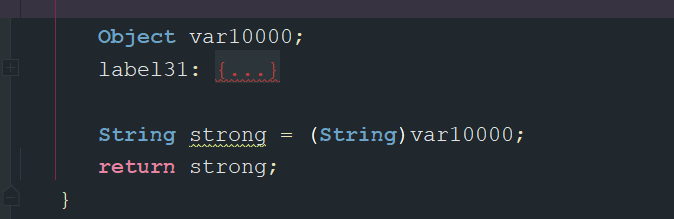

# 测试代码
	- ```kotlin
	  class Test2 {
	      /**
	       *  入口函数
	       */
	      fun enter(){
	          GlobalScope.launch {
	              val data = goodTest()
	              print(data)
	          }
	          Thread.sleep(3000)
	  
	      }
	  
	      /**
	       *  测试多个挂起函数
	       */
	      suspend fun goodTest(): String {
	          val num = deal1()
	          val user = deal2(num)
	          val strong = deal3(user)
	          return strong
	      }
	  
	      suspend fun deal1(): Int {
	          delay(22)
	          return 2
	      }
	  
	      suspend fun deal2(num: Int): User {
	          val user = User(11, "1")
	          delay(2000)
	          return user
	      }
	  
	      suspend fun deal3(user: User): String {
	          delay(300)
	          return "ss"
	      }
	  }
	  
	  public data class User(val id:Int,val name:String)
	  
	  ```
- # 反编译代码
	- ## 总览
		- ```kotlin
		  
		  public final class Test {
		     public final void enter() {}
		    
		    
		     // 挂起函数都会 CPS变换 生成 传入 Continuation
		  	@Nullable
		     public final Object goodTest(@NotNull Continuation var1) {}
		     @Nullable
		     public final Object deal1(@NotNull Continuation var1) {}
		     @Nullable
		     public final Object deal2(int var1, @NotNull Continuation var2) {}
		     @Nullable
		     public final Object deal3(@NotNull User var1, @NotNull Continuation var2) {
		       
		     }
		     
		  }
		  
		  ```
	- ## 入口方法[[Test-Function2]]
	- ## [[goodTest方法前后变换]]
	- ## [[deal1方法前后变换]]
	- ## [[deal2方法前后变换]]
	- ## [[deal3方法前后变换]]
- # 1、launch函数创建协程体
	- ## 背景代码
		- ```kotlin
		      fun enter(){
		          GlobalScope.launch {
		              val data = goodTest()
		              print(data)
		          }
		          Thread.sleep(3000)
		  
		      }
		  ```
	- ## 1-1、launch函数解析
		- Builders.common.kt
		- ```kotlin
		  public fun CoroutineScope.launch(
		      context: CoroutineContext = EmptyCoroutineContext,
		      start: CoroutineStart = CoroutineStart.DEFAULT,
		      block: suspend CoroutineScope.() -> Unit
		  ): Job {
		      val newContext = newCoroutineContext(context)
		      val coroutine = if (start.isLazy)
		          LazyStandaloneCoroutine(newContext, block) else
		          StandaloneCoroutine(newContext, active = true)
		      coroutine.start(start, coroutine, block)
		      return coroutine
		  }
		  ```
		- >结论：`launch{}`函数的`block`参数其实就是挂起函数，通过给定`Continuation`对象，以及调用其`resume`方法就可以运行挂起函数。
		- 1、方法参数：默认值CoroutineStart（启动模式）： CoroutineStart.DEFAULT
		- 2、方法体中：coroutine 创建 StandaloneCoroutine(newContext, active = true)
		- 3、coroutine .start(start, coroutine, block) [[#red]]==**进入启动协程的流程**==
			- 将协程启动模式传入 CoroutineStart.DEFAULT
			- block协程体传入
		- 4、block为背景代码中，testCoroutine()
		- 5、[[#red]]==**launch返回值为StandaloneCoroutine**==，job的子类
		- 看 StandaloneCoroutine的start方法
	- ## 1-2、StandaloneCoroutine为 AbstractCoroutine的子类，
		- StandaloneCoroutine.[[#red]]==**它就是后边一直传递的completion，重点，挂起后恢复用，resumeWith最终调用到这里**==
			- ```kotlin
			  private open class StandaloneCoroutine(
			      parentContext: CoroutineContext,
			      active: Boolean
			  ) : AbstractCoroutine<Unit>(parentContext, initParentJob = true, active = active) {
			      override fun handleJobException(exception: Throwable): Boolean {
			          handleCoroutineException(context, exception)
			          return true
			      }
			  }
			  
			  ```
		- 未定义start，看其父类AbstractCoroutine
			- ```kotlin
			  /**
			       * Starts this coroutine with the given code [block] and [start] strategy.
			       * This function shall be invoked at most once on this coroutine.
			       * 
			       * * [DEFAULT] uses [startCoroutineCancellable].
			       * * [ATOMIC] uses [startCoroutine].
			       * * [UNDISPATCHED] uses [startCoroutineUndispatched].
			       * * [LAZY] does nothing.
			       */
			  public fun <R> start(start: CoroutineStart, receiver: R, block: suspend R.() -> T) {
			    start(block, receiver, this)
			  }
			  ```
		- 调用的启动模式的start方法。
		- [[#red]]==**这里的this(Continuation-类型的  是1-1创建的StandaloneCoroutine)**==
	- ## 1-3、CoroutineStart，枚举类的start即invoke函数
		- ```kotlin
		  public operator fun <R, T> invoke(block: suspend R.() -> T, receiver: R, completion: Continuation<T>): Unit =
		    when (this) {
		      DEFAULT -> block.startCoroutineCancellable(receiver, completion)
		      ATOMIC -> block.startCoroutine(receiver, completion)
		      UNDISPATCHED -> block.startCoroutineUndispatched(receiver, completion)
		      LAZY -> Unit // will start lazily
		    }
		  ```
		- 有1-1入参可知，走默认==**block.startCoroutineCancellable  （suspend扩展方法）**==
		- [[#red]]==**completion 为 上边创建的StandaloneCoroutine**==
	- ## 1-4、startCoroutineCancellable，[[#red]]==**内置的多个挂起函数都会调用到这里**==
		- Cancellable.kt
		- ```kotlin
		  internal fun <R, T> (suspend (R) -> T).startCoroutineCancellable(
		      receiver: R, completion: Continuation<T>,
		      onCancellation: ((cause: Throwable) -> Unit)? = null
		  ) =
		      runSafely(completion) {
		          createCoroutineUnintercepted(receiver, completion).intercepted().resumeCancellableWith(Result.success(Unit), onCancellation)
		      }
		  ```
	- ## 1-5、先看这个createCoroutineUnintercepted-》返回Continuation对象
		- 点击会跳转到intrinsicsKt.class,这个源码其实在IntrinsicsJvm.kt文件里，kotlin通过注解@file:kotlin.jvm.JvmName("IntrinsicsKt")，改变了其生成的class文件名源码在
		- IntrinsicsJvm.kt
		  id:: 64c67b83-887a-4234-91c1-de440a62ce01
		- ```kotlin
		  @SinceKotlin("1.3")
		  public actual fun <R, T> (suspend R.() -> T).createCoroutineUnintercepted(
		      receiver: R,
		      completion: Continuation<T>
		  ): Continuation<Unit> {
		      val probeCompletion = probeCoroutineCreated(completion)
		      return if (this is BaseContinuationImpl)
		          create(receiver, probeCompletion)
		      else {
		          createCoroutineFromSuspendFunction(probeCompletion) {
		              (this as Function2<R, Continuation<T>, Any?>).invoke(receiver, it)
		          }
		      }
		  }
		  ```
		- 可以发现这也是`(suspend () -> T)`的扩展函数，所以`this`其实就是前面代码中的`block`。
			- (看1-3是调用的block的扩展方法，也就是suspend的扩展方法，一路调用下来，this当然是block)
		- 这里需要注意了，前面我们说的[[反编译中`block`的实现类类型是继承至`ContinuationImpl`的]]，这个十分重要，
		- 因为反编译代码无法完整显示出，所以注释2的第一个`if`就能返回`ture`，而这里就是调用`create(probeCompletion)`函数。
		- 而这个`create()`方法就是前面反编译中`block`实现类的`create()`方法
		- ```kotlin
		  @NotNull
		  public final Continuation create(@NotNull Continuation completion) {
		     Intrinsics.checkNotNullParameter(completion, "completion");
		     Function1 var2 = new <anonymous constructor>(completion);
		     return var2;
		  }
		  ```
		- 在这个`create`方法中，会把我们传入的`continuation`对象进行包裹，传入的这个是completion（Launch里创建的StandaloneCoroutine）再次返回一个`Continuation`对象，根据前面文章挂起函数原理可知，这个其实就相当于第一次进入状态机，我们新建一个`Continuation`对象，而这个对象类型就是`var0`的实现类类型。
		- ## 注意了
		- 1、[[#red]]==**create这里返回值是Continuation类型对象，即调用完create()方法，其实就对应着协程被创建了，和挂起函数一样，类型是Continuation类型。**==
		- [[#red]]==**2、并且传入 completion为 StandaloneCoroutine，包装一下 返回 第一个续体Continuation**==
- # 2、续体执行intercepted拦截器，切换线程
  collapsed:: true
	- ## 1-6、intercepted拦截器相关-》DispatchedContinuation对象
		- 进行线程调度[[协程原理-线程调度]]
	- ## 1-7、DispatchedContinuation.resumeCancellableWith
		- DispatchedContinuation.kt
		- ```kotlin
		  public fun <T> Continuation<T>.resumeCancellableWith(
		      result: Result<T>,
		      onCancellation: ((cause: Throwable) -> Unit)? = null
		  ): Unit = when (this) {
		      is DispatchedContinuation -> resumeCancellableWith(result, onCancellation)
		      else -> resumeWith(result)
		  }
		  ```
		- 满足条件1，大概流程为，DispatchedContinuation为DispatchedTask，一个runnable，把自己包装成一个task交给Default线程池去调度。最终执行 DispatchedContinuation 的run方法。详细见
		- [[协程原理-线程调度]]中的resumeCancellableWith解析
	- ## 1-8、看其父类DispatchedTask run方法，即在线程池的work线程执行的代码 [[#red]]==**这里完成了线程切换**==
	  collapsed:: true
		- ```kotlin
		  final override fun run() {
		          assert { resumeMode != MODE_UNINITIALIZED } // should have been set before dispatching
		          val taskContext = this.taskContext
		          var fatalException: Throwable? = null
		          try {
		              val delegate = delegate as DispatchedContinuation<T>
		              val continuation = delegate.continuation
		              withContinuationContext(continuation, delegate.countOrElement) {
		                  val context = continuation.context
		                  val state = takeState() // NOTE: Must take state in any case, even if cancelled
		                  val exception = getExceptionalResult(state)
		                  /*
		                   * Check whether continuation was originally resumed with an exception.
		                   * If so, it dominates cancellation, otherwise the original exception
		                   * will be silently lost.
		                   */
		                  val job = if (exception == null && resumeMode.isCancellableMode) context[Job] else null
		                  if (job != null && !job.isActive) {
		                      val cause = job.getCancellationException()
		                      cancelCompletedResult(state, cause)
		                      continuation.resumeWithStackTrace(cause)
		                  } else {
		                      if (exception != null) {
		                          continuation.resumeWithException(exception)
		                      } else {
		                          continuation.resume(getSuccessfulResult(state))
		                      }
		                  }
		              }
		          } catch (e: Throwable) {
		              // This instead of runCatching to have nicer stacktrace and debug experience
		              fatalException = e
		          } finally {
		              val result = runCatching { taskContext.afterTask() }
		              handleFatalException(fatalException, result.exceptionOrNull())
		          }
		      }
		  
		  ```
		- 经过判断协程未取消，无异常，则执行 continuation.resume(getSuccessfulResult(state))，启动协程
		- [[#red]]==**这里最终调用的是反编译入口函数创建的 Function2（SuspendLamada类型）的 resume**==
- # 3、续体/协程体的启动
  collapsed:: true
	- ## 1-9、continuation为Test方法中反编译生成的func2（SuspendLambda）也是continuationImpl子类。看 resume方法
	  collapsed:: true
		- continuation.kt
		- ```kotlin
		  public inline fun <T> Continuation<T>.resume(value: T): Unit =
		      resumeWith(Result.success(value))
		  ```
		- 调用Continuation的resumeWith
	- ## 1-10、调用Continuation的resumeWith
	  id:: 64c67efb-65f9-4cff-a8f4-281399d0ef0f
	  collapsed:: true
		- ```kotlin
		  public interface Continuation<in T> {
		      /**
		       * The context of the coroutine that corresponds to this continuation.
		       */
		      public val context: CoroutineContext
		  
		      /**
		       * Resumes the execution of the corresponding coroutine passing a successful or failed [result] as the
		       * return value of the last suspension point.
		       */
		      public fun resumeWith(result: Result<T>)
		  }
		  ```
	- ## 1-11、Continuation为接口，调用实现类，[[BaseContinuationImpl-resumeWith]]中实现了resumeWith方法.
	  collapsed:: true
		- [[#red]]==源码==
		  collapsed:: true
			- ```kotlin
			   public final override fun resumeWith(result: Result<Any?>) {
			          // This loop unrolls recursion in current.resumeWith(param) to make saner and shorter stack traces on resume
			          var current = this // 1 这里为SuspendLamada
			          var param = result
			          while (true) {
			              // Invoke "resume" debug probe on every resumed continuation, so that a debugging library infrastructure
			              // can precisely track what part of suspended callstack was already resumed
			              probeCoroutineResumed(current)
			              with(current) {
			                  val completion = completion!!  // 这里为 StandaloneCoroutine
			                  val outcome: Result<Any?> =
			                      try {
			                        // 3这里进入SuspendLamada的invokeSuspend方法
			                          val outcome = invokeSuspend(param) 
			                          if (outcome === COROUTINE_SUSPENDED) return
			                          Result.success(outcome)
			                      } catch (exception: Throwable) {
			                          Result.failure(exception)
			                      }
			                  releaseIntercepted() // this state machine instance is terminating
			                  if (completion is BaseContinuationImpl) {
			                      // unrolling recursion via loop
			                      current = completion
			                      param = outcome
			                  } else {
			                      // top-level completion reached -- invoke and return
			                      completion.resumeWith(outcome)
			                      return
			                  }
			              }
			          }
			      }
			  ```
		- 这里调用resumeWith方法的是Func2（BaseContinuationImpl子类）里边包裹了completion，就是StandaloneCoroutine，
		- 1、 var current = this  则 current 即为func2这个SuspendLamada
		- 2、进入while 循环 递归
		- 3、val completion = completion 函数为StandaloneCoroutine
		- 4、outcome 赋值 进入SuspendLamada的invokeSuspend方法
		- ## [[#red]]==**进入了状态机，开启了协程体的执行**==
		  collapsed:: true
			- ```kotlin
			  public final Object invokeSuspend(@NotNull Object $result) {
			              Object var3 = IntrinsicsKt.getCOROUTINE_SUSPENDED();
			              Object var10000;
			              switch (this.label) {
			                 case 0:
			                    ResultKt.throwOnFailure($result);
			                    Test2 var4 = Test2.this;
			                    this.label = 1;
			                    var10000 = var4.goodTest(this);
			                    if (var10000 == var3) {
			                       return var3;
			                    }
			                    break;
			                 case 1:
			                    ResultKt.throwOnFailure($result);
			                    var10000 = $result;
			                    break;
			                 default:
			                    throw new IllegalStateException("call to 'resume' before 'invoke' with coroutine");
			              }
			  
			              String data = (String)var10000;
			              System.out.print(data);
			              return Unit.INSTANCE;
			           }
			  ```
- # 4、启动状态机后的执行流程
	- ## 1、入口函数部分：走[[Test-Function2]]的invokeSuspend方法
	  collapsed:: true
		- 1、首次走 label = 0  ，设置 this.label = 1; 执行var4.[[#red]]==**goodTest**==(this); 判断是否是挂起函数
			- ```kotlin
			                 case 0:
			                    ResultKt.throwOnFailure($result);
			                    Test2 var4 = Test2.this;
			                    this.label = 1;
			                    var10000 = var4.goodTest(this);
			                    if (var10000 == var3) {
			                       return var3;
			                    }
			                    break;
			  ```
	- ## 2、切到了goodTest方法
	  collapsed:: true
		- 2、调用到goodTest 方法，传入Launch创建的Continuation（携带completion）再次进行包裹 为ContinuationImpl赋值给 $continuation  首次label = 0
		- 3、执行label = 0，设置 这个方法内的this.label = 1 执行[[#red]]==**deal1**==,看其返回值是否是挂起标记
			- ```kotlin
			                 case 0:
			                    ResultKt.throwOnFailure($result);
			                    ((<undefinedtype>)$continuation).L$0 = this;
			                    ((<undefinedtype>)$continuation).label = 1;
			                    var10000 = this.deal1((Continuation)$continuation);
			                    if (var10000 == var7) {
			                       return var7;
			                    }
			  ```
	- ## 3、切到deal1方法
	  collapsed:: true
		- 4、对goodTest方法传入的  ContinuationImpl 再次包裹一层 也为ContinuationImpl类型，label = 0
		- 5、执行deal1里边的 label = 0,label设置为1  判断delay为挂起方法
			- ```kotlin
			           case 0:
			              ResultKt.throwOnFailure($result);
			              ((<undefinedtype>)$continuation).label = 1;
			              if (DelayKt.delay(22L, (Continuation)$continuation) == var4) {
			                 return var4;
			              }
			              break;
			  ```
		- 6、==**返回挂起标记COROUTINE_SUSPENDED**==，[[#red]]==**执行delay方法**==，传入deal1里的ContinuationImpl
	- > [[#red]]==**此时会分兵两路，一个将挂起标记回传，一个继续执行delay方法**==
	- ## 4、切到goodTest方法
	  collapsed:: true
		- 7、那么goodTest的第一个分支0也是返回挂起标记，结束这次调用
	- ## 5、切到 入口函数
	  collapsed:: true
		- 8、入口函数SuspendLamada的 case 0 也是返回 挂起标记了
		- 9、相当于入口函数的invokeSuspend 返回挂起标记
		- 10、即启动协程时调用的resumeWith ，里调用的SuspendLamada的invokeSuspend，返回挂起就return了，不继续执行代码了。
		- 11、[[#red]]==**启动协程后，遇到第一个真正挂起的函数，整个协程会被挂起，即挂起函数之后的代码等恢复后才能执行**==
	- >[[#red]]==**启动协程后，遇到第一个真正挂起的函数，整个协程会被挂起，即挂起函数之后的代码等恢复后才能执行**==
	- ## 6、切到deal1方法，再继续看deal1方法的 delay函数
	  collapsed:: true
		- 12、[[Delay执行流程]],线程池执行延时任务，执行完调用resume恢复方法
		- 13、最终调用到resumeWith方法。主体是deal方法的ContinuationImpl，[[#red]]==**进行挂起恢复**==
		  collapsed:: true
			- ```kotlin
			      public final override fun resumeWith(result: Result<Any?>) {
			          // This loop unrolls recursion in current.resumeWith(param) to make saner and shorter stack traces on resume
			          var current = this // deal方法的ContinuationImpl
			          var param = result
			          while (true) {
			              // Invoke "resume" debug probe on every resumed continuation, so that a debugging library infrastructure
			              // can precisely track what part of suspended callstack was already resumed
			              probeCoroutineResumed(current)
			              with(current) {
			                  val completion = completion!! // goodTest 方法的 ContinuationImpl
			                  val outcome: Result<Any?> =
			                      try {
			                          val outcome = invokeSuspend(param) // 调用 deal方法的ContinuationImpl invoke方法
			                          if (outcome === COROUTINE_SUSPENDED) return
			                          Result.success(outcome)
			                      } catch (exception: Throwable) {
			                          Result.failure(exception)
			                      }
			                  releaseIntercepted() // this state machine instance is terminating
			                  if (completion is BaseContinuationImpl) {
			                      // unrolling recursion via loop
			                      current = completion
			                      param = outcome
			                  } else {
			                      // top-level completion reached -- invoke and return
			                      completion.resumeWith(outcome)
			                      return
			                  }
			              }
			          }
			      }
			  ```
		- 14、调用 deal方法的ContinuationImpl invokeSuspend方法
		  collapsed:: true
			- ```kotlin
			           $continuation = new ContinuationImpl(var1) {
			              // $FF: synthetic field
			              Object result;
			              int label;
			  
			              @Nullable
			              public final Object invokeSuspend(@NotNull Object $result) {
			                 this.result = $result;
			                 this.label |= Integer.MIN_VALUE;
			                 return Test2.this.deal1(this);
			              }
			           };
			  ```
			- 1、赋值回调结果 2、继续调用自身deal1，但是此时label = 1的
		- 15、deal1的case1
		  collapsed:: true
			- ```kotlin
			   		case 1:
			              ResultKt.throwOnFailure($result);
			              break;
			           default:
			              throw new IllegalStateException("call to 'resume' before 'invoke' with coroutine");
			        }
			  
			        return Boxing.boxInt(2);
			  ```
			- 走 case 1 break 退出switch
			- 整体返回 数字2.。即invokeSuspend 返回数字2
			-
		- 16、13中的resumeWith 返回数字2，赋值给outcome
		- 17、进入if判断，completion为父类方法的ContinuationImpl ，满足条件，向上递归一层，current =goodTest方法的 ContinuationImpl 。将deal1函数返回结果赋值给param里
		- 18、再次执行死循环递归
			- completion = 取出goodTest方法的 ContinuationImpl里的成员，即launch创建出的Continuation
			- 执行goodTest的 invokeSuspend的方法
	- ## 7、切到goodTest方法
	  collapsed:: true
		- 19、goodTest方法的ContinuationImpl的invokeSuspend，
		  collapsed:: true
			- ```kotlin
			           $continuation = new ContinuationImpl(var1) {
			              // $FF: synthetic field
			              Object result;
			              int label;
			              Object L$0;
			  
			              @Nullable
			              public final Object invokeSuspend(@NotNull Object $result) {
			                 this.result = $result;
			                 this.label |= Integer.MIN_VALUE;
			                 return Test2.this.goodTest(this);
			              }
			           };
			  ```
		- 20、将deal1函数返回的结果赋值给result。同时调用自身。这次是label = 1 [[#red]]==**deal1结果完成回传**==
			- ```kotlin
			                 case 1:
			                    this = (Test2)((<undefinedtype>)$continuation).L$0;
			                    ResultKt.throwOnFailure($result);
			                    var10000 = $result;
			                    break;
			  ```
			- 赋值给var10000 退出switch语句
			- 继续看下边代码
				- ```kotlin
				  int num = ((Number)var10000).intValue();
				              ((<undefinedtype>)$continuation).L$0 = this;
				              ((<undefinedtype>)$continuation).label = 2;
				              var10000 = this.deal2(num, (Continuation)$continuation);
				              if (var10000 == var7) {
				                 return var7;
				              }
				  ```
			- [[#red]]==**goodTest 里的 label  改成2**==
			- 将deal1结果传给 deal2.调用deal2的挂起函数。返回 挂起标记。
		- 21、则goodTest方法的ContinuationImpl的invokeSuspend返回挂起标记
		- 22、18递归中拿到的goodTest  invokeSuspend 返回的还是挂起标记
	- > [[#red]]==**协程体第二次挂起，因为遇到了第二个挂起函数，resumeWith 被return**==
	- ## 9、切到deal2函数，看其delay
	  collapsed:: true
		- 23、继续执行deal2函数delay的逻辑代码，传入了deal2方法的ContinuationImpl理论上可能是网络请求。
		- 24、再看 deal2的方法,和 deal1的走向一样。
			- 先把goodTest传入的进行ContinuationImpl进行包裹
			- 走label = 0，将label置为1。走delay 函数。延时任务结束后走恢复功能。
			- deal2的ContinuationImpl调用到resumeWith。进行恢复
			- 会走到ContinuationImpl的invokeSuspend方法,调用label =1 将user返回
			- resumeWith 会判断，上一层还是ContinuationImpl即goodTest方法的ContinuationImpl，将current 和 result赋值。再循环一次
			- 这次走goodTest的ContinuationImpl 的 invokeSuspend方法将deal2的 user结果返回
	- ## 10、切到goodTest 方法看deal2结果回传
	  collapsed:: true
		- 25、goodTest 的 invokeSuspend调用自身
		- 26、这次是goodTest 的 label = 2
		  collapsed:: true
			- ```kotlin
			   case 2:
			                    this = (Test2)((<undefinedtype>)$continuation).L$0;
			                    ResultKt.throwOnFailure($result);
			                    var10000 = $result;
			                    break label30;
			  ```
			- 将 deal2 几个 保存到 var10000 break label30，，退出label30分支,继续走代码
			- ```kotlin
			  User user = (User)var10000;
			           ((<undefinedtype>)$continuation).L$0 = null;
			           ((<undefinedtype>)$continuation).label = 3;
			           var10000 = this.deal3(user, (Continuation)$continuation);
			           if (var10000 == var7) {
			              return var7;
			           }
			  ```
			- 将deal2结果 赋值给deal3 执行函数，返回 挂起标记。同时改label =3
	- ## 11、切到deal3
	  collapsed:: true
		- 27、deal3执行逻辑和前边一致。就不走代码了这里直接把结果回调给goodTest ，走invokeSuspend方法
	- ## 14、切到goodTest ，看deal3回传
	  collapsed:: true
		- 28、存下 deal3的结果到result。 调用自身，走label =3
		  collapsed:: true
			- ```kotlin
			                 case 3:
			                    ResultKt.throwOnFailure($result);
			                    var10000 = $result;
			                    break label31;
			  ```
		- 29、存下 deal3结果 跳出 label31的分支
		  collapsed:: true
			- 则只剩下返回结果了，即invokeSuspend方法 返回的这个执行结果
				- 
		- 30、我们应该了解deal3调到invokeSuspend方法 是从resumeWith方法进入的。（整体流程忘了的话可以按照deal2来），而且当时的completion 已经 赋值成了launch创建的第一个Continuation
		- 31、继续走resumewith.
		  collapsed:: true
			- ```kotlin
			  public final override fun resumeWith(result: Result<Any?>) {
			          // This loop unrolls recursion in current.resumeWith(param) to make saner and shorter stack traces on resume
			          var current = this
			          var param = result
			          while (true) {
			              // Invoke "resume" debug probe on every resumed continuation, so that a debugging library infrastructure
			              // can precisely track what part of suspended callstack was already resumed
			              probeCoroutineResumed(current)
			              with(current) {
			                  val completion = completion!! // 这个是Launch的 Continuation 
			                  val outcome: Result<Any?> =
			                      try {
			                         // 这个调用的goodTest 的 ContinuationImpl 执行完了deal3
			                          val outcome = invokeSuspend(param) 
			                          if (outcome === COROUTINE_SUSPENDED) return
			                          Result.success(outcome)
			                      } catch (exception: Throwable) {
			                          Result.failure(exception)
			                      }
			                  releaseIntercepted() // this state machine instance is terminating
			                  if (completion is BaseContinuationImpl) {
			                      // unrolling recursion via loop
			                      current = completion
			                      param = outcome
			                  } else {
			                      // top-level completion reached -- invoke and return
			                      completion.resumeWith(outcome)
			                      return
			                  }
			              }
			          }
			      }
			  
			  ```
		- 32、走completion is BaseContinuationImpl是判断上层
		  collapsed:: true
			- completion这个是Launch的 Continuation 我们记得是SuspendLamada。依据继承关系满足
			- 则将current 赋值为Launch的 Continuation
			- 保存goodTest的执行结果。再次递归一次
		- 33、这次调用的Launch的 Continuation 我们记得是SuspendLamada的  invokeSuspend。就是func2的那个将goodtest函数返回值 回调到上层
	- ## 15、切到入口函数func2,完成协程的恢复
	  collapsed:: true
		- 34、func2的invokeSuspend，调用自己。走label = 1
		  collapsed:: true
			- ```kotlin
			  case 1:
			                    ResultKt.throwOnFailure($result);
			                    var10000 = $result;
			                    break;
			  ```
			- 缓存结果
			- break  switch
			- 继续走代码.恢复 Test的 代码。打印结果。返回Unit.INSTANCE
				- ```kotlin
				              String data = (String)var10000;
				              System.out.print(data);
				              return Unit.INSTANCE;
				  ```
		- 35、相当于invokeSuspend 返回Unit.INSTANCE。再看resumeWith函数
		- 36、继续执行代码 completion is BaseContinuationImpl，条件判断
			- 此时current为 创建的第一个Continuation里包裹着completion是    Launch函数的返回值StandaloneCoroutine，
			- 条件不满足不为BaseContinuationImpl 走else
		- 37、最终执行StandaloneCoroutine的resumeWith。return
	- ## 至此 整个流程结束
		- 38、看StandaloneCoroutine的resumeWith，没有定义，看其父类AbstractCoroutine
		  collapsed:: true
			- ```kotlin
			      public final override fun resumeWith(result: Result<T>) {
			          val state = makeCompletingOnce(result.toState())
			          if (state === COMPLETING_WAITING_CHILDREN) return
			          afterResume(state)
			      }
			  ```
		- 39、afterResume
		  collapsed:: true
			- ```kotlin
			  ```
		-