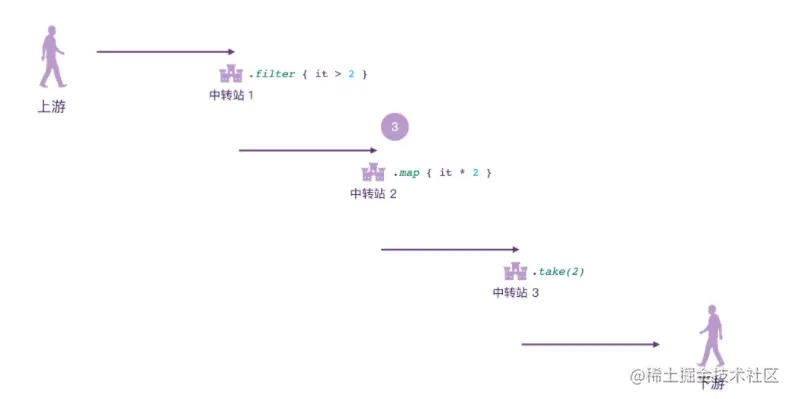
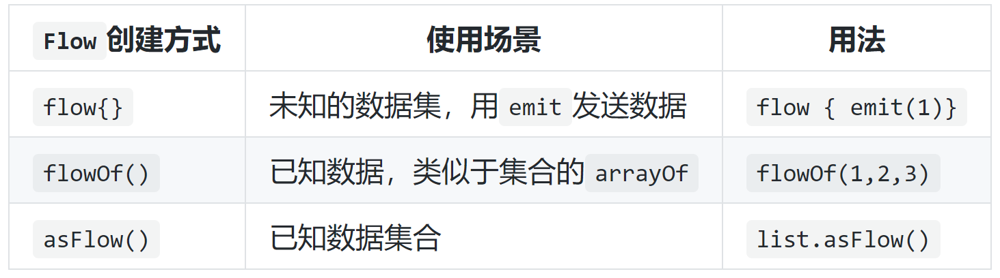
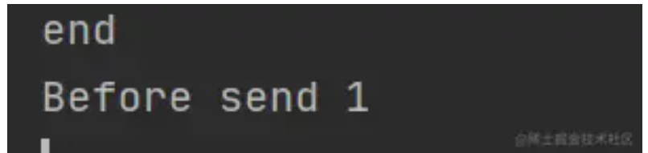
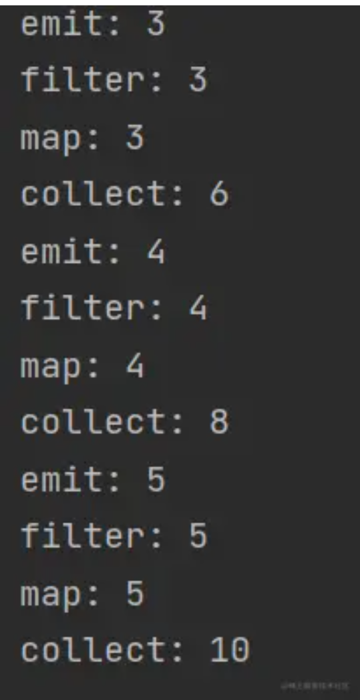

- # 什么是flow
  title:: 协程间通信-Flow流
	- Flow直译过来就是“流”的意思
- # 为什么使用flow，和协程，rxjava区别
	- [[协程Flow,协程channel，rxjava区别]]
- # 介绍
  collapsed:: true
	- 把`Channel`比喻为管道，因为它只[[#red]]==**发送接收**==这2个操作，数据在**封闭的管道**中进行传递
	- 但是`Flow`就不一样了，这个是"流"的概念，即可以把`Flow`比喻为**一条河流**，河流中流淌的是数据，这个数据从河流的发源地开始出发，可以在中间被各种处理厂进行处理，最后流入大海。
	- 所以`Flow`就是一个数据流，它也有上下游的概念，比如下图：
		- 
	- 数据从发源地开始，可以经过多个中转站进行处理。
	-
- # 上游操作符
  collapsed:: true
	- 既然`Flow`是数据流，那流中的数据是如何产生的呢？这就需要上游操作符，我们直接看代码：
	- ```kotlin
	  fun main() = runBlocking {
	      //上游，发源地
	      flow {  
	          //挂起函数，emit是挂起函数
	          emit(1)              
	          emit(2)
	          emit(3)
	          emit(4)
	          emit(5)
	      }.filter { it > 2 }     // 中转站1
	          .map { it * 2 }     // 中转站2
	          .take(2)            // 中转站3
	          .collect{           // 下游
	              println(it)
	          }
	  }
	  ```
	- 上面代码中就创建了一个`Flow`，然后往`Flow`中发送了5个数据，再通过中间3个中转站对数据进行了处理，最后通过`collect`高阶函数进行收集，上面代码的运行结果如下：
		- 
	- 这里完全符合预期，而且这种链式调用非常符合阅读习惯。
	- # [[flow{} 创建 Flow]]
	- # [[ flowOf 和 asFlow 创建 Flow]]
	- ## 所以这里上游操作符的创建`Flow`的方式有3种：
	- 
- # 中间操作符
  collapsed:: true
	- 当数据被发送到`Flow`中，就可以使用中间操作符来对流中的数据进行处理，由上面例子代码中我们可以 发现比如`filter`、`map`这些类似的API其实就是从集和那边抄来的，这些操作符我相信看名字就能够识别和使用。所以这里重点说一些和集和无关的API。
	- ### [[Flow 生命周期回调函数]]
	- ### [[Flow异常处理函数]]
	- ### [[Flow切换Context（可切线程）]]
- # 终止操作符
  collapsed:: true
	- 最后，我们到了`Flow`的下游部分，这里可以使用终止操作符来终止整个`Flow`，当使用了终止操作符，我们再也无法使用`map`这种中间操作符了。
	- 最常用的就是`collect`终止操作符，代表数据流的终止。同时还有一些从集合中抄过来的操作符，比如`first()`、`single()`、`fold`、`reduce`等等。
	- 另外把`Flow`转换为集合的时候，本身也意味着`Flow`数据流的终止，比如`toList`，也算是终止操作符
- # Flow是冷的
  collapsed:: true
	- 上一篇文章我们说了`Channel`即管道这个是热的，特点就像是热情的服务员，不管你想不想喝水，都会给你端茶递水，那这里的`Flow`其实也非常好理解，我们看个代码：
	- ```kotlin
	  fun main() = runBlocking {
	      // 冷数据流
	      val flow = flow {
	          (1..3).forEach {
	              println("Before send $it")
	              emit(it)
	              println("Send $it")
	          }
	      }
	  
	      // 热数据流
	      val channel = produce<Int>(capacity = 0) {
	          (1..3).forEach {
	              println("Before send $it")
	              send(it)
	              println("Send $it")
	          }
	      }
	  
	      println("end")
	  }
	  ```
	- 上面代码的打印：
	- 
	- 可以发现：`Channel`之所以认为是热的，是因为不管有没有接收方，发送方都会工作；而`Flow`冷的原因是，只有调用终止操作符以后，`Flow`才会工作。
- # Flow还是懒的**[[#red]]==它一次只处理一个数据==**
	- 默认情况下，`Flow`不仅是冷的，还是懒的，比如下面代码：
	  collapsed:: true
		- ```kotlin
		  fun main() = runBlocking {
		      flow {
		          println("emit: 3")
		          emit(3)
		          println("emit: 4")
		          emit(4)
		          println("emit: 5")
		          emit(5)
		      }.filter {
		          println("filter: $it")
		          it > 2
		      }.map {
		          println("map: $it")
		          it * 2
		      }.collect {
		          println("collect: $it")
		      }
		  }
		  ```
	- 这里的执行结果如下：
	  collapsed:: true
		- 
	- 会发现**[[#red]]==它一次只处理一个数据==**，结合上一篇文章的服务员端茶倒水的例子，就是`Flow`不仅是一个冷淡的服务员，还是一个懒惰的服务员，明明饭桌上有3个人需要喝水，但服务员偏偏不一次递上3杯水，而是每个人都叫服务员一次，服务员才一杯一杯地把水递过来。
- # 总结
	- 总体来说，`Flow`和`Channel`一样，都是用来协程间的通信的，可以让我们更方便的处理复杂逻辑。
	- 整个`Flow`的API设计可以分为上游、中间操作符和下游操作符：
	- 上游：主要负责创建`Flow`，同时产生数据，主要有3个API：`flow{}`、`flowOf()`和`asFlow()`;
	- 中间操作符：可以分为4类，第一类是集合抄过来的操作符；第二类是**生命周期回调**，比如`onStart`和`onCompletion`；第三类是**捕获异常`catch`操作符**；第四类是**切换`context`**，比如`flowOn`和`launchIn`。
	- 下游终止操作符：可以分为3类，第一个就是`collect`；第二类就是集合抄过来的；第三类就是`Flow`转集合的API，比如`flow.toList()`。
	- [[协程Flow,协程channel，rxjava区别]]
- # 参考
	- [协程Flow原理](https://juejin.cn/post/7231816037812813882)